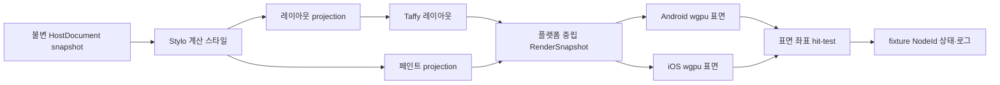

# 0019 · S04 첫 CSS·레이아웃·GPU 연결 슬라이스

**계약 버전:** `0.1.0-draft` · **상태:** S04.1~S04.6 simulator fixture 검증, S04.7 후속 작업 소유 경계 연결, S04.8 비대칭 y 비교, S04.9 정적 snapshot hit-test 완료 · **공개 API:** 아님

## 목적과 완료 범위

기존 C04.2 고정 Chromium Flex 픽스처를 기하 기준으로 유지합니다. `S04-flex-paint-v1`의 CSS 배경색 경로에 이어 별도 `S04-asymmetric-y-v1`로 비대칭 세로 배치와 GPU 좌표 변환을 검증합니다. 기존 C04.2와 가로 S04 fixture/reference는 변경하지 않습니다.



이것은 **픽스처 전용 내부 실험**입니다. S04.9에서 고정 snapshot 좌표 hit-test와 Android·iOS 터치 입력을 연결하지만, 사용자 UI 런타임, 일반 CSS 지원, 공개 DOM, 프레임워크 어댑터, 지속적인 프레임 처리, DOM 이벤트·JavaScript callback 경로를 구현하거나 완료 처리하지 않습니다. 완료해도 S04 전체 완료나 C04/C08/C19 CSS 지원 완료를 뜻하지 않습니다.

Android·iOS 연결은 `spikes/wgpu-backend`의 플랫폼별 Cargo feature로 컴파일을 분리합니다. `SPINON_ENABLE_S04_ANDROID_FIXTURE=1` 또는 `SPINON_ENABLE_S04_IOS_FIXTURE=1`인 검증 빌드에서만 해당 feature와 JNI·Objective-C++ 경로를 켜며 기본 빌드에는 fixture 경로를 넣지 않습니다. 이는 `#[cfg(test)]` 전용 단위 테스트가 아니라 플랫폼 surface와 GPU readback을 실행하는 내부 통합 fixture입니다. 제품 renderer나 공개 호출 계약으로 취급하지 않습니다.

기존 가로 fixture의 기하 기준은 [C04.2 fixture](../../tests/fixtures/css/c04/style-layout-bridge.v1.json), [S04-flex-paint-v1 fixture](../../tests/fixtures/css/s04/flex-paint.v1.json)와 [CSS 원본](../../tests/fixtures/css/s04/flex-paint.v1.css), [고정 Chromium reference](../../tests/fixtures/css/references/s04-flex-paint-v1-chromium-154.0.8037.95-a4abee019ac5-827b7e12ddf3-affc6715a14a.json)입니다. 이 기준은 301×40 CSS px, 부모 1개와 자식 3개입니다. 별도 301×65 세로 fixture와 그 Chromium reference 및 좌표 오차 기준은 S04.8에 기록합니다. 기존 C04.2와 가로 S04 fixture/reference는 변경하지 않았습니다.

### 기존 C04.2 profile과 CSS 배경색 경로

현재 C04.2 `FlexLayoutV1` 입력 검증은 레이아웃 속성만 허용합니다. `background-color`를 추가한 stylesheet를 그대로 전달하면 기존 검증기가 거부하며, 기존 adapter도 `FlexLayoutV1` 이외의 profile을 거부합니다. 따라서 CSS 배경색 경로는 C04.2 v1을 재사용한다고 표현할 수 없습니다.

- 새 S04 fixture·reference와 `S04FlexPaintV1` profile을 사용합니다. 이 profile은 C04.2 레이아웃 속성과 명시적 `background-color`만 허용하고 한 번의 Stylo cascade에서 두 결과를 만듭니다. C04.2의 기존 `FlexLayoutV1` 계약과 fixture/reference는 변경하지 않습니다.
- CSS 경로에서는 새 profile의 레이아웃 속성을 명시적으로 `LayoutStyle`로 투영하는 S04 경로를 추가합니다. 기존 `spinon-style-to-layout` 함수에 새 profile을 묵시적으로 넣지 않습니다. paint projection은 플랫폼 중립 불투명 sRGB 색으로 변환합니다. 두 projection은 `DocumentGeneration`·`DocumentRevision`·`RenderTreeRevision` 세 값과 전체 노드 ID 집합이 정확히 같아야 결합할 수 있습니다.
- 새 computed-style profile은 Chromium 비교용 computed serialization과 별도로 `NodeId`별 typed `OpaqueCssSrgb` 값을 제공합니다. S04 adapter는 Stylo computed color에서 불투명 sRGB를 얻으며 CSS 직렬화 문자열을 다시 파싱하거나 Stylo 내부 타입을 renderer에 노출하지 않습니다.
- author stylesheet allowlist도 새 profile에 한해 레이아웃 허용 목록과 `background-color`의 합집합으로 제한합니다. author color 값은 여섯 자리 `#RRGGBB`만 허용하고 다른 색 문법·그 외 선언·inline style·parse 진단은 실패입니다. Chromium과 Stylo의 선택 computed property는 문자열로 정확히 비교하고, `width`·`height`는 비교 목록에서 제외합니다. Chrome의 `getComputedStyle()`은 flex 자식의 사용값 크기를 반환하지만 Stylo cascade snapshot은 레이아웃 전 computed 값(`auto`)을 가지기 때문입니다. 크기와 좌표는 별도 frame 비교로 검증합니다. 페인트는 CSS 직렬화 문자열을 재파싱하지 않고 Stylo computed color에서 얻습니다.

## 계층별 연결 계약

| 경계 | 입력 | 출력·불변 조건 | 오류·미지원 정책 |
| --- | --- | --- | --- |
| 문서 → cascade | 한 번 커밋된 `HostDocumentSnapshot`과 같은 세대·revision의 `StyloDocumentView` | `DocumentGeneration`, `DocumentRevision`, `RenderTreeRevision`을 유지 | 세 값 중 하나라도 다르면 계산 전체를 거부합니다. 부분 트리나 최신값으로의 자동 대체는 없습니다. |
| cascade → layout | S04 전용 `compute_s04_style_layout`과 `S04FlexPaintV1` | 선택 profile을 검증하고 layout 필드만 `TaffyFlexSubsetV1` projection으로 보냅니다. C04.2 함수는 계속 `FlexLayoutV1`만 받습니다. | Stylo 진단, profile 밖 선언·값, 텍스트 노드가 있으면 전체 요청을 거부합니다. |
| cascade → paint | 새 `S04FlexPaintV1`의 typed computed color | `background-color`를 Stylo computed color에서 불투명 sRGB 중립 값으로 변환합니다. Taffy에는 전달하지 않습니다. 변환은 `spinon-style-to-render`가 소유하고 Stylo 내부 타입은 경계 밖으로 내보내지 않습니다. | 누락 색·불투명하지 않은 값·`#RRGGBB` 이외의 author 문법·계산 진단은 전체 요청을 실패시킵니다. |
| layout·paint → RenderSnapshot | `StyleLayoutOutput`, HostDocument 하위 트리, 명시적 fixture ID→`NodeId` preorder mapping, fixture/reference 출처 | `spinon-style-to-render`는 부모와 자식 3개를 `NodeId`, root-relative CSS px frame, typed paint로 보존하고 `spinon-render`의 불변 `StaticRenderSnapshot`을 만듭니다. 세 revision, 전체 style/frame/node 집합, fixture mapping 순서가 같아야 합니다. | 누락·중복·범위 밖 노드, mapping 불일치, 비유한 frame, viewport 오류, 세 revision 불일치는 전체 실패입니다. |
| RenderSnapshot → 플랫폼 호스트 | 불변 snapshot과 host submission envelope의 frame ID·대상 surface generation | 플랫폼별 Rust 호스트가 같은 노드·좌표·색 순서로 사각형 장면을 제출합니다. `get_current_texture` 상태, `Queue::submit`의 `SubmissionIndex`, `Queue::present` 요청과 화면 캡처를 별도 기록합니다. fixture의 surface 수명 변경·generation 확인·획득·제출·표시 요청은 R13 UI-thread host sequence에서 직렬화합니다. | 플랫폼 객체나 `wgpu` handle은 Rust 공용 snapshot에 넣지 않습니다. 대기 중 대상 surface generation이 바뀌면 획득 전에 해당 제출을 폐기합니다. surface generation은 대상 extent와 backing scale 변경도 반영하며, CSS viewport와 물리 surface 전체 크기를 직접 비교하지 않습니다. 획득한 `SurfaceTexture`가 남아 있는 동안에는 재구성하지 않습니다. 같은 device queue에는 이 sequence만 제출합니다. present 요청·GPU 작업 완료 callback은 화면 표시 완료를 증명하지 않습니다. 이 실험의 선택은 앱 전체 렌더 스레드 정책을 정하지 않습니다. |
| 플랫폼 호스트 → fixture hit-test | Android `MotionEvent` local surface px, iOS `UITouch` local point × drawable density, 시작 시점 surface generation | 현재 제출 세대와 같은 generation에서만 hit-test하고 CSS point·fixture `NodeId`·paint order·frame sequence를 화면 상태와 로그에 표시합니다. Android·iOS tap slop, 취소, 다중 포인터 입력은 플랫폼 호스트가 제외합니다. | 이는 정적 fixture 결과이며 실제 표시 완료 frame의 식별이 아닙니다. CSS stacking context·clip·transform, DOM 이벤트 전파·취소·listener, JavaScript callback 또는 접근성 이벤트를 구현하지 않습니다. |

### 플랫폼별 opt-in 빌드와 내부 C ABI

| 항목 | 계약 |
| --- | --- |
| 기본 빌드 | Android·iOS 빌드 스크립트의 S04 환경 변수 기본값은 `0`입니다. 기본 iOS 바이너리에는 S04 Rust 경로와 iOS create 선언이 없고, 개발 화면 인자만 실행하면 `SPINON_S04_FIXTURE=disabled`를 기록합니다. |
| iOS 빌드 | `SPINON_ENABLE_S04_IOS_FIXTURE=1`은 Rust `s04-ios-fixture` alias와 Objective-C++ 전처리 정의를 함께 켭니다. 이 alias는 공통 Rust `s04-fixture`를 활성화합니다. 환경 변수는 `0` 또는 `1`만 허용합니다. |
| 생성 | `spinon_wgpu_create_uikit_s04(view, width, height, backend, density, surface_generation, output, capacity)`는 비-null UIKit view를 빌려 Metal surface와 고정 snapshot scene을 만들고 성공 시 opaque renderer를 반환합니다. 생성 실패는 null과 출력 진단으로 보고합니다. `view`는 destroy 완료까지 유효해야 하고 `density`와 generation은 유한한 양수여야 합니다. iOS fixture는 backend `3`(Metal)을 요청합니다. |
| 프레임 제출 | `spinon_wgpu_s04_draw(renderer, output, capacity)`는 renderer를 만든 UI-thread host sequence에서 직렬 호출합니다. `0`은 `Success` surface 획득, 제출 index 기록, present 요청까지 끝났다는 뜻입니다. `-1`은 S04 scene 부재, `-2`는 Timeout·Occluded·Validation, `-3`은 Lost, `-4`는 Outdated, `-5`는 device lost, `-6`은 Suboptimal 획득 결과입니다. 성공은 화면 표시 완료를 뜻하지 않습니다. |
| 색상 표본 확인 | `spinon_wgpu_s04_poll_readback(renderer, output, capacity)`는 device poll을 한 번 수행하고 대기하지 않습니다. 기존 `S04-flex-paint-v1`은 고정 42개, `S04-asymmetric-y-v1`은 36개 RGBA 표본이 모두 맞으면 `1`, 대기 중이면 `0`, 음수면 실패입니다. 호스트는 main/UI thread를 동기 대기시키지 않고 최대 5000 ms 동안 16 ms 간격으로 재호출합니다. |
| 정적 snapshot hit-test | `spinon_wgpu_s04_hit_test(renderer, expected_surface_generation, surface_x, surface_y, output, capacity)`는 physical surface px 입력을 draw에 사용한 동일 scale·letterbox mapping으로 CSS px로 되돌린 뒤 불변 snapshot을 조회합니다. `0`은 `NodeId` hit, `1`은 box hit 없음, `-1`은 null renderer, `-2`는 S04 scene 또는 현재 generation의 제출 frame 없음, `-3`은 오래된 surface generation, `-4`는 비유한 좌표입니다. 출력에는 CSS point·NodeId·paint order·generation·제출 frame sequence·fixture ID를 포함합니다. |
| 표면 크기 변경·해제 | `spinon_wgpu_s04_resize(renderer, width, height, density, surface_generation)`는 양수 크기·density와 현재 generation보다 큰 값을 전달해 snapshot 장면과 surface를 재구성합니다. generation이 같거나 더 낮으면 장면을 바꾸지 않고 실패합니다. 반환값 `0`은 성공, `-1`은 null renderer, `-2`는 0 크기, `-3`은 S04 scene 부재, `-4`는 잘못된 density/generation 또는 장면 갱신 실패입니다. `spinon_wgpu_destroy(renderer)`는 opaque handle을 정확히 한 번 해제하며 view는 호출이 끝날 때까지 유효해야 합니다. |
| 공통 ABI 안전 경계 | 출력 진단은 capacity가 양수일 때 UTF-8 바이트를 최대 `capacity - 1`개 복사하고 NUL 종료합니다. 호출자는 출력 버퍼의 실제 크기를 전달하고, 같은 renderer의 create 이후 호출·resize·destroy를 한 UI-thread sequence에서 직렬화해야 합니다. 동시에 호출하거나 destroy 뒤 핸들을 재사용하면 안 됩니다. |

이 표의 함수는 `spikes/wgpu-backend/include/spinon_wgpu_r08.h`에서 opt-in feature가 켜진 빌드에만 선언됩니다. iOS feature-off 상태에서는 Objective-C++ wrapper가 Rust S04 함수를 호출하지 않습니다. Android는 JNI 전용 화면과 `s04-android-fixture` alias를 사용합니다. 두 플랫폼의 표면 수명·화면 배치 코드는 서로 다르며 공통 snapshot·draw/readback 의미만 공유합니다.

hit-test의 `surface_x`·`surface_y`는 Android에서 `MotionEvent.getX/Y()`가 돌려주는 SurfaceView local physical px이고 iOS에서는 UIKit local point에 configured drawable density를 곱한 값입니다. 결과 문자열은 화면·로그 진단용입니다. hit-test는 그 generation에서 성공적으로 submit된 frame sequence와 snapshot을 연결하지만 `Queue::present()`의 실제 표시 완료를 확인하지 않으며, 결과를 JS event callback에 전달하지 않습니다. fixture 상세와 실제 simulator 입력 결과는 [S04.9 사전 기준](evidence/s04-hit-test-precomparison-2026-10-07.md), [S04.9 실행 근거](evidence/s04-hit-test-platforms-2026-10-07.md)에 둡니다.

### 픽스처 RenderSnapshot 자료형

아래 자료형은 내부 Rust crate에서 구현했습니다. 공개 Rust API나 안정 ABI는 아닙니다.

```rust
pub struct StaticRenderSnapshot {
    source: StaticRenderSource,
    viewport_css_px: CssSize,
    boxes: Vec<StaticRenderBox>,
}

pub struct CssSize { width: f32, height: f32 }
pub struct CssRect { x: f32, y: f32, width: f32, height: f32 }
pub struct OpaqueCssSrgb { red: u8, green: u8, blue: u8 }

pub struct StaticRenderSource {
    document_generation: DocumentGeneration,
    document_revision: DocumentRevision,
    render_tree_revision: RenderTreeRevision,
    computed_style_profile: ComputedStyleProfileId,
    layout_projection: LayoutProjectionId,
    paint_profile: PaintProfileId,
    fixture_id: String,
    fixture_sha256: [u8; 32],
    stylesheet_sha256: [u8; 32],
    chromium_reference_id: String,
    chromium_reference_sha256: [u8; 32],
}

pub struct StaticRenderBox {
    node_id: NodeId,
    frame_css_px: CssRect,
    paint: OpaqueCssSrgb,
    paint_order: u32,
}

enum ComputedStyleProfileId { S04FlexPaintV1 }
enum LayoutProjectionId { TaffyFlexSubsetV1 }
enum PaintProfileId { OpaqueBackgroundColorV1 }
```

- `boxes`는 fixture 트리의 root-first preorder이며 모든 레이아웃 노드가 정확히 한 번 나와야 합니다. 이 순서는 겹침·stacking context에 대한 CSS 일반 규칙이 아닙니다.
- fixture의 문자열 ID(`flex-parent`, `flex-a` 등)와 내부 `NodeId` 사이의 대응은 S04 fixture에 명시하고 일대일이어야 합니다. preorder만으로 ID 대응을 추정하지 않습니다. `computed_style_profile`은 Stylo 입력 계약, `layout_projection`은 Taffy에 전달할 필드 집합을 각각 식별합니다.
- `OpaqueCssSrgb`의 세 채널은 CSS `#RRGGBB` 순서의 encoded sRGB 8-bit 값이며 alpha는 항상 255입니다. 이 타입은 CSS 직렬화 문자열이나 Stylo 타입을 뜻하지 않습니다.
- `fixture_sha256`, `stylesheet_sha256`, `chromium_reference_id`, `chromium_reference_sha256`는 출처와 비교 자료 바이트를 고정합니다. 이번 Chromium reference는 `s04-flex-paint-v1-chromium-154.0.8037.95-a4abee019ac5-827b7e12ddf3-affc6715a14a`, 파일 SHA-256은 `20a55f01c35bd0b6546026bb7d6a68d0a2bfc0f4010984573ca0ac791cc85b05`입니다. 현재 computed-style snapshot에는 독립 `StyleRevision`이 없으므로 이 fixture 출처가 제품의 동적 stylesheet revision을 대신하지 않습니다.
- snapshot ID, frame ID와 surface generation은 플랫폼 host submission envelope에서 연계합니다. surface generation은 표면 교체·재구성, 대상 크기 또는 backing scale 변동 때 증가합니다. 오래된 envelope는 acquire 전에 버려 같은 snapshot의 로그·캡처를 연결할 수 있어야 합니다. snapshot 생성, queue submission index, GPU 완료 callback, `Queue::present` 요청은 화면 표시 성공 또는 표시 시각을 뜻하지 않습니다.

## S04.1 확정 정책

다음은 첫 fixture 슬라이스에 적용할 정책입니다. 제품 전체의 CSS·렌더링 지원 범위나 앱 전역 스레드 정책을 정하지 않습니다.

1. **페인트:** 새 S04 fixture의 부모와 자식 세 요소에 서로 다른 고정 불투명 `background-color: #RRGGBB`를 지정하고, 새 `S04FlexPaintV1`로 computed color를 RenderSnapshot까지 전달합니다. `color`, `opacity`, gradient, border, blend, alpha는 제외합니다. computed serialization은 새 Chromium oracle과 정확히 비교하고, 오프스크린 출력은 아래의 고정 지점에서 RGBA bytes를 정확히 비교합니다. 기존 fixture에는 배경색이 없으므로 새 fixture와 Chromium reference를 추가합니다. 이 좁은 사례는 C08/C19 전체 완료를 뜻하지 않습니다.
2. **진단색 대안 제외:** 진단색 경로는 채택하지 않습니다. 이 fixture는 CSS computed paint가 snapshot까지 도달하는 경로를 검증합니다.
3. **좌표:** 기존 `S04-flex-paint-v1`에서 1 CSS px은 Android dp 1단위 및 iOS point 1단위에 대응합니다. Taffy의 CSS px `f32` 좌표를 CPU에서 정수로 반올림하지 않습니다. 플랫폼이 surface에 제공하는 backing scale을 GPU 좌표 변환에서 한 번 적용합니다. 계산 viewport는 backing scale과 무관하게 301×40 CSS px입니다. S04.8의 301×65 viewport도 같은 변환 정책을 적용합니다. 이 정책은 고정 fixture에 한정되며 S02의 일반 앱 좌표 계약을 완료 처리하지 않습니다.
4. **뷰포트·안전 영역:** 각 fixture의 계산 viewport는 고정 입력(기존 301×40, S04.8 301×65 CSS px)을 따르고 root 원점은 surface content의 왼쪽 위입니다. safe area와 화면 전체 root 배치는 포함하지 않습니다. 테스트용 GPU 영역의 배치·크기는 fixture 바깥 호스트가 정합니다.
5. **장면 갱신:** 전체 장면을 한 번 생성·제출합니다. 부분 갱신, dirty region, 프레임 병합, 동적 변경 queue 정책은 이 실험에서 정하지 않습니다.
6. **플랫폼 backend·surface color space:** 기존 R08의 `wgpu` 표면 연결을 재사용하고 실제 선택 backend·장치·surface format·color space를 근거에 남깁니다. surface는 `SurfaceColorSpace::Srgb`를 명시하고 해당 format 조합이 capabilities에 없으면 fixture 실패로 처리합니다. 자동 wide-gamut/HDR 선택은 하지 않습니다. Android 자동 fallback 정책이나 기기 지원표를 확정하지 않습니다.
7. **스레드와 표면 수명:** 앱 전체의 렌더 스레드, JS 대기, frame queue 정책은 이번 계약에서 정하지 않습니다. fixture의 surface lifecycle·configure·generation 검사·acquire·`Queue::submit`·present 순서는 R13에서 검증한 하나의 UI-thread host sequence가 소유하며 같은 device queue에 다른 sequence가 submit하지 않습니다. 지연된 요청은 실행 시작 시 캡처한 surface generation과 현재 generation이 다르면 acquire 전에 버립니다. 이 generation은 표면 교체·재구성·대상 크기·backing scale 변경 때 증가하며 CSS viewport 크기와 물리 surface extent를 직접 비교하지 않습니다. 획득한 `SurfaceTexture`를 present하거나 폐기하기 전에는 configure·표면 해제를 하지 않습니다. surface 크기가 0이거나 요청한 format/color space가 capabilities에 없으면 configure를 호출하지 않고 fixture 실패로 처리합니다. 이 직렬화 선택은 실험 한정이며 앱 전역 렌더 스레드 선택이 아닙니다.
8. **오류와 GPU 호출 의미:** cascade·layout·snapshot 생성만 전체 성공 또는 전체 실패로 묶입니다. 이 보장은 GPU 호출 뒤의 표시까지 확장되지 않습니다. wgpu API별 반환값·진단과 Android/iOS 개별 판정은 아래에 고정합니다.

불투명 sRGB 배경색을 선택하면 snapshot에는 encoded sRGB bytes를 보존합니다. 각 채널은 `c = byte / 255`로 정규화한 뒤 IEC 61966-2-1 sRGB EOTF(`c ≤ 0.04045`이면 `c / 12.92`, 아니면 `((c + 0.055) / 1.055)^2.4`)를 적용해 linear RGB로 만듭니다. `SurfaceColorSpace::Srgb`와 sRGB texture format 조합은 linear shader 값을 출력해 format의 sRGB 인코딩을 한 번 적용하고, 같은 color space의 non-sRGB UNORM format은 linear channel `l`에 역 OETF(`l ≤ 0.0031308`이면 `12.92l`, 아니면 `1.055 × l^(1/2.4) − 0.055`)를 적용해 encoded sRGB 값을 shader에서 출력합니다. alpha는 항상 1입니다. surface format별 변환을 중복 적용하지 않으며, 이 규칙은 R08의 색상 차이를 전체 제품에서 해결한 것이 아니라 해당 fixture의 출력을 고정하기 위한 좁은 정책입니다.

### wgpu 30.0.1 호출·오류 모델

- `Surface::configure`는 반환값이 없습니다. 호출 전 surface 크기가 0보다 크고 format과 명시한 `SurfaceColorSpace::Srgb` 조합이 surface capabilities에 있는지, 이전 `SurfaceTexture`가 모두 소비·폐기됐는지 확인합니다. 호출과 선택한 configuration·resolved color space를 기록하고 validation 진단은 error scope/uncaptured-error 경로로 수집합니다. wgpu가 문서화한 panic 조건은 호출 전 거부하며, 그 밖의 panic은 복구 가능한 결과로 세지 않습니다. FFI/빌드 panic 설정에 따라 프로세스가 중단될 수 있으므로 실행 성공을 보장하지 않습니다.
- `Surface::get_current_texture` 결과는 `Success`, `Suboptimal`, `Timeout`, `Occluded`, `Outdated`, `Lost`, `Validation`으로 분류합니다. 각 variant는 같은 성공 코드로 합치지 않습니다. `Suboptimal`도 texture는 획득하지만 surface 설정 갱신이 권고되므로 이번 fixture의 통과 조건인 `Success`에는 포함하지 않습니다. 이 경우 획득 texture를 present하거나 drop한 뒤 직렬 sequence에서 재구성하며, 다른 variant도 상세 로그를 남겨도 성공 출력으로 세지 않습니다. surface 재생성·복구 검증은 R13에 남깁니다.
- `Queue::submit`은 `Result`가 아니라 `SubmissionIndex`를 반환합니다. 이를 제출 식별자로 기록하고 GPU validation·device loss는 error scope, uncaptured-error, device-lost 경로로 수집합니다. 캡처 시점까지 error scope 결과가 비어 있고 uncaptured validation·device-lost 오류가 없어야 플랫폼 run을 통과 처리합니다.
- 표면 텍스처 표시 요청은 `Queue::present(surface_texture)`입니다. 이는 실제 화면 표시 시각이나 표시 성공 callback을 제공하지 않습니다. `Queue::on_submitted_work_done`도 GPU queue 작업 완료일 뿐 화면 표시 확인이 아닙니다.
- 오프스크린 readback은 surface 표시 확인과 별도 경로입니다. 두 fixture 모두 `301 × 4 = 1204` bytes 행을 256 정렬 `bytes_per_row=1280`으로 복사하고, `COPY_DST | MAP_READ` staging buffer 크기는 viewport 높이에 따라 `1280×40` 또는 `1280×65` bytes입니다. 픽셀 채널 byte offset은 `y × 1280 + x × 4 + channel`입니다. map callback이 성공한 뒤에만 읽고 모든 view를 drop한 다음 unmap합니다. Android·iOS fixture host는 UI 스레드에서 `device.poll(PollType::Poll)`을 16 ms 간격으로 호출하고 최대 5000 ms 뒤 완료가 오지 않으면 실패로 끝냅니다. 이는 GPU 완료를 기다리며 UI 스레드를 동기 대기시키지 않습니다. 기존 가로 fixture는 x 14개·y 3개, 총 42개 표본을, 비대칭 y fixture는 x 3개·y 12개, 총 36개 표본을 정확 대조합니다. 어느 경로도 전체 화면 bytes를 비교하지 않습니다. map 실패·5초 제한 초과는 성공 출력이 아니라 readback 실패입니다.
- Android와 iOS 실행은 서로 독립입니다. 한 플랫폼의 성공만으로 교차 플랫폼 슬라이스를 통과 처리하지 않으며, Android emulator와 iOS simulator의 대상별 surface capture를 각각 남깁니다. `commit-to-present`나 실제 표시 완료 지연은 이 fixture 작업의 통과 기준이 아닙니다.

### 기존 가로 fixture의 CSS 색상 readback 지점

이 기준은 CSS 배경색 경로에만 적용합니다. 1× `301×40` `Rgba8UnormSrgb` offscreen target에서 `(x,y)`는 픽셀 index이며 읽는 위치는 픽셀 중심 `(x+0.5,y+0.5)` CSS px입니다. 각 지점의 `[R,G,B,A]` bytes를 해당 fixture 색의 `#RRGGBB` bytes와 `255` alpha에 정확히 대조합니다. offscreen 출력은 같은 `StaticRenderSnapshot`의 paint box 순서와 색상 변환식을 사용합니다. 301×40 CSS px 좌표에 맞춘 별도 vertex buffer와 readback target format에 맞춘 pipeline을 만들며, 화면 크기·density에 맞춘 surface vertex buffer를 readback에 재사용하지 않습니다.

| y=0, 20, 39에서 검사할 x index | 기대 영역 | 이유 |
| --- | --- | --- |
| `24`, `47` | 자식 A | 내부와 오른쪽 경계 직전 |
| `49`, `51`, `52` | 부모 배경의 첫 gap | 자식 A의 경계 뒤와 자식 B 경계 전 |
| `54`, `102`, `149` | 자식 B | 왼쪽 경계 직후, 내부, 오른쪽 경계 직전 |
| `151`, `153`, `154` | 부모 배경의 둘째 gap | 자식 B의 경계 뒤와 자식 C 경계 전 |
| `156`, `228`, `300` | 자식 C | 왼쪽 경계 직후, 내부, 오른쪽 경계 직전 |

네 박스의 CSS 색은 서로 달라야 하며 새 fixture와 Chromium reference에 고정합니다. 표의 모든 x 지점을 y index `0`, `20`, `39` 각각에서 읽어 박스 내부의 위·중앙·아래가 같은 paint인지 확인합니다. 각 RGBA8 row는 1204 bytes이지만 `copy_texture_to_buffer`의 `bytes_per_row`는 256-byte 배수인 1280으로 지정하고, 행마다 붙는 76 padding bytes를 건너뛴 뒤 `y × 1280 + x × 4` offset부터 sample을 읽습니다. CPU RenderSnapshot의 모든 frame은 Chromium과 별도로 좌표당 최대 절대 오차 0.5 CSS px로 비교합니다. 현재 C04.2 fixture의 모든 frame은 `y=0`, `height=40`이므로 이 출력 검사는 세로 원점 반전이나 비대칭 세로 배치를 판별하지 못합니다. 세 표본 행은 높이 축소·부분 누락은 잡지만 일반적인 세로 좌표 변환을 증명하지 않습니다. 일반 세로 좌표 변환을 주장하기 전에 별도 비대칭 y fixture가 필요합니다. Android/iOS 캡처는 해당 snapshot ID·frame ID가 붙은 host 로그와 함께 실제 표면에 같은 색 순서와 상대 배치가 나온다는 시각 증거이며, 전체 화면의 OS 간 픽셀 일치는 요구하지 않습니다.

`spinon-style-to-layout`은 레이아웃 속성만 검증해 Taffy로 보냅니다. `spinon-style`은 computed `background-color`를 Stylo에서 읽어 `OpaqueCssSrgb` 중립 타입으로 제공합니다. `spinon-style-to-render`는 해당 타입을 검증·투영하며 `spinon-render`는 Stylo 의존성 없이 paint snapshot과 장면을 소유합니다. `spinon-render`는 플랫폼 GPU 객체와 표면 수명을 소유하지 않습니다.

### 비대칭 y fixture의 CSS 색상 readback

새 `S04-asymmetric-y-v1`은 `301×65` target, stride 1280, staging buffer `1280×65` bytes를 사용합니다. x `[0,150,300]`과 y `[0,11,12,14,15,32,33,35,36,59,60,64]`의 36개 pixel center RGBA를 정확히 비교합니다. 표본 행은 세로 Flex 자식 내부, gap 경계 양쪽, 부모의 아래 여백을 포함합니다. 색상 표본은 y 좌표의 전체 기하 정확도 증거가 아니므로 Chromium frame 대조와 NDC 단위 검사를 함께 사용합니다. [사전 비교 기준과 수치](evidence/s04-asymmetric-y-precomparison-2026-10-07.md).

## 비교 모델과 통과 기준

| 확인 층 | 비교 기준 | 통과 조건 |
| --- | --- | --- |
| computed style | 기존 C04.2 layout 기준과 두 S04 paint fixture의 고정 Chromium reference | computed property 문자열이 정확히 일치하고 진단이 없습니다. 기존 C04.2·가로 S04 reference 결과는 바꾸지 않습니다. |
| layout | 각 fixture에 고정한 Chromium reference (C04.2 / 기존 S04는 `154.0.8037.95`, 비대칭 y는 `154.0.8037.98`) | 모든 node의 x/y/width/height 각각 최대 오차 0.5 CSS px 이하입니다. node 평균으로 실패를 상쇄하지 않습니다. |
| RenderSnapshot | 같은 입력을 사용한 Rust 직접 기준 자료 | ID, preorder, source revision, viewport, CSS px 좌표가 결정적으로 같습니다. 실패 입력에서 부분 snapshot이 나오지 않습니다. |
| GPU 출력 | Android·iOS별 simulator 화면 캡처와 snapshot ID·frame ID·surface generation이 연결된 로그, 고정 offscreen readback | 각 플랫폼 run은 `Success` 획득, 제출 index, 오류 부재를 확인합니다. CPU RenderSnapshot frame은 Chromium fixture의 좌표별 오차 기준으로 별도 확인합니다. CSS 색상 경로의 개별 GPU readback 지점·RGBA 기대값·행 stride는 아래 기준을 따릅니다. 플랫폼 캡처는 실제 표면의 결과를 확인하는 별도 근거입니다. |

Chromium computed style·geometry는 CSS/layout oracle입니다. GPU screenshot은 해당 snapshot이 각 표면에 도달했음을 보이는 별도 증거이며, 좁은 불투명 배경색 확인 외에 글꼴·전체 화면 CSS 적합성 oracle로 사용하지 않습니다. Android emulator와 iOS simulator 결과는 실기기 근거나 성능 근거로 확대 해석하지 않습니다.

## 이번 슬라이스에서 하지 않는 것

- `color`, `opacity`, border, transform, clip, z-index, stacking context의 화면 표현
- C08 Block formatting, C19 paint subset, 전체 Flexbox·Grid·CSSOM·동적 stylesheet 무효화
- 텍스트 shaping·폰트 측정·이미지 decode/upload·scroll
- CSS 일반 규칙을 따르는 displayed-frame hit-test, DOM 이벤트 순서·취소·캡처·버블링, JS callback
- 접근성 의미 트리, VoiceOver/TalkBack, IME
- 앱 런타임의 연속 frame scheduling·backpressure·thread ownership, 부분 렌더 갱신
- HMR·OTA·CSS 자원 교체와 style/resource generation 활성화

## 이번 계약에서 확정하지 않는 범위

| 범위 | 현재 계약의 한계 |
| --- | --- |
| 동적 style/environment revision | 고정 fixture의 문서·stylesheet/reference hash로만 출처를 식별합니다. 제품 연결 전 별도 revision 계약이 필요합니다. |
| 전체 S04의 입력 경로 | 이번 GPU 화면 뒤에 둡니다. S03 이벤트 callback·대상 수명 계약과 표시된 frame 기준이 먼저 필요합니다. R08 표면 탭은 DOM 노드 이벤트가 아닙니다. |
| backend fallback | 이번 fixture는 관찰 backend를 기록하고 실패를 드러냅니다. 제품 backend 선택·fallback 정책은 R08/R13에서 별도 결정합니다. |
| 일반 CSS·제품 런타임 | 불투명 단색 배경색 fixture만 다룹니다. C08/C19·전체 CSS와 앱 런타임 지원은 별도 계약·상태 항목입니다. |

## S04 후속 구현 체크리스트

S04.1 정책 확정 뒤 이어갈 내부 fixture 작업입니다. 아래 단계는 제품 지원 선언이 아닙니다.

- [x] **S04.1 계약 확정** — CSS background paint, 1 CSS px↔1 Android dp/iOS point, backing scale 1회 적용, `spinon-style-to-render` adapter, R13 UI-thread fixture sequence, fixture-only revision과 error/readback boundary를 확정했습니다. 제품 CSS/API 지원 완료는 뜻하지 않습니다.
- [x] **S04.2 CSS fixture·oracle 추가** — 기존 C04.2 v1을 보존하고 새 `S04FlexPaintV1` profile·fixture·CSS·Chromium reference를 고정했습니다. author property allowlist, fixture ID→`NodeId` 순서, 선택 computed property 문자열, 좌표별 0.5 CSS px 오차, y=0/20/39와 RGBA8 기대값을 fixture·계약에 기록했습니다. GPU readback 실행은 S04.4·S04.5에서 검증합니다. [fixture](../../tests/fixtures/css/s04/README.md) · [실행 근거](evidence/s04-css-layout-render-snapshot-2026-10-03.md).
- [x] **S04.3 Rust snapshot 변환** — `spinon-style-to-render`가 고정 입력에서 결정적인 `StaticRenderSnapshot`을 만들고 generation·document/render revision, style/layout/node 집합, fixture mapping과 누락·중복·비유한 frame 실패를 확인했습니다. [실행 근거](evidence/s04-css-layout-render-snapshot-2026-10-03.md).
- [x] **S04.4 Android GPU 연결** — 동일 snapshot을 R08 `wgpu` Android surface에 제출하고 backend·surface generation·획득 variant·submission index·wgpu 진단·present 요청과 상관관계를 로그·화면 캡처에 남겼습니다. Android API 36 ARM64 emulator의 Vulkan `llvmpipe` CPU adapter에서 세로→가로→세로 generation 1→2→3 모두 `Success`를 얻고, generation별 42개 RGBA sample readback과 화면 캡처를 확인했습니다. 경로는 `spikes/wgpu-backend`의 `s04-android-fixture` opt-in Cargo feature로 포함하는 내부 통합 fixture이며 `#[cfg(test)]` 전용 코드나 제품 renderer/API가 아닙니다. 기본 Android APK에서는 제외되고, JNI 비활성 응답도 확인했습니다. 하드웨어 GPU·실기기는 검증하지 않았습니다. [실행 근거](evidence/s04-android-gpu-surface-2026-10-03.md).
- [x] **S04.5 iOS GPU 연결** — 동일 snapshot을 R08 `wgpu` iOS Metal surface에 제출하고 backend·surface generation·획득 variant·submission index·wgpu 진단·present 요청과 상관관계를 로그·화면 캡처에 남겼습니다. iPhone 17 Pro / iOS 26.2 시뮬레이터에서 generation 1 `Success`, `Bgra8UnormSrgb`·sRGB, 비동기 42개 표본 정확 readback을 확인했습니다. opt-in `s04-ios-fixture` Cargo feature로만 snapshot 경로를 포함하며 기본 iOS 빌드에서는 비활성 안내를 반환합니다. 실기기·회전별 재생성·성능은 검증하지 않았습니다. [실행 근거](evidence/s04-ios-gpu-surface-2026-10-03.md).
- [x] **S04.6 교차 플랫폼 대조** — Android API 36 emulator와 iPhone 17 Pro / iOS 26.2 simulator의 surface 캡처 색상 경계를 density로 CSS px에 환산해 Chromium geometry oracle과 `StaticRenderSnapshot`의 고정 frame 값에 대조했습니다. 두 결과의 최대 좌표 오차는 각각 0.167 CSS px이고 색상 픽셀은 fixture sRGB 값과 정확히 일치합니다. 로그의 fixture ID·revision·frame·surface generation, 42개 readback과 simulator 한계를 [실행 근거](evidence/s04-cross-platform-comparison-2026-10-03.md)에 기록했습니다. snapshot digest는 로그에 없어 캡처와 snapshot의 바이트 정체성을 증명하지 않습니다. 전체 화면 픽셀 동등, 실기기 GPU와 표시 완료 callback도 증명하지 않습니다.
- [x] **S04.7 후속 작업 소유 경계 연결** — 각 후속 작업의 기준 명세와 기존 상태 ID를 아래 표에 연결했습니다. 이 체크는 계획 추적 정리만 완료했다는 뜻이며 CSS·DOM·이벤트·제품 frame 기능의 구현이나 S04 전체 완료를 뜻하지 않습니다.
- [x] **S04.8 비대칭 y 좌표 비교** — `S04-asymmetric-y-v1`의 computed style과 모든 노드 geometry를 Chromium `154.0.8037.98`에 대조하고, 서로 다른 y·높이·간격·가로 좌표를 둔 독립 CPU→NDC oracle을 검사했습니다. Android API 36 ARM64 emulator Vulkan `llvmpipe` CPU adapter와 iPhone 17 Pro / iOS 26.2 simulator Metal surface에서 각각 같은 fixture의 36개 RGBA 표본이 정확히 일치하고 화면 캡처의 색 순서를 확인했습니다. [사전 비교 기준](evidence/s04-asymmetric-y-precomparison-2026-10-07.md) · [실행 근거·원본 로그·캡처](evidence/s04-asymmetric-y-platforms-2026-10-07.md). 실기기·하드웨어 GPU·성능·제품 runtime은 검증하지 않았습니다.
- [x] **S04.9 정적 snapshot hit-test fixture** — `StaticRenderSnapshot`에서 right/bottom 제외 경계와 기록 paint order를 적용하고, 렌더와 동일한 scale·letterbox mapping의 역변환을 사용합니다. Chromium `document.elementFromPoint()` 11점 대조, surface generation·성공 제출 frame·비유한 좌표 실패 기준, Android API 36 emulator 탭과 iPhone 17 Pro / iOS 26.2 Simulator 터치로 NodeId 결과 및 화면 상태를 확인했습니다. 세대·frame·CSS point·NodeId가 연결된 로그와 캡처는 [사전 비교 기준](evidence/s04-hit-test-precomparison-2026-10-07.md) · [플랫폼 실행 근거](evidence/s04-hit-test-platforms-2026-10-07.md)에 있습니다. 이는 fixture 입력 결과이며 displayed-frame ID, CSS stacking/clip/transform, DOM event 또는 JS callback 검증이 아닙니다.

### S04 후속 작업 소유 경계

상태와 완료 판정은 [공식 상태 대장](../STATUS.md)에만 둡니다. 이 표는 그 상태 ID가 가리키는 책임 문서를 연결하며 별도 체크리스트나 API 범위를 만들지 않습니다.

| 작업 범위 | 계약 소유 문서 | 기존 상태 ID | 다음 구현의 통과 기준과 경계 |
| --- | --- | --- | --- |
| 기본 화면과 CSS paint | [CSS 호환 범위](../0008-css-compatibility.md) | `S04`, `C08`, `C19`, `E02`; 고급 장식·합성은 `C22`, `C23` | 속성·값마다 Chromium 비교 입력과 GPU fixture를 둡니다. S04의 단색 배경 fixture를 전체 paint 지원으로 확대하지 않습니다. |
| cascade와 변경된 스타일 재계산 | [CSS 호환 범위](../0008-css-compatibility.md), [C03 DOM 어댑터](0010-stylo-dom-adapter-c03.md), [C04 cascade](0016-c04-basic-cascade.md), [스타일→레이아웃 어댑터](0017-c04-style-layout-bridge.md), [레이아웃 입력](0009-layout-engine.md) | `C03`, `C04`, `C05`, `S02`; 앱이 DOM CSSOM을 직접 쓰는 경우에만 `C29` 추가 | 변경된 선언·선택자 상태가 해당 표시 트리의 계산 스타일과 다음 프레임에 반영되는지 확인합니다. 프레임워크가 내부 style 입력을 전달하는 것과 공개 `Element.style` 지원을 같은 항목으로 취급하지 않습니다. |
| viewport·플랫폼 환경과 계산 revision | [UI 트리·이벤트 의미](../0002-ui-tree-events.md), [레이아웃 입력 계약](0009-layout-engine.md) | `S02`, `S04`, `C06`, `C07`, `C16`, `C21`, `U09` | `LayoutInputRevision`이 source·style·environment 축을 보존합니다. S04 fixture snapshot admission은 현재 style revision·viewport와 오래된 결과를 비교해 전체 거부합니다. 제품 입력 소유자, 다중 소유자의 원자 snapshot, 런타임 재계산과 GPU frame queue stale 검사는 미구현입니다. [S02.2 상태와 비교 근거](../STATUS.md#2-세-플랫폼-수직-구현), [실행 근거](evidence/s02-layout-revision-gate-2026-10-04.md). |
| CSS 좌표에서 GPU surface 좌표로의 변환 | [레이아웃 엔진 계약](0009-layout-engine.md), 이 문서의 좌표·surface 정책 | `S02`, `S04`, `C17` | 비대칭 y fixture에 0이 아닌 세로 위치와 서로 다른 높이·간격을 두고 Chromium geometry, snapshot, Android·iOS 출력을 비교합니다. 이번 y 변환 확인을 `C17`의 RTL·writing-mode 지원 근거로 확대하지 않습니다. 각 좌표·크기의 최대 오차 기준은 fixture에서 고정하고 y=0 전용 검증으로 일반 방향 변환을 주장하지 않습니다. |
| 플랫폼 presentation 확인과 입력 상관관계 | [R13 surface 생명주기 실험](r13-platform-gpu-recovery.md), [S05 입력 전달 계약](0023-s05-event-delivery.md), [S04.10 API·기기 capability 검증](evidence/s04-10-presentation-signal-audit-2026-10-07.md) | `S04.10`, `S05`, `S07`, `E03` | Android·iOS가 제공하는 presentation 확인 신호를 FrameId·surface generation·revision tuple에 묶고, 입력과 확인 callback의 실제 직렬 순서·오래된 generation 거부를 확인합니다. API 36 emulator Vulkan은 `VK_GOOGLE_display_timing` 미지원, Samsung Xclipse 940 실기기는 지원하며 wgpu adapter도 feature를 보고했습니다. 잠금 해제 후 실기기에서 surface generation 1·2의 `Queue::present` 요청과 각 36개 오프스크린 색상 표본을 통과했습니다. 이는 표시 timing record가 아닙니다. `presentID`/actual timing·제품 FrameId 기록과 iOS 연결은 미검증입니다. Queue.present 성공은 광학 표시 완료 증거가 아닙니다. |
| hit-test와 JavaScript·접근성 이벤트 | [UI 트리·이벤트 의미](../0002-ui-tree-events.md), [DOM 호환 범위](../0007-dom-compatibility.md), [S05 입력 전달 계약](0023-s05-event-delivery.md) | `S03`, `S05`, `S07`, `E03`, `J12`, `X06` | 화면 frame과 입력 대상 revision을 연결하고 겹침 순서, 오래된 frame, 분리 노드, 이벤트 전파·취소와 콜백 수명을 고정 fixture로 검증합니다. S04.9의 R13 도형 탭은 DOM 이벤트 근거가 아닙니다. |
| 네이티브 프레임 구동기와 GPU 프레임 대기열 | [UI 트리·이벤트 의미](../0002-ui-tree-events.md) | `S04`, `E04`, `E06` | 표시 주기 예약, 대기 frame 수, 변경 snapshot 병합·폐기, 역압력과 surface 획득 실패 뒤 재시도 규칙을 정하고 연속 frame에서 확인합니다. 공개 rAF가 없어도 정적 GPU 화면을 갱신할 수 있어야 합니다. |
| JavaScript 작업 대기열과 우선순위 | [내부 JavaScript 작업 스케줄러](0006-js-task-scheduler.md) | `R06`, `E05` | 작업 출처·우선순위·FIFO·취소·포화·기아 및 공정성을 별도 검증합니다. 논리 작업 우선순위는 OS thread QoS나 GPU 프레임 예약을 의미하지 않습니다. |
| 공개 rAF·취소 의미 | [웹 표면 API](../0003-web-surface.md) | `J04` | 콜백 시각·취소·화면 비활성·백그라운드 중단·재개 의미를 결정하고 웹·Android·iOS 사례를 검증합니다. 네이티브 프레임 구동기의 존재만으로 공개 rAF 지원을 표시하지 않습니다. |
| surface 생명주기·표시 증거 | [R13 surface 생명주기 실험](r13-platform-gpu-recovery.md) | `R13` 실험 근거, 제품 동작은 `S04`, `S11`, `E07` | 표면 재생성·세대 변경·대기 제출 폐기·자원과 callback 수명 및 실제 표시 확인을 검증합니다. R13의 에뮬레이터·시뮬레이터 실험은 제품 수명 보장이나 present 완료 callback을 뜻하지 않습니다. |

각 후속 구현은 위에서 지정한 소유 문서와 기존 상태 ID를 갱신합니다. 해당 명세에 이미 있는 요구사항을 S04나 계획 문서에 복제하지 않으며, 새 독립 작업 ID가 실제로 필요해질 때에만 상태 대장 규칙에 따라 추가합니다.

## 관련 계약과 근거

- [S02 레이아웃 엔진 `0.3.0-draft`](0009-layout-engine.md)
- [S04.4 Android GPU surface 실행 근거](evidence/s04-android-gpu-surface-2026-10-03.md)
- [S04.5 iOS GPU surface 실행 근거](evidence/s04-ios-gpu-surface-2026-10-03.md)
- [C04.1 stylesheet cascade](0016-c04-basic-cascade.md)
- [C04.2 computed style→Taffy adapter `0.1.0`](0017-c04-style-layout-bridge.md)
- [S03.1 V8 HostDocument 변경 묶음 `0.1.0`](0018-s03-v8-hostdocument-bridge.md)
- [R08 wgpu 표면 실험](evidence/r08-wgpu-surface-2026-09-29.md)
- [R13 플랫폼 표면 직렬화·복구 계약](r13-platform-gpu-recovery.md)
- [wgpu 30.0.1 `Surface`](https://docs.rs/wgpu/30.0.1/wgpu/struct.Surface.html) · [`CurrentSurfaceTexture`](https://docs.rs/wgpu/30.0.1/wgpu/enum.CurrentSurfaceTexture.html) · [`Queue`](https://docs.rs/wgpu/30.0.1/wgpu/struct.Queue.html) · [`TexelCopyBufferLayout`](https://docs.rs/wgpu/30.0.1/wgpu/struct.TexelCopyBufferLayout.html)
- [wgpu 30.0.1 `SurfaceColorSpace`](https://docs.rs/wgpu/30.0.1/wgpu/enum.SurfaceColorSpace.html) · [CSS Color 4 sRGB conversion](https://www.w3.org/TR/css-color-4/#predefined-sRGB)
- [wgpu 30.0.1 `Buffer::map_async`](https://docs.rs/wgpu/30.0.1/wgpu/struct.Buffer.html#method.map_async)
- [C04.2 실행 근거](evidence/css-c04-style-layout-bridge-2026-10-03.md)
