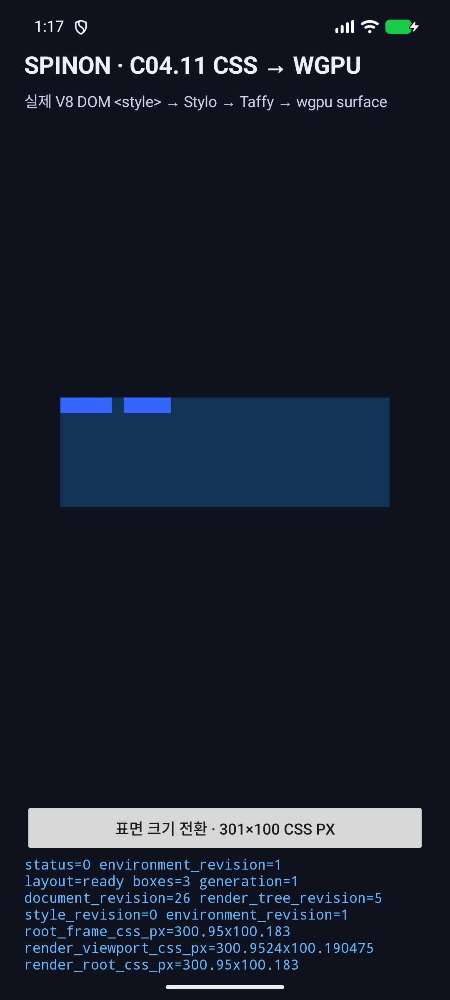
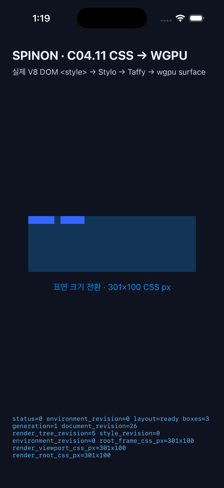

# C04.11 구현 검토와 Simulator 실행 근거

## 결과 요약

C04.11의 고정 범위인 연결된 HTML `<style>` → Stylo author cascade → 기존 Taffy profile → WGPU 장면을 확인했다. 공개 CSS 지원이나 C04/C05 상위 항목 전체를 완료로 표시하지 않았다. 내부 계약 버전과 Cargo package 버전은 모두 출시 전 값 `0.1.0`을 유지한다.

계획 검토는 [별도 기록](c04-runtime-author-stylesheets-plan-review-2026-10-10.md)에 두었다. 아래 구현 검토는 계획 검토 항목을 재사용하지 않고 현재 코드·테스트·플랫폼 실행에서 서로 다른 실패 경계를 다시 확인한다.

## 구현 후 실패 관점 검토

| # | 실패 관점 | 확인 근거와 결과 |
|---:|---|---|
| 1 | 제한된 구현이 C04/C05 전체나 출시 API로 과장되는가 | `spec/STATUS.md`의 C04.11만 체크했고 부모 범위는 미완료다. 내부 명세는 `0.1.0` 고정이며 새 제품 JS API는 추가하지 않았다. 통과. |
| 2 | 분리된 HostDocument 노드가 stylesheet로 들어오는가 | collector는 snapshot의 HostRoot 자식에서만 순회한다. 분리→재연결 테스트에서 source 수와 계산 폭이 현재 snapshot에 따라 바뀐다. 통과. |
| 3 | 여러 source의 순서가 node ID나 삽입 이력으로 뒤바뀌는가 | collector 전위 순회와 cascade fixture의 뒤쪽 규칙 변경 결과를 대조했다. DOM 위치를 옮겼을 때 43px→39px로 바뀌며, 여러 text descendant를 separator 없이 연결하는 별도 테스트도 추가했다. 통과. |
| 4 | 다른 HostRoot의 author source가 누락되는가 | 첫 root의 `<style>` 규칙이 둘째 root의 cascade에 적용되는 runtime test를 추가했다. 두 root layout 자체는 계약대로 `multiple_host_roots`로 실패한다. 통과. |
| 5 | source ID가 문서 재생성 뒤 충돌하는가 | ID가 document generation과 node ID를 포함하며 collector test에서 실제 ID를 대조한다. 통과. |
| 6 | HTML이 아닌 namespace의 `style`이 잘못 적용되는가 | HTML namespace를 명시 비교하고 SVG namespace fixture가 collector 오류를 받는 것을 확인했다. 통과. |
| 7 | `type` MIME essence와 data block을 혼동하는가 | 대소문자 media와 `text/css; charset=utf-8`는 등록되고 `application/json`은 CSS source에서 제외된다. 통과. |
| 8 | 지원하지 않는 `media`를 조용히 무조건 적용하는가 | `SCREEN`은 허용되고 `print`는 계산 전체를 거부하는 runtime collector test가 통과했다. |
| 9 | `link rel`의 부분 토큰을 놓치거나 href를 가져오는가 | `preload stylesheet` 토큰 fixture가 외부 stylesheet 오류를 반환한다. collector/registry 경로에는 network loader가 없고 Stylo import 처리는 `AllowImportRules::No`다. 통과. |
| 10 | CSS 본문 UTF-16 오류를 replacement character로 바꾸는가 | unpaired surrogate 본문 fixture가 strict `String::from_utf16` 경로에서 오류를 받는다. 통과. |
| 11 | author origin이 inline·specificity·source order를 깨뜨리는가 | 고정 Chrome fixture의 계산값과 runtime 결과를 대조했다. `!important` inline 폭 47px 및 뒤 stylesheet의 `#second` 폭 43px가 맞는다. 통과. |
| 12 | C05.1 custom property 허용이 일반 CSS profile로 새는가 | CSS 변수로 계산한 gap·배경색이 GPU paint profile에 반영되고, layout-only profile에서는 paint 전용 `background-color`가 거부된다. 통과. |
| 13 | parser recovery diagnostic 뒤 부분 layout/scene을 게시하는가 | 동일 invalid stylesheet에서 layout-only와 GPU 계산이 source ID·줄 위치 진단으로 모두 실패하며 결과 문자열도 같다. 통과. |
| 14 | 외부 `@import`가 fetch되거나 diagnostic이 무시되는가 | 외부 URL `@import`의 `AllowImportRules::No` 진단이 layout·GPU 양 계산을 실패시킨다. import rule은 stylesheet registry에 등록되지 않는다. 통과. |
| 15 | UA가 `<style>` 상자를 만들거나 paint하는가 | Chromium 기준의 `display:none`·0 geometry와 runtime computed style/frame을 대조했다. 두 style 노드는 0×0이며 장면 box에는 포함되지 않는다. 통과. |
| 16 | `display:none` 조상의 text가 Taffy에 들어가 계산을 깨뜨리는가 | `HostDocument` layout projection에서 hidden ancestor 경로를 건너뛰며, 기존 전체 workspace layout test와 새 runtime fixture가 통과했다. |
| 17 | 숨겨진 style text가 renderer preorder에 다시 나타나는가 | runtime renderer preorder도 hidden subtree text를 제외한다. fixture scene은 root와 tile 두 개, 총 3 box만 포함한다. 통과. |
| 18 | 보이는 일반 text 또는 보이도록 바꾼 style text를 빈 상자로 삼키는가 | visible text test와 author CSS `display:flex`로 `<style>`을 드러내는 edge test 모두 `unsupported_text_node` 실패를 확인했다. 통과. |
| 19 | text 변경·stylesheet 이동·분리 뒤 이전 규칙이 남는가 | source text 변경, 문서상 이동, detach, reinsert 후 현재 폭과 source 수를 각 단계에서 재계산해 확인했다. request 사이 persistent stylesheet cache는 없다. 통과. |
| 20 | 이전 revision, 플랫폼 fixture 또는 잘못된 demo 경로가 성공처럼 보이는가 | worker stale-key test가 오래된 결과 게시를 막는다. Android·iOS 로그에서는 실제 V8 평가 뒤 3개 box를 가진 WGPU 장면을 표시했다. Android surface 교체 중 stale 요청 `-12`는 거부된 뒤 최신 revision이 `status=0`으로 그려졌다. 통과. |

검토 중 발견해 고친 사항은 두 가지다. 새 helper에서 Clippy가 복잡한 tuple 타입을 지적해 이름 있는 fixture type alias로 바꿨다. style text 노출 테스트는 지원하지 않는 root display 값 때문에 text 경로 전에 실패해, 지원되는 `div` root와 `display:flex`로 수정해 의도한 visible-text guard에 도달시켰다. 두 수정 후 관련 test와 Clippy를 다시 실행했다.

## 자동 검증

- `cargo fmt --all -- --check` — 통과
- `cargo test --locked --workspace` — 전체 workspace 통과
- `cargo test --locked -p spinon-runtime author_stylesheets -- --nocapture` — C04.11 테스트 11개 통과
- `cargo clippy --locked --workspace --all-targets -- -D warnings` — 통과
- `cargo check --locked -p spinon-ffi --features c04-runtime-gpu` — 통과
- `node --test tools/css-reference/c04-runtime-author-stylesheets.test.mjs` — 고정 Chromium reference 입력·hash 검사 통과
- `git diff --check` — 통과

## Android API 37 emulator

- AVD: `spinon_api37_1_compat16k`, API 37 / Android 17, ARM64 emulator
- V8 fixture 결과: `SPINON_C0411_EVAL status=0`, `document_revision=26`, `render_tree_revision=5`, `document_nodes=7`
- 최신 runtime layout: `layout=ready`, `boxes=3`; viewport `300.9524×100.190475` CSS px, root frame `300.95×100.183` CSS px
- WGPU: `presented boxes=3`, status `0`, surface texture `790×263` px
- 선택된 backend는 ANGLE/SwiftShader 소프트웨어 구현이다. Android 하드웨어 GPU 성능 결과로 해석하지 않는다.
- surface 최초 생성 직후 이전 크기 요청 하나가 status `-12`로 거부되었고, 최신 environment revision 요청은 `status=0`으로 다시 계산·표시됐다. 이 차이는 로그에 그대로 보존한다.

원본: [Android log](c04-runtime-author-stylesheets-android-api37.log).

## iOS Simulator

- 기기: iPhone 17 Pro Simulator, iOS 26.2
- V8 fixture 결과: `SPINON_C0411_EVAL status=0`, `document_revision=26`, `render_tree_revision=5`
- runtime layout: `layout=ready`, `boxes=3`, viewport/root `301×100` CSS px
- WGPU: status `0`, surface texture `903×300` px
- simulator 화면·Metal 실행 확인이다. iOS 실기기 GPU 성능이나 scanout 지연을 검증한 결과는 아니다.

원본: [iOS Simulator log](c04-runtime-author-stylesheets-ios-26.2.log).

## 남은 범위

외부 `<link>`·`@import` loader, CSSOM, 일반 stylesheet media query, SVG stylesheet, text shaping/font layout, 증분 스타일 무효화, 실기기 및 성능 비교는 완료하지 않았다. 고정 Chromium 비교는 작은 fixture 적합성만 증명하며 전체 웹 호환성 주장이 아니다.
