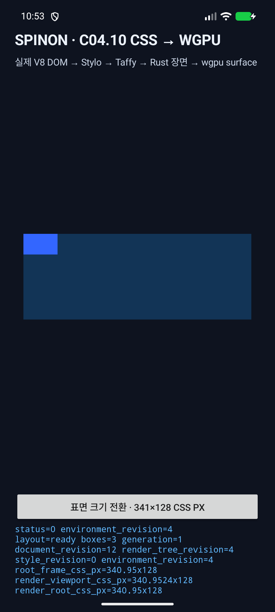
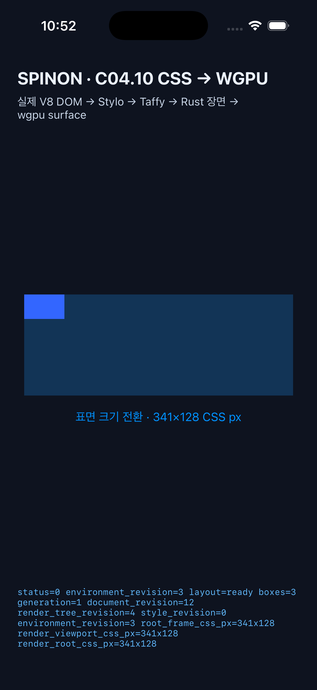

# C04.10 · Android·iOS surface resize 왕복 실행

## 실행 범위

같은 `runtime-css-to-gpu-resize.js`를 실제 V8 session에 적용한 뒤 `301×100 → 341×128 → 301×100 → 341×128` CSS viewport 변경을 확인했다. Chromium의 고정 fixture는 root가 `100vw × 100vh`로 각 viewport를 채우고 자식 frame은 고정되는 기준이다. 이 실행은 simulator/emulator의 화면 갱신 정확성을 확인하며 실기기 동작이나 성능을 증명하지 않는다.

| 환경 | 실행 구성 |
|---|---|
| Android | API 37 ARM64 emulator, display `1080×2400`, density `420 dpi` (`2.625`), 현재 Activity `dev.spinon.bootstrap/.MainActivity` |
| Android WGPU | 자동 backend 선택에서 GL / ANGLE / Vulkan SwiftShader software adapter, `Rgba8Unorm`; 실기기 GPU가 아님 |
| iOS | iPhone 17 Pro Simulator, iOS 26.2, screen scale `3` |
| Chromium 기준 | `Chrome/154.0.8037.98`, viewport `301×100`, `341×128`, device scale factor `1` |

## resize 단계 관찰

| 단계 | Android native window / WGPU texture | Android CSS viewport / root frame | iOS point / drawable | iOS CSS viewport / root frame |
|---|---|---|---|---|
| 시작 | `790×263 px` | `300.9524×100.1905` / `300.95×100.183` CSS px | `301×100 pt` / `903×300 px` | `301×100` / `301×100` CSS px |
| 확대 | `895×336 px` | `340.9524×128` / `340.95×128` CSS px | `341×128 pt` / `1023×384 px` | `341×128` / `341×128` CSS px |
| 축소 | `790×263 px` | `300.9524×100.1905` / `300.95×100.183` CSS px | `301×100 pt` / `903×300 px` | `301×100` / `301×100` CSS px |
| 재확대 | `895×336 px` | `340.9524×128` / `340.95×128` CSS px | `341×128 pt` / `1023×384 px` | `341×128` / `341×128` CSS px |

Android surface pixel 크기는 dp 경계에서 정수 반올림되므로 실제 CSS viewport가 기준보다 최대 `0.5 CSS px` 미만 다르다. 네 단계의 root frame, acquired texture와 최종 surface 색상 영역이 각각 같은 크기로 돌아오는 것을 확인했다. iOS `UIView.bounds` point 크기는 두 기준과 같고 point×3이 drawable pixel 크기다.

## 화면 캡처 확인

캡처에서 root 배경 `(18,52,86)`과 고정 크기 자식 `(51,102,255)`의 실제 pixel 영역을 세었다. 좌표의 오른쪽·아래 경계는 반개구간이다.

| 캡처 | root 배경 bbox / 크기 | 자식 bbox / 크기 |
|---|---|---|
| Android 축소 | `(145,954)–(935,1217)` / `790×263 px` | `(145,954)–(279,1035)` / `134×81 px` |
| Android 재확대 | `(92,917)–(987,1253)` / `895×336 px` | `(92,917)–(226,998)` / `134×81 px` |
| iOS 최종 확대 | `(92,1119)–(1115,1503)` / `1023×384 px` | `(92,1119)–(245,1212)` / `153×93 px` |

Android 축소 단계: [캡처](c04-runtime-css-to-gpu-resize-android-api37-baseline.png). Android는 획득 texture 크기가 새 값으로 바뀌어도 실제 화면의 root 배경이 이전 크기에 남는 문제를 먼저 재현했다. 현재 경로는 같은 V8 host를 유지하면서 render queue에서 Android renderer만 파괴·재생성한다. 확대·축소 왕복 캡처에서 root 배경 경계가 acquired texture와 일치했다.

## 로그와 재현

- [Android API 37 resize 전 과정](c04-runtime-css-to-gpu-resize-android-roundtrip-2026-10-09.log) — surface generation, renderer 파괴·생성, environment revision, root frame과 acquired texture.
- [iOS 26.2 resize 전 과정](c04-runtime-css-to-gpu-resize-ios-26.2-2026-10-09.log) — UIKit point/drawable 변경, environment revision, root frame과 acquired texture.
- Android의 301→341→301→341 전환은 emulator 화면 버튼을 순서대로 눌러 실행했다.
- iOS는 내부 시뮬레이터 실행 인자 `--spinon-c0410-auto-resize`로 동일한 세 번의 전환을 재현했다.
- `SPINON_ENABLE_C04_RUNTIME_GPU=1 mise exec -- bash tools/build-ios-sim.sh`는 `BUILD SUCCEEDED`로 끝났다. 새 앱을 iPhone 17 Pro Simulator에 설치·실행했다.
- `mise exec -- bun run test:css-reference`는 23/23 통과했다. `git diff --check`와 `mise exec -- cargo fmt --all -- --check`도 통과했다.
- Android 앱은 같은 Android API 37 emulator에 설치되어 실제 화면 전환·캡처를 수행했다. resize 수정을 포함한 Android build는 이 실행 전 작업 단계에서 성공했다.

## 미검증 경계

- Android emulator에서 Vulkan adapter를 강제하면 adapter를 찾지 못했다. 위 화면은 GL/ANGLE/SwiftShader software backend 결과다.
- Android 실기기, iOS 실기기, release 성능, renderer 재생성 비용은 측정하지 않았다.
- 연속 이벤트 폭주에 대한 제한 대기열/backpressure, 종료 중 pending draw, 강제 WGPU draw 실패는 아직 실행 검증하지 않았다. platform serial executor의 대기열은 현재 제한되지 않는다.
- 화면 캡처는 실제 surface 제출·크기 반영을 확인한다. CSS 색/좌표의 oracle 판정은 고정 Chromium JSON 및 offscreen readback 결과와 별도로 유지한다.
