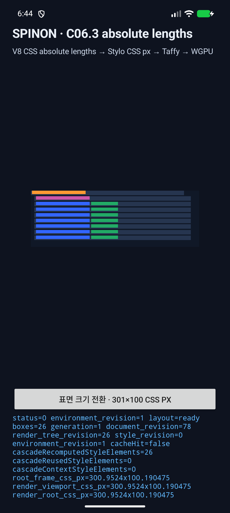
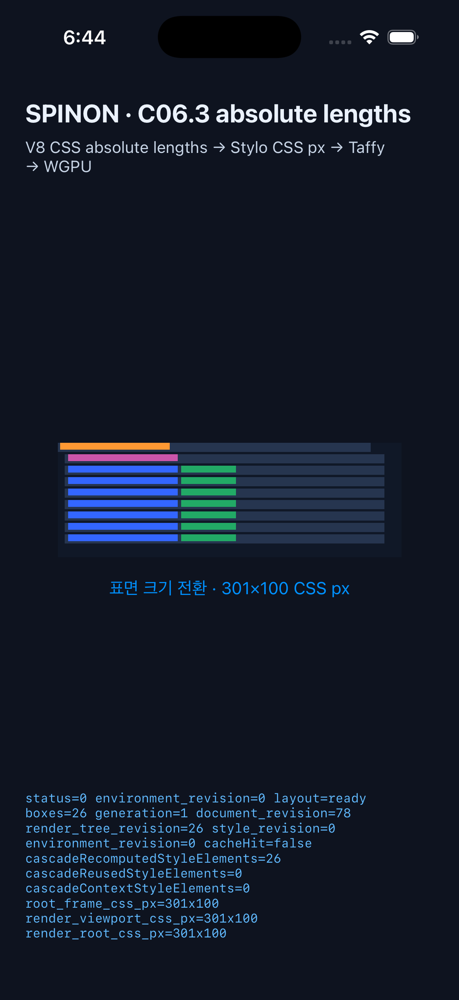

# C06.3 구현 실패 경로 검토와 실행 근거

- **검토 대상:** 현재 `feat/css-c06-unit-conversion` 작업 트리의 C06.3 절대 길이 단위 변경
- **구현 전 계획 검토:** [계획 실패 경로 20개](c06-3-absolute-lengths-plan-review-2026-10-10.md). 아래 항목은 계획표를 반복하지 않고 변경 코드·fixture·실제 실행 경계를 별도로 공격했다.
- **내부 계약:** [문서 0039 · C06.3 절대 길이 단위](../0039-c06-absolute-lengths.md), 숫자 버전 `0.1.0` 유지
- **비교 모델:** [고정 Chrome 154 oracle](../../../tests/fixtures/css/references/c06-absolute-lengths-v1.json)
- **실행 범위:** Android API 37 emulator 및 iPhone 17 Pro / iOS 26.2 Simulator. Android 실기기는 이번 검증에 사용하지 않았다.

## 구현에서 확인하고 바로잡은 점

- 이 경계에는 별도 절대 단위 수식 변환기를 추가하지 않았다. Stylo가 절대 길이를 computed `CSSPixelLength`로 정규화하고, 기존 typed bridge가 `.px()` 값을 `LengthPx`로 전달한다. 구현 전 확인한 소스와 runtime 결과가 같은 책임 분리를 사용한다.
- runtime fixture가 UI 진입점까지 연결되지 않았던 부분을 Android Intent/JNI와 iOS launch argument/Objective-C++/Swift 경로에 추가했다. 두 플랫폼에서 실제 fixture가 26개 노드를 만들고 `layout=ready` 결과를 그렸다.
- Rust oracle 비교는 26개 node의 네 frame 필드를 검사한다. 이번 고정 입력의 최대 절대 오차는 `0 CSS px`, 허용치는 각 필드 `0.5 CSS px`다.
- 작업 중 첫 동적 HostDocument fixture가 잘못된 owner ID로 commit을 거부했다. fixture 변경과 같은 owner ID를 사용하도록 수정한 뒤 관련 Rust 테스트를 다시 통과시켰다. 상수 `calc(1in)` 처리의 범위 수정은 별도 계획 검토 기록에만 두고 아래 구현 검토 항목에는 중복 산입하지 않았다.

## 구현 코드·실행의 서로 다른 실패 경로 20개

| # | 공격한 실패 경로 | 확인 결과 |
|---:|---|---|
| 1 | `in`, `cm`, `mm`, `Q`, `pt`, `pc`가 CSS 절대 길이 표준 배율과 달라지는가 | 7개 단위와 `px` 동치 fixture를 Stylo computed typed 값·Chrome oracle로 확인했다. 기준은 `1in = 96 CSS px`다. |
| 2 | Stylo에서 이미 정규화한 값을 Spinon이 다시 단위 배율로 변환하는가 | bridge는 `length.px()` 결과를 `LengthPx`로 저장한다. Rust typed 값과 모든 frame이 일치했고, 중복 변환 경로가 없다. |
| 3 | CSS 길이를 device pixel, Android `dp`, iOS point로 잘못 해석하는가 | DPR 1과 3의 26-node CSS frame이 `0.001 CSS px` 비교 기준 안에서 같았고, 실제 platform fixture도 CSS viewport를 별도 보고했다. |
| 4 | 폭의 절대 단위가 다른 node나 선언에 연결되는가 | 고정 reference의 DOM ID와 각 element의 computed property 및 frame을 대조했다. 26개 node 모두 통과했다. |
| 5 | `width`와 `height`의 절대 단위가 `LengthPx`로 보존되는가 | 단위별 width `96px` 및 height `6px` typed DTO와 최종 frame을 검사했다. |
| 6 | `flex-basis`에서 값이 문자열·percentage로 오분류되는가 | 단위별 basis `48px` typed DTO와 Flex item geometry를 검사했다. |
| 7 | `margin`, `padding`, `column-gap`에서 절대 단위가 누락되는가 | 각 단위 row의 margin `6px`, padding `3px`, gap `3px` typed 값과 Chrome frame을 검사했다. |
| 8 | signed 절대 margin 부호를 잃거나 양수로 clamp하는가 | `-4.5pt`를 `-6px`로 유지하고 Chrome의 row·child 위치와 비교했다. |
| 9 | 음수 크기·padding·gap을 layout에서 허용하는가 | 기존 finite/nonnegative validation과 layout fail-closed 검사를 전체 workspace 테스트로 확인했다. negative margin은 별도 허용 경로다. |
| 10 | 대소문자 `Q` 또는 CSS parser unit recovery가 깨지는가 | authored `Q` 선언은 고정 Chrome CSSOM reference와 대조했다. unknown `1spinon` 뒤 valid `10px` 선언이 남는 별도 regression test도 통과했다. |
| 11 | custom property에서 절대 단위 의미를 잃는가 | `--physical-length: 2.54cm` → `var(...)` width를 typed `96px`와 Chrome oracle로 확인했다. |
| 12 | 상수 `calc(1in)`가 Stylo에서 해소된 뒤 거부되거나 잘못 변환되는가 | computed `CSSPixelLength(96px)` 결과와 frame width `96px` 테스트가 통과했다. |
| 13 | `calc(1in + 10%)` 잔여 calc variant를 절대 길이로 추측하는가 | 해당 width가 `UnsupportedComputedValue`로 실패하는지 확인했다. C06.5 범위를 조용히 앞당기지 않는다. |
| 14 | unit 없는 비유한 값 또는 지원하지 않는 값이 0px로 대체되는가 | 기존 `UnsupportedComputedValue`·`InvalidStyle` 경계와 workspace negative tests를 확인했다. implicit zero fallback은 없다. |
| 15 | authored unit 또는 computed property를 재파싱해 Stylo cascade 결과를 바꾸는가 | runtime bridge가 typed `ComputedValues` variant를 소비하는 코드 경로를 확인했고, 26-node computed CSSOM reference를 대조했다. |
| 16 | Chrome 기준 파일이 다른 fixture·실행 파일·캡처 소스로 바뀌어도 통과하는가 | reference hash와 Chrome revision을 고정하는 Node 테스트를 실행했다. `tools/css-reference/c06-absolute-lengths.test.mjs` 4개 모두 통과했다. |
| 17 | oracle 마지막 row가 viewport 밖이라 테스트에서 누락되는가 | inventory/reference의 전체 26개 ID와 유한 rect 및 마지막 row 경계를 검사하는 Node 테스트가 통과했다. 마지막 row는 Chrome root 높이 안에 있다. |
| 18 | Android 진입 extra·Java native 선언·JNI 심볼·FFI 호출이 서로 어긋나는가 | API 37 emulator에서 `--ez spinon_c063_absolute_lengths true` 뒤 `SPINON_C063_EVAL status=0`, `boxes=26`, `layout=ready`와 draw `presented`를 확인했다. 실제 Android 캡처를 함께 보관했다. |
| 19 | iOS launch argument·AppDelegate route·Swift selector·Objective-C++ FFI 경계가 단절되는가 | iPhone 17 Pro / iOS 26.2 Simulator에서 `--spinon-c063-absolute-lengths`로 실행해 `status=0`, `boxes=26`, `layout=ready`, draw `presented`와 화면을 확인했다. |
| 20 | eval 로그만 성공하지만 실제 장면이 그려지지 않거나 GPU 조건을 과장하는가 | 두 화면 캡처와 draw 결과를 함께 대조했다. Android는 GL/ANGLE·SwiftShader software renderer였고 iOS는 Simulator Metal 경로다. 실기기·hardware GPU·성능 주장은 하지 않는다. |

## 실행한 검사와 결과

- `mise exec -- cargo test --locked -p spinon-style-to-layout absolute_length -- --nocapture` — C06.3 Rust 테스트 5개 통과. geometry 최대 오차 `0 CSS px / 0.5 CSS px`.
- `node --test tools/css-reference/c06-absolute-lengths.test.mjs` — 4개 통과.
- `mise exec -- bun run test` — JS 2개, 전체 CSS reference 37개, Android physical-touch harness 29개, Rust workspace 전부 통과.
- `mise exec -- cargo clippy --locked --workspace --all-targets -- -D warnings` — 통과.
- `mise exec -- cargo fmt --all -- --check` 및 `git diff --check` — 통과.
- `SPINON_ENABLE_C04_RUNTIME_GPU=1 mise exec -- bun run build:android` — APK 빌드 성공; `emulator-5554` API 37에서 C06.3 실제 V8→WGPU fixture 실행.
- `SPINON_ENABLE_C04_RUNTIME_GPU=1 mise exec -- bun run build:ios-sim` — iOS Simulator build 성공; iPhone 17 Pro / iOS 26.2에서 C06.3 실제 V8→WGPU fixture 실행.

## 화면과 원본 로그

- Android 원본 요약 로그: [`android-api37.log`](c06-absolute-lengths/android-api37.log)
- iOS 원본 요약 로그: [`ios-26.2.log`](c06-absolute-lengths/ios-26.2.log)

iOS unified log가 긴 eval payload를 약 1 KiB 지점에서 자르므로 해당 로그의 eval 행에는 `boxes=26` 뒤쪽 전체 필드가 남지 않는다. 같은 실행의 짧은 `DRAW` 행에는 `presented boxes=26`이 있고, 저장한 Simulator 캡처의 상태 label에는 `layout=ready boxes=26` 전체가 보인다. 이는 성공 수치를 누락된 로그에서 추정한 것이 아니다.

이 결과는 C06.3 제한 runtime profile만 입증한다. 외부 CSS URL, `font-size`/text metrics, font-relative 및 viewport/container 단위, 미지원 mixed `calc()`, CSSOM, 전체 CSS/HTML 호환성, 실기기 및 hardware GPU 동작은 여전히 미완료다.
