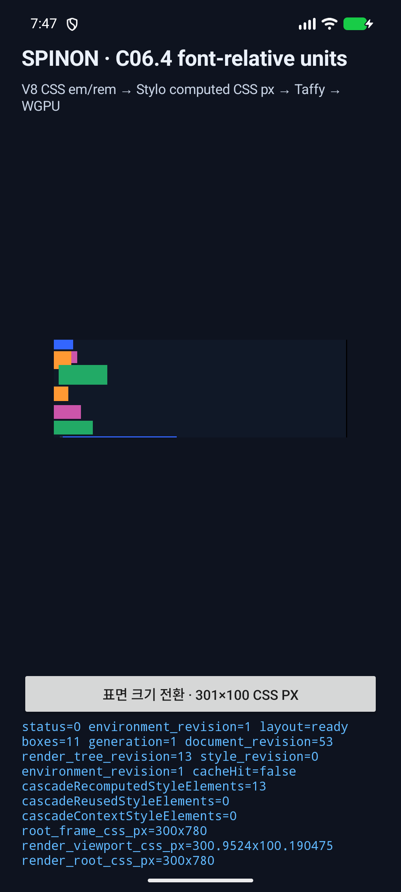
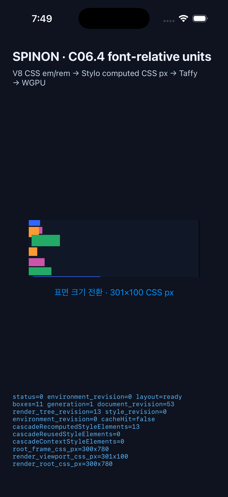

# C06.4 구현 실패 경로 검토와 실행 근거

- **검토 대상:** `feat/css-c06-unit-conversion` 작업 트리의 C06.4 `em`·`rem` 및 `font-size` 연결
- **계획 검토:** [계획 실패 경로 20개](c06-4-font-relative-units-plan-review-2026-10-10.md)와 다른 코드·테스트·실행 실패 경로를 검토했다.
- **내부 계약:** [문서 ID 0040 · C06.4 글꼴 상대 길이 단위](../0040-c06-font-relative-units.md). 문서 ID는 버전이 아니며, 내부 숫자 계약·crate 버전은 출시 전 `0.1.0`으로 유지한다.
- **비교 모델:** 고정 Chrome 154.0.8037.98, CSS viewport 320×800, DPR 1·2.
- **실행 범위:** Android API 37 emulator와 iPhone 17 Pro / iOS 26.2 Simulator. Android 실기기는 사용하지 않았다.

## 구현에서 발견해 수정한 결함

- iOS AppDelegate가 C06.4 launch argument를 런타임 GPU 화면으로 전달하지 않아 해당 실행 인자가 무시될 수 있었다. `--spinon-c064-font-relative-units` 경로를 등록한 뒤 새 앱 빌드와 실제 Simulator 실행에서 `SPINON_C064_EVAL` 및 WGPU `presented`를 확인했다.
- 합성 `body` UA 기본값을 추가하면서 incremental UA selector 회귀 테스트의 고정 허용 목록이 갱신되지 않았다. `body` selector를 기대 집합에 포함하고 전체 workspace 테스트를 다시 통과시켰다.
- Clippy가 지적한 중첩 조건과 테스트 baseline의 복잡한 튜플을 단순화했다. 동작 의미는 바꾸지 않았으며 Clippy와 전체 Rust workspace 테스트를 다시 통과시켰다.

## 서로 다른 구현 실패 경로 20개

| # | 공격한 실패 경로 | 확인 결과 |
|---:|---|---|
| 1 | 기존 HostRoot mount를 CSS 문서 루트로 오인해 `rem` 기준을 10px로 계산하는가 | 합성 `html`·`body`와 mount를 분리했다. Rust oracle에서 문서 root 20px, mount 10px을 각각 확인했다. |
| 2 | `:root { font-size: 1.25rem }`의 자기 참조 `rem`이 새 root 값에 순환 의존하는가 | Chrome 기준의 초기 16px 계산에 따라 root가 20px이 되는 값을 검사했다. |
| 3 | 합성 `body`가 상속되는 font-size·direction·custom property를 끊는가 | `body`의 RTL direction·40px font-size·`2em` custom property를 HostRoot mount와 자식까지 전파하는 cascade test가 통과했다. |
| 4 | `font-size: 1.2em`과 일반 `width: 2em`이 같은 기준 글꼴 크기를 잘못 사용하는가 | 부모 기준 12px font-size, 해당 요소 기준 24px width를 Chrome reference와 대조했다. |
| 5 | 자식의 `font-size: 1.5em`이 부모 font-size 대신 자신의 미계산 값을 참조하는가 | 부모 12px에서 자식 18px 및 자식 `1em` 크기를 비교했다. |
| 6 | percentage `font-size`가 layout percentage로 전달되거나 parent size 없이 계산되는가 | 10px mount의 150% font-size가 15px가 되는 Chrome computed value와 frame을 비교했다. |
| 7 | root font-size가 0일 때 기본 16px로 대체되어 `rem`이 커지는가 | 0px root font-size를 그대로 유지하고 `em`·`rem` 크기도 0px가 되는 테스트가 통과했다. |
| 8 | `var()`로 공급된 `em`·`rem`이 단위 typed value로 복구되지 않는가 | custom-property substitution 뒤의 computed width를 Chrome reference와 대조했다. |
| 9 | em/rem이 width·height·flex-basis·margin·padding·gap 중 일부에서 누락되거나 중복 환산되는가 | Stylo computed typed 값과 Taffy 입력/최종 frame을 속성별로 대조했다. |
| 10 | Flex layout 이후 Chrome의 resolved height를 Stylo의 사전 computed height와 같은 값으로 오인하는가 | flex item typed input과 최종 rect를 따로 비교해 computed/used 단계를 분리했다. |
| 11 | DPR 2에서 CSS px 값이나 Taffy frame이 두 배가 되는가 | 동일 fixture의 DPR 1·2 computed property와 frame map을 정확 비교했다. |
| 12 | 일부 node/property만 골라 비교해 fixture 차이를 숨기는가 | Chrome reference의 각 지원 node x/y/width/height를 검사하고 필드별 절대 오차 `0.5 CSS px` 기준을 적용했다. |
| 13 | 합성 html/body의 width·height·flex-basis가 box 없이 조용히 사라지는가 | 해당 계산값은 `UnsupportedSyntheticDocumentStyle` 오류로 닫는 테스트가 통과했다. |
| 14 | 합성 html/body의 margin·padding 변경이 앱 mount 위치에서 사라지는가 | nonzero/auto spacing을 실패시키는 테스트가 통과했다. |
| 15 | 합성 wrapper의 display 변경이 화면에는 반영되지 않는데 성공 처리되는가 | `display:block` 이외의 값과 body `display:none`을 오류로 거부했다. |
| 16 | 합성 html/body background paint가 Taffy/GPU 상자 없이 누락되는가 | 투명 이외 배경을 `UnsupportedSyntheticDocumentStyle`로 거부했다. |
| 17 | 실제 font metric이 필요한 `ex`·`rex`·`ch`·`rch`·`cap`·`rcap`·`ic`·`ric`·`lh`·`rlh`가 임의 기본값으로 통과하는가 | 10개 단위 각각을 inline length·`font-size`, stylesheet length·custom-property substitution/fallback, inline fallback, 중첩 함수 등 8개 입력 형태에서 모두 fail-closed했다. |
| 18 | 중첩 함수·escaped unit을 놓치거나 주석/문자열의 비슷한 글자를 단위로 오인하는가 | nested/escaped token 테스트, string/comment negative control, malformed CSS 거부 테스트가 통과했다. |
| 19 | 새 metric 검사기가 기존 일반 cascade profile까지 불필요하게 차단하는가 | runtime layout profile에만 검사기가 적용되고 기본 cascade scanner는 그대로 동작하는 테스트가 통과했다. |
| 20 | 앱 진입 인자·JNI/Objective-C++ FFI·V8 평가·layout·GPU 제출 중 한 경계가 끊겨도 성공처럼 보이는가 | Android API 37 emulator와 iPhone 17 Pro / iOS 26.2 Simulator에서 모두 `status=0`, `layout=ready`, `boxes=11`, WGPU `presented` 및 별도 화면 캡처를 확인했다. iOS 진입 누락은 수정 후 검증했다. |

## 실행 결과

- `mise exec -- bun run test` — JavaScript 2개, CSS reference 41개, Android touch harness 29개와 Rust workspace 전체 통과.
- `mise exec -- cargo test --locked --workspace` — 전체 Rust workspace 통과.
- `mise exec -- cargo clippy --locked --workspace --all-targets -- -D warnings` — 통과.
- `mise exec -- cargo fmt --all -- --check` 및 `git diff --check` — 통과.
- `cargo test -p spinon-style font_relative_units_tests` — 8개 통과. font metric 10개 단위와 8가지 입력 경계를 조합한 negative cases를 포함한다.
- `cargo test -p spinon-style-to-layout runtime_em_rem_computed_values_and_taffy_frames_match_chromium` — 1개 통과. 모든 HostDocument layout frame이 각 축 `0.5 CSS px` 이내이고 DPR 1·2 결과가 같았다.
- `cargo test -p spinon-ffi --lib` — 23개 통과.
- `node --test tools/css-reference/c06-font-relative-units.test.mjs` — 4개 통과.
- `SPINON_ENABLE_C04_RUNTIME_GPU=1 mise exec -- bun run build:android` — APK 빌드 성공. `emulator-5554`에 명시적으로 설치·실행했다. 기기 목록에 실기기가 연결되어 있었지만 검증 대상은 emulator뿐이다.
- `SPINON_ENABLE_C04_RUNTIME_GPU=1 mise exec -- bun run build:ios-sim` — iOS Simulator 앱 빌드 성공. `--spinon-c064-font-relative-units` 실행으로 V8 fixture 평가와 WGPU frame 제출을 확인했다.
- Android renderer 로그는 ANGLE/SwiftShader software renderer를 보고한다. 실기기, hardware GPU, 성능은 검증하지 않았다.

## 화면과 원본 로그

- Android: [실행 로그](c06-font-relative-units/android-api37.log) · [API/model](c06-font-relative-units/android-release.txt)
- iOS: [실행 로그](c06-font-relative-units/ios-26.2.log) · [Simulator](c06-font-relative-units/ios-device.txt)
- Chrome 수치 기준: [고정 reference](../../../tests/fixtures/css/references/c06-font-relative-units-v1.json)

C06.4는 현재 작업 브랜치에서 구현·검증했으며 아직 병합되지 않았다. 공개 CSS API, text shaping, font loading/fallback 및 실제 font metric 단위 지원을 선언하지 않는다.
