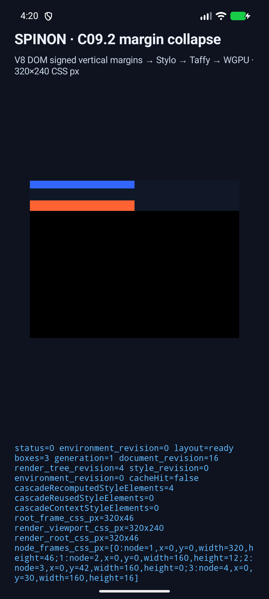
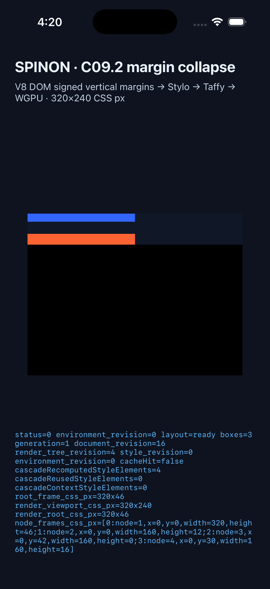

# C09.2 구현 실패 관점 검토와 시뮬레이터 근거

## 범위

- 대상: C09.2 수직 margin collapse의 내부 fixture, Taffy 연결 확인, Android·iOS V8 실행 경로.
- 내부 계약: [`0047`](../0047-c09-block-formatting.md), 숫자 버전 `0.1.0` 고정. 공개 API가 아니다.
- 비교 기준: Chromium `154.0.8037.98`, revision `@b859317bf11f6be47f9b7799ec690a0a42a1fb33`, viewport `320×240` CSS px, DPR 1·2.
- 고정 reference v2는 전체 30개 case·103개 node다. 이번 비교는 C09.2의 16개 case·57개 node다.
- 이 결과는 시뮬레이터 검증이다. 실기기 동작·성능, `flow-root`, float·clear·clearance, inline line box, CSS root margin propagation을 주장하지 않는다.

## 적대적 검토 관점

| # | 공격 관점 | 확인한 실패 경로와 결과 |
| --- | --- | --- |
| 1 | reference가 변경된 fixture를 조용히 가리키는가 | reference v2의 HTML·inventory·capture 도구·공통 Chromium helper SHA-256과 Chrome 실행 파일 hash를 테스트에서 다시 계산한다. 모두 고정값과 일치했다. |
| 2 | reference 재생성이 기존 기준을 덮어쓰는가 | capture 도구의 기존 파일 거부 경로와 v2 고정 입력 검사를 확인했다. 이전 v1은 변경하지 않고 과거 기준으로 남겼다. |
| 3 | fixture node 순서나 parent ID가 collapse 결과를 우연히 맞추는가 | 각 case의 tree를 preorder로 펼쳐 양 DPR reference의 node ID·parent ID와 전부 비교한다. C09.2 16개 case에서 누락·중복·순서 차이가 없다. |
| 4 | 양수 형제 margin을 더해서 과도한 간격을 만드는가 | `c092-positive-siblings`에서 양수 margin이 합이 아니라 큰 값으로 collapse하며 다음 형제 y=40임을 확인했다. |
| 5 | 음수만 있는 형제 margin을 0으로 잘라내는가 | `c092-negative-siblings`에서 음수 collapse 후 다음 형제 y=-20, root 높이 0을 Chromium과 대조했다. |
| 6 | 양수·음수 strut에서 음수 절댓값을 빼지 않거나 부호를 뒤집는가 | `c092-signed-self-collapse`의 empty node와 마지막 형제 위치를 확인했다. 보완한 실제 V8 fixture도 +30px와 -12px의 strut 결과로 마지막 node y=30을 보고한다. |
| 7 | 분수 CSS px를 정수화해 DPR별 결과를 바꾸는가 | `c092-fractional-signed-collapse`는 y=28.25 및 root 높이 38.25를 보존한다. 모든 C09.2 frame은 DPR 1·2 사이 완전히 같은 CSS px 값이다. |
| 8 | 부모-첫 자식 margin을 형제 규칙으로 처리하거나 root 경계를 넘는가 | `c092-parent-first-child`에서 부모와 첫 자식의 y=20을 각각 oracle에 대조했다. HostRoot fragment에는 CSS 부모를 만들지 않는 계약을 유지한다. |
| 9 | 부모-마지막 자식 collapse가 다음 형제 위치에 누락되는가 | `c092-parent-last-child`에서 부모의 아래 margin과 자식 margin이 다음 sibling에 반영되어 y=30인지 확인했다. |
| 10 | 빈 Block의 top/bottom margin strut을 분리하는가 | `c092-signed-self-collapse`에서 height 0 empty node와 마지막 node y=28을 확인해 self-collapse 경로를 대조했다. |
| 11 | min-height가 생긴 빈 상자도 계속 self-collapse하는가 | 기존 barrier case만으로는 이 조합을 직접 입증하지 못해, 내용이 없는 `height:0; min-height:1px` 상자와 자체 top/bottom margin을 가진 fixture를 추가했다. 새 oracle는 used height 1, 마지막 node y=61, root 높이 71을 요구한다. |
| 12 | 고정 height를 auto-height 부모처럼 취급하는가 | `c092-fixed-height-barrier`에서 parent height 20, 뒤쪽 node y=35를 확인했다. |
| 13 | `min-height` 부모 barrier가 child margin에 무시되는가 | `c092-min-height-barrier`에서 `min-height:1px`와 뒤쪽 node y=30을 확인했다. |
| 14 | 세로 percentage margin을 높이 기준으로 계산하는가 | `c092-percentage-margins`에서 320px containing block inline size에 대한 percentage 변환과 collapse 결과(y=40, root 높이 50)를 확인했다. |
| 15 | `display:none` 자손의 margin이 주변 흐름으로 새는가 | `c092-hidden-margin-subtree`의 hidden parent·child frame이 0이고 다음 visible node가 y=40인지 확인했다. |
| 16 | `border-style:none`·`hidden`의 지정 폭을 used border로 오인하는가 | 두 reference case에서 computed used `border-top-width`가 0px이고 child y=20임을 확인했다. 테스트는 선언 폭이나 Typed OM 원문이 아니라 실제 사용 폭을 비교하도록 정리했다. |
| 17 | 실제 nonzero border 또는 padding 장벽이 collapse를 막는가 | `c092-border-solid`에서 used border 4px와 child y=24, `c092-padding-barrier`에서 child y=21을 확인했다. |
| 18 | 테스트가 Chromium만 검사하고 실제 layout adapter의 차이를 놓치는가 | Rust runtime 테스트에서 Taffy 경로로 C09.2 16개 case·57개 node를 DPR 1·2 각각 실행해 geometry·선택한 computed style·DPR 간 동일성을 검사했다. pinned Chromium과 모든 지원 값이 일치했다. |
| 19 | 새 fixture가 한 플랫폼의 FFI 또는 앱 진입점에서 빠지는가 | C fixture source, C 헤더, JNI, Android Java·launch route, Objective-C++·Swift, iOS launch argument를 연결하는 정적 회귀 검사를 추가했다. 실제 두 플랫폼 로그에서 공통 `SPINON_C09_BLOCK_HOST`와 C09.2 eval을 확인해 host 로그 분류도 맞췄다. |
| 20 | 레이아웃 성공 로그만 있고 실제 화면 제출은 실패하는가 | Android API 37 emulator에서 `layout=ready`, 3개 box, root `320×46`, node frame 및 WGPU 제출을 확인했다. iPhone 17 Pro / iOS 26.2 Simulator에서 같은 V8 fixture, `layout=ready`, 3개 box·root `320×46`을 화면에서 확인하고 WGPU 제출 로그를 보존했다. 실기기나 hardware GPU 결과로 확대 해석하지 않는다. |

## 발견해 반영한 수정

- self-collapse가 유지되는 `min-height` 빈 상자 조합을 직접 증명하는 fixture가 빠져 있어 독립 case를 추가했다.
- `border-style:none`·`hidden` 검증은 선언된 폭과 used 폭을 섞지 않도록 실제 사용 폭 oracle에 맞췄다.
- Android·iOS의 공통 C09 Block host 로그를 C09.1 전용 이름으로 기록하던 부분을 공통 이름으로 고쳤다.
- 별도 margin-collapse 알고리즘을 중복 구현하지 않는다. Stylo typed style을 전달받는 pinned Taffy 0.14.0 Block 경로와 Chromium oracle의 일치를 검증한다.

## 검증 결과

| 검증 | 결과 |
| --- | --- |
| `mise exec -- bun run css:reference:c09-block-formatting` | Chrome 154 reference v2 생성, 30개 case·103개 node, DPR 1·2 |
| `mise exec -- node --test tools/css-reference/c09-block-formatting.test.mjs` | 8개 통과 |
| `mise exec -- bun run test:css-reference` | 84개 통과 |
| `mise exec -- cargo test --locked -p spinon-runtime c092_margin_collapse_matches_pinned_chromium_for_all_cases -- --nocapture` | C09.2 전체 16개 case·57개 node 비교 통과 |
| `mise exec -- cargo test --locked -p spinon-runtime` | 단위·통합·lifecycle 테스트 통과; 기존 ignore 2개 |
| `mise exec -- cargo test --locked --workspace` | 전체 workspace 성공 |
| `mise exec -- cargo fmt --all -- --check` | 통과 |
| `mise exec -- cargo clippy --locked --workspace --all-targets -- -D warnings` | 통과 |
| Android API 37 emulator | 빌드·설치·실제 V8 eval·layout·WGPU 제출 통과. emulator renderer는 ANGLE/SwiftShader software 경로다. |
| iPhone 17 Pro / iOS 26.2 Simulator | 빌드·설치·실제 V8 eval·layout·WGPU 제출과 화면 확인 통과. 실기기 측정은 하지 않았다. |

## 화면과 원시 근거

### Android API 37 emulator

- [Android logcat](./c09-2-margin-collapse/android.log)
- node frame: root `320×46`; 첫 상자 `y=0, h=12`; 빈 상자 `y=42, h=0`; 마지막 상자 `y=30, h=16`.
- 화면에 보이는 blue/coral 상자, `layout=ready`, `boxes=3`는 이 로그와 같은 실행이다. 이 작은 fixture는 서로 collapse하는 margin의 차이를 눈으로 확인하게 한다.

### iPhone 17 Pro / iOS 26.2 Simulator

- [iOS unified log](./c09-2-margin-collapse/ios.log)
- 화면에서 root `320×46`, 세 child frame, `layout=ready`, `boxes=3`를 확인했다. unified log provider가 긴 eval 줄을 자르므로 전체 frame 목록은 화면 캡처에 보존했다.

## 남은 한계

- 16개 fixture는 내부 profile의 선택된 Block 조건만 다룬다. 모든 CSS margin-collapse 조합을 보장하지 않는다.
- `flow-root`와 BFC 간 경계는 C09.3, float·clear·clearance는 C26, inline line box는 C15에서 다룬다.
- Android 결과는 emulator의 ANGLE/SwiftShader software renderer다. iOS는 Simulator다. 실기기 성능과 hardware GPU 차이는 측정하지 않았다.
- 이번 변경은 border 선 paint를 추가하지 않는다. border width가 레이아웃 장벽으로 계산되는 것과 화면에 선을 그리는 일은 별도 항목이다.
