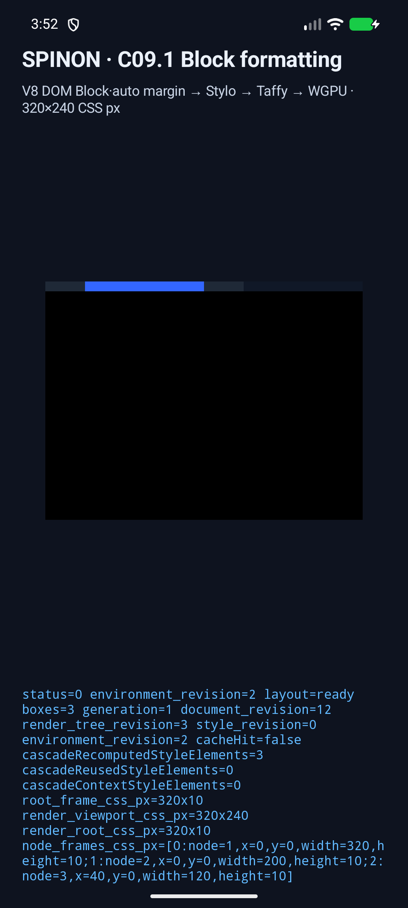
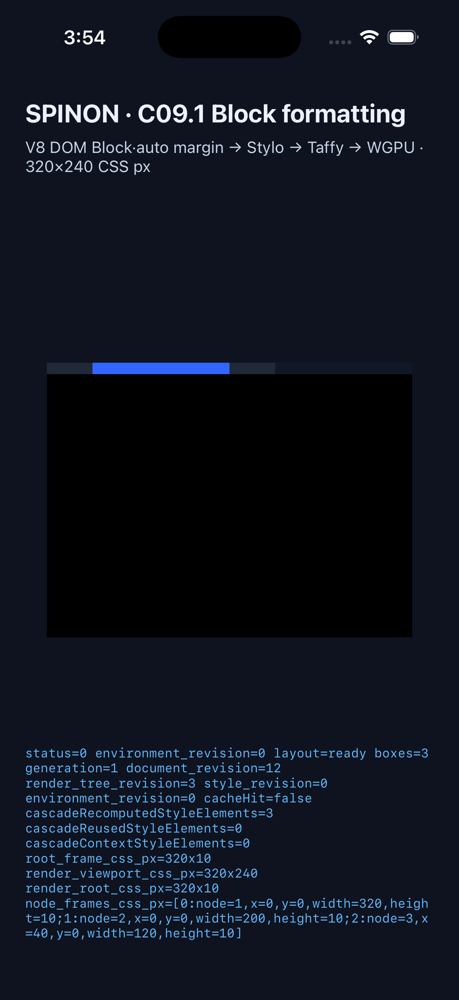

# C09.1 구현 변경 검토와 시뮬레이터 근거

## 범위

- 대상: C09.1 normal Block geometry 구현 branch; 내부 계약 `0047`, 숫자 버전 `0.1.0` 고정.
- 비교 기준: 고정 Chromium `154.0.8037.98`, revision `@b859317bf11f6be47f9b7799ec690a0a42a1fb33`, viewport `320×240` CSS px, DPR 1·2.
- C09 기준 전체는 23개 case·76개 node다. C09.1 범위인 10개 case·30개 node를 Rust/runtime에서 비교했다. C09.2–C09.4는 이 결과에 포함하지 않는다.
- 실제 기기 성능 또는 hardware GPU에 대한 주장은 하지 않는다.

## 수정한 결함

처음에는 inline `display:grid`가 Stylo computed snapshot에서 `block`으로 나타나 Taffy projection과 runtime이 성공하는 경우를 재현했다. 이 값만 검사하면 지원 밖 layout model을 Block으로 위장할 수 있었다. C09.1은 CSS token parser로 inline style과 `<style>` author rule의 원문 `display` 선언을 검사하고, 지원하지 않는 알려진 값은 node 또는 stylesheet ID와 함께 실패하도록 변경했다. 이 검사는 comment/string 안의 단어는 무시하고, `!important`, 대소문자, CSS escaped identifier를 처리한다. CSS 문법상 무효한 알 수 없는 keyword는 Stylo의 일반 CSS recovery에 남긴다.

원문 선언 검사에는 범위 제약이 있다. 이 제한 profile은 선택되지 않는 selector나 나중에 덮이는 fallback 선언의 `display:grid`도 거부한다. 적용 요소별 selector/cascade winner만 판정하는 웹 동작과 같다고 주장하지 않는다. 이 제한은 내부 계약 `0047`에도 기록했다.

## 적대적 변경 검토

| # | 공격 관점 | 확인과 결과 |
| --- | --- | --- |
| 1 | Stylo가 `display:grid`를 `block`으로 바꿀 때 성공하는가 | 재현 뒤 원문 토큰 사전 검사로 수정했다. inline 회귀 테스트는 node와 `grid` 값이 포함된 실패를 요구한다. |
| 2 | `<style>`·중첩 규칙에서 같은 fallback이 생기는가 | 원문 parser가 grouping at-rule과 CSS nested style rule을 재귀 검사하도록 연결했다. 일반 author rule runtime regression에서 stylesheet ID와 `grid` 오류를 확인하고, nested rule·at-rule prelude 오탐도 parser unit test로 확인했다. 현 profile은 at-rule 자체를 지원 범위 밖으로 거부한다. 중첩 깊이는 64에서 실패시킨다. |
| 3 | CSS 대소문자·escape·`!important`가 우회로 쓰이는가 | `GRID`, `gr\\69 d !important` parser test에서 동일하게 거부한다. |
| 4 | 주석이나 문자열의 `display:grid`가 오탐되는가 | comment·string fixture는 거부하지 않으며 CSS token 경계에서만 선언을 찾는다. |
| 5 | 무효한 `display:unknown-value`를 유효한 미지원 layout으로 오인하는가 | parser helper negative control이 통과해 Stylo의 CSS recovery에 남는다. |
| 6 | `display:var(...)`가 computed fallback을 숨길 수 있는가 | 현재 C09.1 profile에서 `var()`는 지원하지 않는 값으로 거부한다. |
| 7 | 허용 값 `block`·`none`도 차단되는가 | inline parser unit과 Chromium C09.1 fixture 비교에서 허용된다. |
| 8 | selector prelude·content 문자열의 `display` 단어가 선언으로 오인되는가 | stylesheet parser는 규칙 body의 declaration만 검사한다. selector·`content` 문자열 negative control이 통과한다. |
| 9 | 지원 밖 display가 inline·flow-root·flex·grid·table에서 달리 빠져나가는가 | runtime matrix가 다섯 모델을 각각 실패 코드와 값으로 확인한다. |
| 10 | `direction:rtl` 또는 vertical writing이 LTR Block으로 묵살되는가 | rtl은 inline property 실패, `writing-mode`는 node/속성이 남는 Stylo diagnostic으로 닫는다. |
| 11 | viewport를 앱 DOM node로 만들어 frame 수를 부풀리는가 | 10개 Chromium case에서 node ID·부모·preorder와 frame count를 대조하며 viewport 합성 입력은 결과 노드에서 제외된다. |
| 12 | root auto margin이 viewport 폭 대신 콘텐츠 폭을 쓰는가 | 별도 회귀에서 viewport 320, node width 100일 때 `x=110`을 확인한다. |
| 13 | over-constrained LTR과 음수·분수 margin이 정수화되거나 잘못 분배되는가 | pinned Chromium의 node별 x/width 및 computed value를 0.5 CSS px 기준과 DPR 1·2로 대조한다. |
| 14 | auto height와 자식 수직 배치가 합성 root에 누출되는가 | Chromium oracle의 부모·자식 geometry 및 normal-flow 순서를 10개 C09.1 case에서 확인한다. |
| 15 | nested percentage가 viewport 기준으로 잘못 해석되는가 | definite/indefinite containing block case를 oracle과 비교해 기존 C06 basis를 재사용한다. |
| 16 | C06/C07 box-sizing·min/max·border가 중복 가산되는가 | typed projection과 Taffy 경로를 확인하고 reference frame 및 기존 layout regression이 통과했다. border는 geometry만 반영한다. |
| 17 | `display:none` subtree가 레이아웃 또는 paint에 남는가 | C09.1 hidden case의 preorder/zero frame을 비교하고 renderer의 hidden-node filtering 및 기존 C08 regression을 확인했다. |
| 18 | 오류 이후 partial frame이나 stale scene이 성공으로 노출되는가 | 계산은 전체 `Result` 실패를 반환하고 성공 경로에서 같은 revision/frame set을 검증한다. 기존 stale revision·failure-atomic layout tests를 포함한 workspace가 통과했다. |
| 19 | 새 FFI 진입점에서 null output·0 capacity·짧은 출력 버퍼가 손상되는가 | 새 함수는 null/zero capacity를 먼저 거부하고 공용 `write_host_status`를 사용한다. 공용 ABI의 null·exact-capacity·short-buffer tests와 Android/iOS 링크를 통과했다. |
| 20 | 한 플랫폼만 fixture를 실행하거나 화면 캡처 전에 그리기를 확인하지 않는가 | Android API 37 emulator와 iPhone 17 Pro/iOS 26.2 Simulator에서 같은 V8 fixture를 실행했다. 두 로그 모두 `layout=ready`, 세 frame, 320×240 viewport, WGPU `presented boxes=3`를 확인한 뒤 화면을 저장했다. |

이 검토에서 발견한 silent `display:grid` fallback은 수정했다. 문서화된 미지원 경계 밖에서 남은 의도적 제약은 source-wide display preflight, C09.2–C09.4 미구현, border 선 paint 미구현이다. 마지막 항목은 C22 소유 범위이며 C07.2 border width는 레이아웃 계산만 한다.

## 검증 결과

| 검증 | 결과 |
| --- | --- |
| `cargo fmt --all -- --check` 및 `git diff --check` | 통과 |
| `cargo test --locked --workspace --quiet` | 425 통과, 2 ignored, 0 실패 |
| `cargo clippy --locked --workspace --all-targets -- -D warnings` | 통과 |
| `mise exec -- bun run test:css-reference` | 83 통과, 0 실패. C09 Chromium reference 고정 입력 검증 포함 |
| `bun run test:js` | 2 통과, 0 실패 |
| `bun run test:benchmark:r05-physical-touch` | 29 통과, 0 실패 |
| Android API 37 ARM64 emulator (compile SDK 37.2), `SPINON_ENABLE_C04_RUNTIME_GPU=1 mise exec -- env SPINON_V8_DIR=… bun run build:android` | APK 빌드·설치·C09.1 실행 통과. 로그에 `layout=ready boxes=3`, frames `node1 320×10`, `node2 200×10`, `node3 x=40 width=120`, `viewport=320×240`, `presented boxes=3`가 있다. renderer는 ANGLE/SwiftShader software path다. |
| iPhone 17 Pro Simulator / iOS 26.2, `SPINON_ENABLE_C04_RUNTIME_GPU=1 mise exec -- env SPINON_V8_DIR=… bun run build:ios-sim` | 빌드·설치·`--spinon-c091-block-formatting` 실행 통과. 로그와 화면 report에서 같은 3개 frame, `layout=ready`, `viewport=320×240`, `presented boxes=3`를 확인했다. |

Android 빌드는 compile SDK 37.2와 Android Gradle Plugin 8.13.2 사이 호환 권고를 출력했지만 성공했다. iOS build는 pinned V8 archive의 duplicate debug-map warning을 출력했지만 성공했다. 이는 이 fixture 결과의 실패로 처리하지 않았다.

## 화면과 원시 로그

이미지는 확인용이며 수치 정확도 판정은 Rust의 Chromium reference 비교가 소유한다.

### Android API 37 emulator

- [Android logcat](./c09-block-formatting-implementation/android.log)
- 화면은 `Spinon C09.1 Block formatting`, 320×240 CSS px viewport, 파란 auto-margin Block과 세 frame report를 보여 준다.

### iPhone 17 Pro / iOS 26.2 Simulator

- [iOS unified log](./c09-block-formatting-implementation/ios.log)
- 화면 report는 Android와 같은 세 frame과 viewport를 보여 준다. unified log는 장문 eval report를 OS가 잘라 기록하지만 layout/draw event와 전체 화면 report는 보존했다.

## 제한

- 시뮬레이터는 실제 기기 성능·입력·하드웨어 GPU의 증거가 아니다.
- 비교한 10개 case·30개 node는 C09.1 범위뿐이다. 23개 전체 C09 case를 완료한 결과가 아니다.
- author stylesheet source-wide preflight는 unmatched selector 및 overwritten fallback 선언을 거부한다.
- C09.2 margin collapse, C09.3 `flow-root` BFC, C09.4 shrink-to-fit은 미구현이다.
- C07.2 border width는 frame 계산에 들어가지만 선은 현재 renderer가 그리지 않는다. border style/color paint는 C22 계획 범위다.
