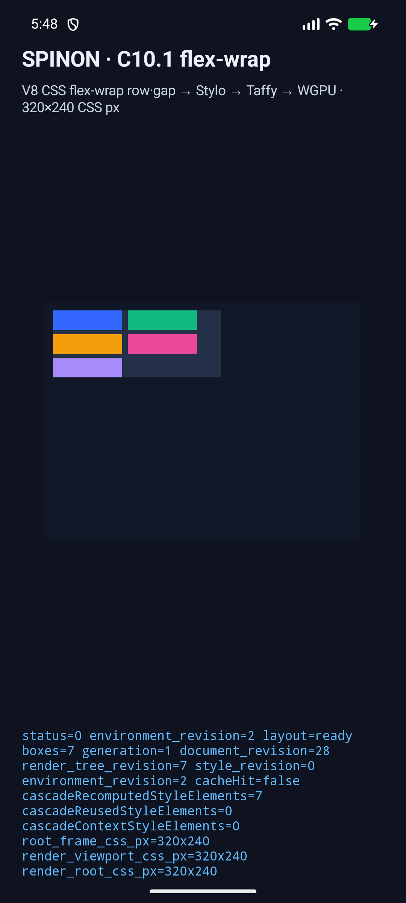
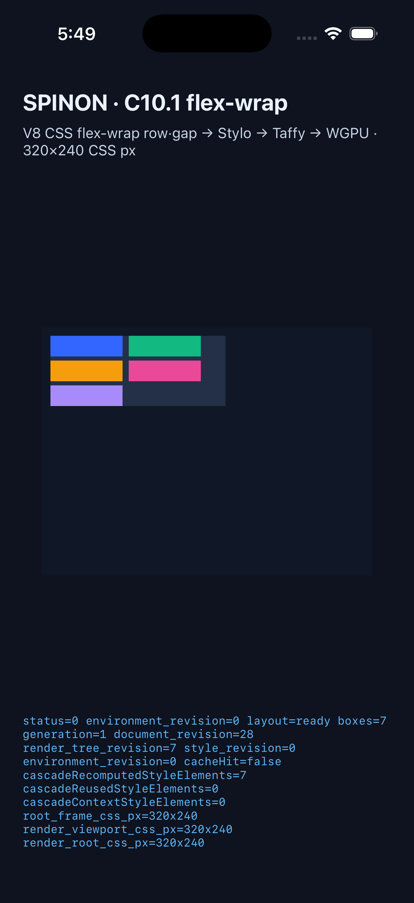

# C10.1 `flex-wrap` 구현 실패 경로 검토 및 실행 근거

**계약:** [0048 · C10.1 Flex 줄바꿈](../0048-c10-flex-wrap.md) · **내부 계약 숫자 버전:** `0.1.0` 고정

**상태:** 구현 브랜치 검증 완료, PR 미병합. 공식 완료 체크는 병합 전까지 미완료다.

## 구현을 공격적으로 검토한 20개 관점

| # | 실패 관점 | 확인한 결과와 수정 |
| ---: | --- | --- |
| 1 | 실제 앱이 쓰는 profile에만 `flex-wrap`을 추가했는가 | 실제 앱은 `RuntimeFlexCustomPropertiesPaintV1`을 사용한다. 두 기본 profile만 연결했던 초기 구현을 발견해 여섯 runtime Flex profile로 확장하고 profile별 projection 시험을 추가했다. |
| 2 | typed layout 값이 CSS 초기값과 다르게 기본 설정되는가 | `FlexWrap::default()`는 `NoWrap`이며 `LayoutStyle::default()`도 이를 사용한다. 기본 nowrap fixture와 Rust projection을 확인했다. |
| 3 | Block 전용 profile이 공통 속성 목록 변경으로 wrap을 받아들이는가 | 공통 Flex 목록에서 Block layout 목록을 만들 때 `flex-wrap`을 제외한다. Block author 입력은 기존 진단 경계에서 `flex-wrap`으로 거부되고 Block computed snapshot에는 값이 나오지 않는다. |
| 4 | 기존 static 호환 profile에 새 기능이 새는가 | projection은 여섯 runtime Flex profile만 입력값을 읽는다. 기존 static/Block profile에서는 wrap 동작을 연결하지 않는다. 관련 crate 회귀 시험을 실행했다. |
| 5 | `wrap-reverse`나 잘못된 computed 값을 nowrap으로 오인하는가 | projector는 `nowrap`과 `wrap`만 변환하고 그 외 값은 node·property 정보를 붙인 unsupported-value 오류로 거부한다. `wrap-reverse` 실패 시험이 통과했다. |
| 6 | `flex-flow` 뒤 longhand 우선순위가 뒤집히는가 | Stylo computed winner를 사용한다. shorthand 뒤 `flex-direction:row` override와 wrap 값이 Chromium·Rust 시험에서 일치했다. |
| 7 | inline style 외 author stylesheet 입력이 무시되는가 | 실제 `<style>` author cascade에서 `flex-flow`와 longhand override를 적용해 사용자 지정 속성 paint profile의 computed 값을 확인했다. |
| 8 | registered profile에서 `@property`와 author rule을 동시에 처리하는가 | 등록 paint profile에는 등록 사용자 지정 속성 규칙과 flex author rule을 분리해 공급했다. 초기 검토에서 등록되지 않은 profile에 `@property` fixture를 넣은 잘못된 시험 구성을 발견해 profile별 case로 분리했다. |
| 9 | 앱이 실제 사용하는 incremental paint profile이 새 속성을 갱신하는가 | 기존 incremental 검사는 비-paint profile만 다뤘다. 이를 실제 `RuntimeFlexCustomPropertiesPaintV1` 경로에서 nowrap→wrap과 배경색을 함께 바꾸고 full cascade와 결과 전체를 대조하도록 보강했다. |
| 10 | 여섯 profile 사이 computed property 목록이 달라지는가 | layout 속성 목록을 공통으로 사용하고 paint profile에만 배경색을 추가한다. 여섯 profile 각각의 computed `flex-wrap`이 wrap으로 보존되는 시험이 통과했다. |
| 11 | computed 문자열을 layout adapter가 잘못 파싱하는가 | 값 변환은 `nowrap`/`wrap`에 한정되고 미지원 입력은 기본값으로 대체하지 않는다. 잘못된 값이 node/property 오류를 내는 경계를 확인했다. |
| 12 | Taffy 전달에서 typed 값이 항상 `NoWrap`으로 고정되는가 | Spinon `FlexWrap`을 Taffy 0.14.0 `FlexWrap` enum에 명시적으로 매핑한다. 여섯 profile에서 두 번째 항목이 다음 줄로 가는 Taffy projection을 확인했다. |
| 13 | 정확히 맞는 line 경계를 잘못 다음 줄로 넘기는가 | 고정 폭·간격 합과 정확히 맞는 Chromium case에서 두 번째 항목이 첫 줄에 남고 Rust 좌표가 일치했다. |
| 14 | 1 CSS px 초과에서 wrap 판단을 놓치는가 | exact-fit 바로 다음 경계로 1px 초과 case를 두었다. Chrome 154와 Rust 모두 두 번째 항목을 다음 줄에 배치했다. |
| 15 | 여러 row line에서 순서나 세로 간격이 흔들리는가 | 5개 항목을 3개 줄로 수집하고 `row-gap:2px`, `column-gap:5px` 좌표를 node별로 비교했다. DOM preorder와 세 번째 line의 y좌표가 일치했다. |
| 16 | column 방향에서 gap 축을 혼동하는가 | column wrap에서 `row-gap`은 주축, `column-gap`은 다음 column 사이의 교차축으로 확인했다. 세 번째 항목의 x좌표가 Chrome reference와 일치했다. |
| 17 | wrap 값이 자식이나 중첩 Flex에 상속되는가 | outer Flex는 wrap, nested Flex는 초기 nowrap으로 고정하고 내부 자식 및 다음 sibling frame을 대조했다. 값과 line 배치가 일치했다. |
| 18 | 빈 컨테이너·단일 항목·`display:none`이 빈 line을 만드는가 | 세 경계를 별도 fixture로 두었다. 빈/단일 사례에 추가 line이 없고 숨긴 항목의 frame은 0이며 뒤 항목이 올바른 위치에 왔다. |
| 19 | 브라우저 캡처 wrapper가 앱 geometry를 오염시키는가 | runtime case 표시를 캡처 코드가 `block`으로 덮어써 `flow-root` 경계를 잃던 오류를 발견해 보존하도록 고쳤다. 이어 block 첫 자식의 margin collapse가 viewport root frame을 움직이는 차이를 확인했다. 실제 앱과 oracle runtime root를 세로 Flex viewport 컨테이너로 맞춰 C10.1의 wrap 비교에서 C09 margin-collapse 범위를 분리했다. |
| 20 | Android/iOS FFI 보고·화면만으로 결과를 과장하는가 | 기본 V8 앱에서 Android API 37 emulator와 iPhone 17 Pro / iOS 26.2 Simulator를 실행했다. 플랫폼별 7개 DOM preorder frame이 Chrome 154 frame과 모두 일치하고 WGPU 로그가 각 7개 box 제출을 기록했다. 로그는 node frame별 별도 줄로 남겨 iOS의 긴 report truncation과 화면 육안 추정에 기대지 않는다. |

## 실행 결과

Chromium 기준은 `Google Chrome 154.0.8037.98`, revision `@b859317bf11f6be47f9b7799ec690a0a42a1fb33`, viewport `320×240 CSS px`, DPR 1·2다. 12개 case·44개 node를 기록했고 computed value와 CSS geometry는 두 DPR에서 같았다. node별 절대 좌표 오차 한도는 `0.5 CSS px`다.

실제 앱의 runtime fixture 7개 node는 Chromium과 Android·iOS에서 모두 다음 좌표를 냈다.

| DOM node | x | y | width | height |
| --- | ---: | ---: | ---: | ---: |
| viewport root | 0 | 0 | 320 | 240 |
| flex container | 8 | 8 | 170 | 68 |
| item 1 | 8 | 8 | 70 | 20 |
| item 2 | 84 | 8 | 70 | 20 |
| item 3 | 8 | 32 | 70 | 20 |
| item 4 | 84 | 32 | 70 | 20 |
| item 5 | 8 | 56 | 70 | 20 |

- `node tools/css-reference/capture-c10-flex-wrap.mjs` — 고정 Chrome 실행 파일·revision 확인 후 12 case/44 node reference 생성.
- `node --test tools/css-reference/c10-flex-wrap.test.mjs` — Chromium reference, Rust 비교 fixture 기준, Android/iOS 실행 로그의 9개 검사가 통과했다.
- `node --test tools/css-reference/*.test.mjs` — CSS reference 회귀 94/94 통과.
- `cargo fmt --all --check` — 통과.
- `cargo test --locked -p spinon-layout -p spinon-style -p spinon-style-to-layout -p spinon-ffi --quiet` — 관련 Rust crate 213/213 통과, 실패 0.
- `mise exec -- env SPINON_ENABLE_C04_RUNTIME_GPU=1 SPINON_V8_DIR=/Users/yoonhb/Documents/workspace/spinon/build/v8-source/v8 tools/build-android-app.sh` — Android API 37 / ARM64 emulator용 debug 앱 빌드 성공.
- Android 앱 실행: API 37 ARM64 16KB emulator에서 `layout=ready`, `boxes=7`, `document_revision=28`; 7개 node frame이 Chrome과 일치하고 `presented boxes=7`을 기록했다. Renderer는 ANGLE/SwiftShader software path다.
- `mise exec -- env SPINON_ENABLE_C04_RUNTIME_GPU=1 SPINON_V8_DIR=/Users/yoonhb/Documents/workspace/spinon/build/v8-source/v8 tools/build-ios-sim.sh` — Xcode 26.2, iPhone 17 Pro / iOS 26.2 Simulator 빌드 성공.
- iOS 앱 실행: `layout=ready`, 7개 frame 로그가 Chrome과 일치하고 Metal surface에 `presented boxes=7`을 기록했다. iOS linker는 raw-window-metal duplicate-symbol 경고를 출력했지만 빌드는 성공했다.

## 원본 화면·로그

- [Android Logcat 원본](./c10-1-flex-wrap/android-api37-emulator-logcat.txt)
- [iOS Simulator unified log 원본](./c10-1-flex-wrap/ios-26.2-simulator-log.txt)

이 실행은 simulator/emulator 기능·frame 대응을 확인한다. 실기기 입력, hardware GPU, frame latency, 전체 Flexbox 또는 전체 CSS 호환성을 검증하지 않는다. C10.1은 PR 병합 뒤에만 공식 완료 처리한다.
