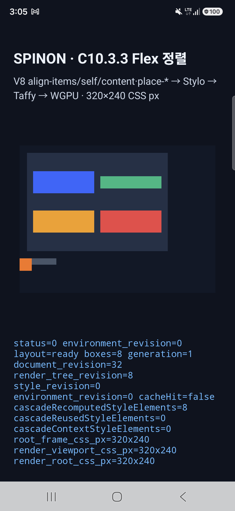

# C10.3.3 Android 실기기 실행 근거 · 2026-10-11

## 환경과 산출물

- 기기: Samsung SM-S731N, Android 16 / API 36, ARM64 실기기
- 디스플레이: 1080×2340 physical px, density 2.8125
- 빌드: `mise exec -- env SPINON_ENABLE_C04_RUNTIME_GPU=1 bun run build:android`
- 앱 artifact SHA-256: `86cb2bc316a10ec86536ea356a7f215b19d57d35b48ab1db6c7e63185e3377d8`
- CSS viewport: 320×240 CSS px, WGPU surface texture 900×675 physical px
- GPU: WGPU Vulkan backend, Samsung Xclipse 940

## 결과

- 실제 V8 → Stylo → Taffy 경로가 `layout=ready boxes=8`로 끝났다. Node 1–8의 CSS frame은 고정 Chrome runtime 기준과 각각 일치했다. 최대 좌표 오차는 0 CSS px다.
- 핵심 edge case는 60×10 Flex 부모 안의 20×20 item에 `margin-top:auto`와 `align-self:flex-end`를 함께 적용한다. Chrome, Rust와 Android runtime 모두 item frame `(0,184,20,20)`을 반환한다. 이 입력은 cross-start auto margin이 overflow할 때의 시작 좌표를 확인한다.
- WGPU renderer가 `backend=Vulkan device=Samsung Xclipse 940`을 보고했고 `status=0 presented boxes=8`로 제출했다.
- 화면 캡처에는 Flex 장면, overflow case, `layout=ready boxes=8` 상태가 보인다. OS 상태·내비게이션 영역을 포함한 전체 기기 화면이다.

## 실행 및 재현 자료

- [최종 build log](./c1033-android-physical-final-build-2026-10-11.log)
- [APK SHA-256](./c1033-android-physical-final-apk-sha256-2026-10-11.txt)
- [설치 log](./c1033-android-physical-final-install-2026-10-11.log) · [launch log](./c1033-android-physical-final-launch-2026-10-11.log)
- [Spinon runtime·WGPU 필터 log](./c1033-android-physical-final-filtered-2026-10-11.log)
- [Chrome runtime reference](./c1033-chrome-runtime.json) · [화면 캡처](./c1033-android-physical-final-2026-10-11.png)

## 남은 범위

이 실기기 실행은 8-node runtime smoke이며 50-case × 여섯 profile의 전체 Rust 비교를 Android에서 실행한 결과가 아니다. WPT suite, 입력 상호작용, 장시간 안정성, 성능 측정 및 iOS 실기기는 포함하지 않는다. `c1033-android-physical-2026-10-11.*`의 앞선 6-node 실행은 초기 증거로 보존했으며 최종 판정에는 위 `physical-final` 자료를 사용한다. Gradle은 AGP 8.13.2와 compile SDK 37.2의 검증 범위 warning을 출력했지만 빌드는 성공했다.

