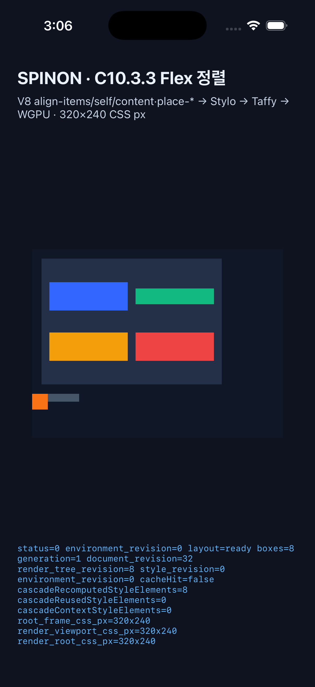

# C10.3.3 iOS Simulator 실행 근거 · 2026-10-11

## 환경과 산출물

- 기기: iPhone 17 Pro Simulator, iOS 26.2
- CSS viewport: 320×240 CSS px, WGPU surface texture 960×720 physical px, scale 3.0
- 빌드: `mise exec -- env SPINON_ENABLE_C04_RUNTIME_GPU=1 bun run build:ios-sim`
- 실행: `--spinon-c1033-flex-alignment`
- GPU: iOS Simulator Metal surface를 통한 WGPU 제출

## 결과

- 실제 V8 → Stylo → Taffy 경로가 `layout=ready boxes=8`로 끝났다. Node 1–8의 CSS frame은 고정 Chrome runtime 기준과 각각 일치했다. 최대 좌표 오차는 0 CSS px다.
- overflow case의 60×10 Flex 부모와 20×20 child frame은 각각 `(0,184,60,10)`, `(0,184,20,20)`이다.
- WGPU가 `status=0 presented boxes=8`로 제출했다. 캡처에서 동일 overflow 장면과 `layout=ready boxes=8` 상태를 확인했다.

## 실행 자료

- [최종 Simulator build log](./c1033-ios-simulator-final-build-2026-10-11.log)
- [재실행 runtime log](./c1033-ios-simulator-rerun-2026-10-11.log) · [launch log](./c1033-ios-simulator-rerun-launch-2026-10-11.log)
- [화면 캡처](./c1033-ios-simulator-rerun-2026-10-11.png) · [capture command log](./c1033-ios-simulator-rerun-screenshot-2026-10-11.log)
- 앞선 6-node 초기 실행 자료도 같은 폴더에 보존했다. 최종 판정에는 `rerun` 파일을 사용한다.

## 남은 범위

이는 시뮬레이터 기능 검증이며 iOS 실기기·GPU 성능 증거가 아니다. iOS build는 성공했지만 deprecated Swift API, `RawWindowMetalLayer` 중복 symbol과 dSYM debug map warning이 출력됐다. WPT suite, 전체 50-case 모바일 실행, pixel 단위 Chrome 이미지 비교는 여기서 수행하지 않았다.

