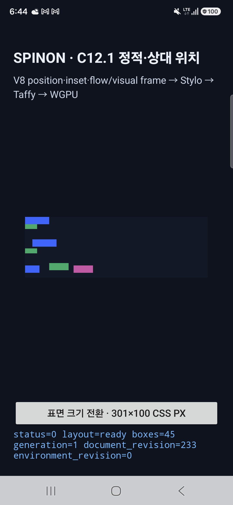
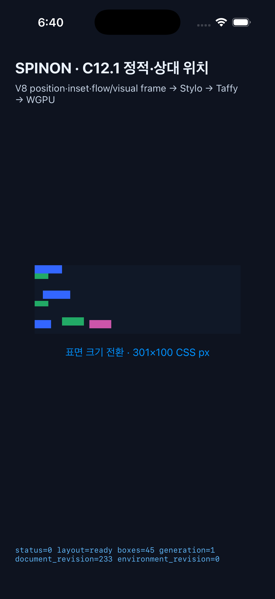

# C12.1 정적·상대 위치 실행 근거

## 실행 환경

| 플랫폼 | 환경 | 결과 |
| --- | --- | --- |
| Android 실기기 | SM-S731N · Android 16 / API 36 · Vulkan · Samsung Xclipse 940 | APK 빌드·설치·실행, 세 번의 cold start 모두 세 C12.1 상태·48 frame 기록, WGPU `presented boxes=45` |
| iOS Simulator | iPhone 17 Pro · iOS 26.2 | 시뮬레이터 빌드·설치·실행, WGPU `presented boxes=45` |

두 호스트 모두 같은 `runtime-position-static-relative.js`를 V8에서 실행하고, `initial`, `target-relative`, `ancestor-relative` 세 상태를 기록했다. 각 상태는 layout-ready·45 boxes와 fixture inventory 47개 요소를 포함한 48개 raw frame을 출력한다. 추가 한 개는 fixture `<style>` 요소다.

고정 Chromium 154.0.8037.98의 CSS 360×800 reference와 비교했다. 모바일 fixture의 surface/root는 301×100 CSS px이므로 viewport 자체인 root frame의 폭·높이만 비교에서 제외하고, 나머지 47개 요소의 x·y·width·height를 비교했다. 여섯 플랫폼·상태 조합 모두 최대 오차는 0 CSS px였다. `bun run test:css-reference`는 체크인한 로그를 읽어 각 상태의 47개 geometry와 frame 수를 다시 대조한다.

Android는 실기기 화면, Vulkan adapter, 앱 렌더 제출을 확인했다. iOS는 Simulator에서 앱 렌더 제출을 확인했다. 이 자료는 고정 fixture 범위의 실행 근거이며 WPT 전체, 전체 CSS 지원, 텍스트·접근성·hit-test 적합성 또는 제품 출시 검증을 뜻하지 않는다.

초기 Android 재설치 직후 실행에서 Surface 크기가 확정되기 전에 fixture가 시작되어 `status=-12`로 장면이 superseded되는 실패를 재현했다. C12.1 초기화는 양수 폭·높이가 전달된 `surfaceChanged` 뒤에 한 번만 예약하도록 바꿨다. 수정 후 실기기 cold start 3회에서 매번 `initial`, `target-relative`, `ancestor-relative`가 모두 layout-ready·45 boxes·48 frames였고, 각 실행에서 Vulkan WGPU가 45 boxes를 제출했다. 별도 로그 세 개를 함께 보관한다.

## 화면

### Android 실기기

### iOS Simulator

## 기록 파일

- [Android 실기기 Spinon runtime 로그](android-physical.log)
- [Android cold start 1](android-physical-cold-start-1.log) · [2](android-physical-cold-start-2.log) · [3](android-physical-cold-start-3.log)
- [iOS Simulator Spinon runtime 로그](ios-simulator.log)
- Android build: `mise exec -- env SPINON_ENABLE_C04_RUNTIME_GPU=1 bun run build:android` · 성공
- iOS Simulator build: `mise exec -- env SPINON_ENABLE_C04_RUNTIME_GPU=1 bun run build:ios-sim` · 성공

iOS 빌드는 성공했으며 V8 archive의 중복 debug symbol 경고와 AppIntents framework가 없어 metadata 추출을 건너뛴 경고가 남았다. 이 경고들은 빌드를 실패시키지 않았다.
