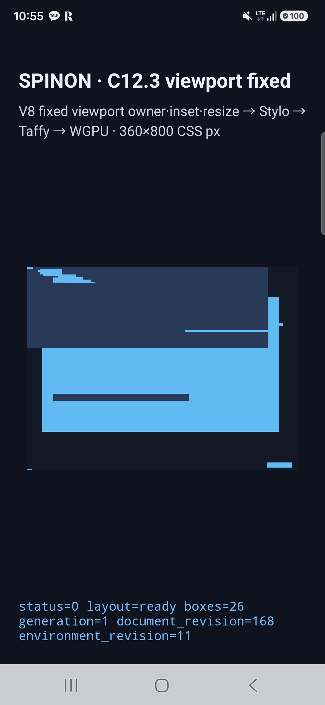
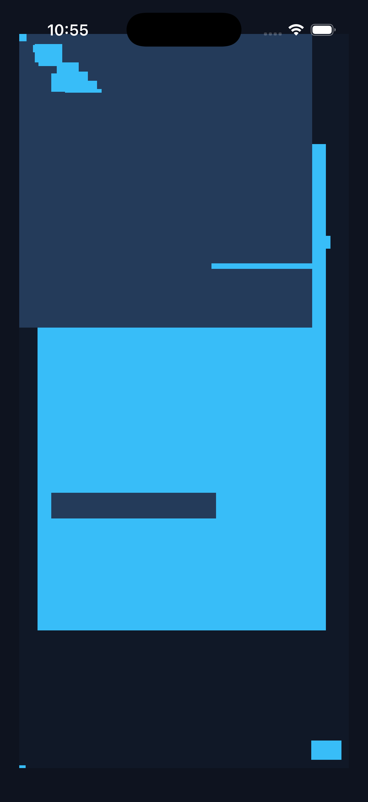

# C12.3 viewport fixed 실제 실행 근거

## 결과 요약

고정된 Chromium 154 reference의 28-node parent-closed runtime subset을 Android 실기기와 iOS Simulator에서 각각 V8 → Stylo → Rust/Taffy → WGPU 경로로 실행했다. 각 플랫폼에서 13개 viewport/DPR/resize 상태의 364개 frame이 node ID별로 기준과 일치했다. 최대 frame 오차는 양쪽 모두 `0.009375 CSS px`, 허용치는 `0.5 CSS px`였다.

| 플랫폼 | 실행 환경 | 제출 backend | 상태 수 | 비교 frame | 최대 오차 | 마지막 제출 |
| --- | --- | --- | ---: | ---: | ---: | --- |
| Android 실기기 | Samsung SM-S731N, Android 16/API 36, 1080×2340 px, density 450 | Samsung Xclipse 940 / Vulkan | 13 | 364 | 0.009375 CSS px | `boxes=26`, environment revision 11, 360×800 CSS px |
| iOS Simulator | iPhone 17 Pro, iOS 26.2 | Apple iOS simulator GPU / Metal | 13 | 364 | 0.009375 CSS px | `boxes=26`, environment revision 11, 360×800 CSS px |

각 플랫폼의 상태에는 `360×800` 및 `390×844` CSS viewport에서 DPR 1·2·2.625·3, resize outbound·no-op·return, device scale 최종값 적용이 포함된다. DPR만 변할 때 CSS frame은 변하지 않는다. 마지막 revision의 실제 WGPU `presented` 로그와 캡처를 함께 보관한다.

## 캡처에서 보이는 오른쪽 겹침

화면 중앙의 큰 고정 사각형 오른쪽에 작은 조각이 약간 더 나와 보이는 것은 fixture의 겹침이다. 고정 Chromium 기준에서 `viewport-stretch`는 `x=20`, `width=315`라 오른쪽이 `335`이고, `viewport-single-auto-inset`은 `x=308`, `width=32`라 오른쪽이 `340`이다. 따라서 두 색칠된 고정 box가 겹치는 구간에서 작은 box가 큰 box보다 5 CSS px 더 보인다. 둘 다 360 CSS px viewport 안에 있다. Android/iOS 캡처의 이 모양은 화면 가장자리에서 잘린 결과를 뜻하지 않는다.

이 판단은 해당 두 node의 Chromium 기준 frame과 재실행한 Android 실기기·iOS Simulator frame 비교에 한정한다. 캡처 전체의 pixel-diff나 모든 79-node inventory의 모바일 검증을 뜻하지 않는다. 두 캡처는 fixture가 표시되었음을 보여주는 자료다.

## 원본 자료

- Android 실기기 전체 로그: `spec/internal/evidence/c12-3-fixed-positioning/android-physical.log`
- iOS Simulator 전체 로그: `spec/internal/evidence/c12-3-fixed-positioning/ios-simulator.log`
- 런타임 출력 비교기·회귀: `tools/css-reference/compare-c12-3-fixed-runtime.mjs`, `tools/css-reference/c12-3-fixed-runtime.test.mjs`
- 고정 Chromium reference·V8 runtime fixture: `tests/fixtures/css/references/c12-3-position-fixed-v1.json`, `tests/fixtures/css/c12/runtime-position-fixed.js`

비교 실행:

```sh
node tools/css-reference/compare-c12-3-fixed-runtime.mjs android-physical spec/internal/evidence/c12-3-fixed-positioning/android-physical.log
node tools/css-reference/compare-c12-3-fixed-runtime.mjs ios-simulator spec/internal/evidence/c12-3-fixed-positioning/ios-simulator.log
node --test tools/css-reference/c12-3-fixed-runtime.test.mjs
```

## 화면 캡처





## 해석 범위

이 근거는 고정 28-node fixture의 layout frame, viewport/DPR revision 전이와 WGPU 제출을 확인한다. 기준 inventory 전체 22 case·79 node의 모바일 실행, 전체 CSS Position 적합성, WPT suite, native view 상호작용, scroll 불변, 픽셀 동일성, 성능, iOS 실기기, hardware GPU 비교는 포함하지 않는다. 캡처는 화면에 fixture가 표시되었음을 보이는 자료이며 frame 수치 비교를 대체하지 않는다.
