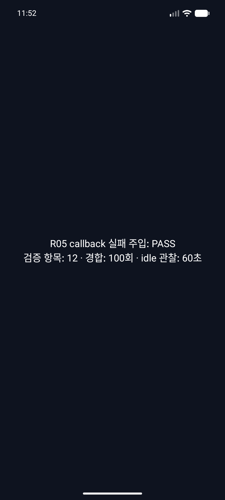
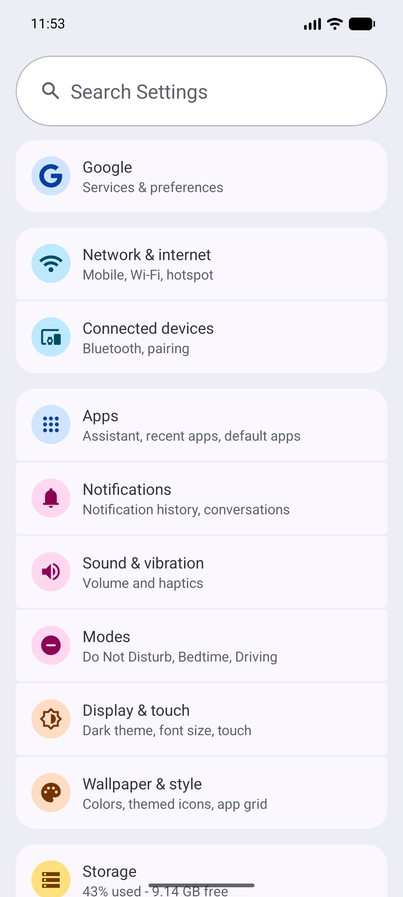

# R05.3 · Android API 37.0 화면 캡처 재현 결과

**결과:** 기존 API 37.0 AVD를 데이터 초기화·이미지 재설치 없이 두 번 콜드 부팅했다. 두 실행 모두 실제 캡처 픽셀에 `R05 callback 실패 주입: PASS`가 표시됐다. PR #77 당시의 검은 runner 캡처는 재현되지 않았으며, 원인은 확정하지 않았다.

**AVD 조치:** `spinon_api37_0_applied_txn`의 기존 사용자 데이터와 system image revision 6을 유지했다. 실행 뒤 이 Spinon AVD를 정상 종료했고 `.avd` 데이터 1.7GB가 남아 있음을 확인했다. AVD 또는 system image 재설치는 필요하지 않았다. 검증 스크립트는 매 회 debug APK를 빌드·설치했고 두 APK SHA-256은 같았다.

## 비교 조건

- AVD: `spinon_api37_0_applied_txn`, Android API 37.0, Google APIs ARM64, 4KB guest page, Pixel 6 profile, 1080×2400 / density 420.
- Emulator: 37.2.12.0, `-gpu host`, `-no-snapshot-load -no-snapshot-save`; 각 회 새 QEMU PID로 시작했다. `-wipe-data`는 사용하지 않았다.
- 각 회 guest `sdk_full=37.0`, `PAGE_SIZE=4096`, ABI `arm64-v8a`, `sys.boot_completed=1`을 확인했다.
- 두 실행의 앱 입력 소스 checksum 목록은 동일하고, pinned V8 checkout은 `7b50b62cb18f28617959e8452e2cd18195b38bcf`이며 clean이었다. 두 debug APK SHA-256은 `d9a26b62d326d4f9310394b9eb06ffcecbb7c31e27758548c27eb1b454e40bb1`로 같다.
- AVD serial은 `emulator-5580`이다. 다른 프로젝트의 `emulator-5554` / `zl_poc`은 시험과 종료 대상에서 제외했다.

## 두 콜드 부팅 결과

| 실행 | QEMU PID / 앱 PID | fixture | timeout/callback 경합 | idle | runner bitmap |
|---|---:|---|---|---|---|
| run 01 | 91908 / 3455 | 12 checks, 실패 0 | 100회: callback 91, timeout 9 | 60 samples, pending·queue·active 0 | PASS 표시 |
| run 02 | 12308 / 3148 | 12 checks, 실패 0 | 100회: callback 66, timeout 34 | 60 samples, pending·queue·active 0 | PASS 표시 |

두 회 모두 실제 applied-transaction 기준 surface lifecycle 세 경로가 통과했다: baseline callback, surface destroy/recreate 뒤 취소된 late callback 분류, 새 surface generation에서 callback 회복. race winner 비율은 실행마다 달랐고, 판정 기준은 분포가 아니라 양쪽 결과의 안전한 단일 종결과 pending 0이다.

## 화면과 Activity 대조

각 runner `result.png`와 별도 시계열의 0·1·5·15초 이미지를 육안으로 확인했다. 무입력 관찰 내내 PASS 문구가 보인다. run 01 네 시계열 캡처의 SHA-256은 모두 `11023864f4e8c06ab91fd781d84efb0424b7c620c513aeadf80c8690aff52be4`로 같았다. run 02의 0·1·5초 캡처는 같고 15초 캡처는 상태 표시줄 시각이 바뀌어 달랐으며, PASS 본문은 유지됐다.

Settings 화면도 두 실행에서 정상 캡처됐다. Back 후 1초 시점의 `dev.spinon.bootstrap/.MainActivity`는 resumed/foreground 상태였고 프로세스 PID는 각 실행의 runner PID와 같았다. 복귀 이미지에도 PASS가 보였다. 계획은 Back 직후 bitmap과 1초 뒤 bitmap을 모두 요구했지만 즉시 bitmap은 따로 수집하지 않았다. hierarchy의 텍스트는 화면 캡처와 별도로 저장했으며 bitmap 판정을 대신하지 않는다.

## AVD 정리 및 경계

- `spinon_api37_0_applied_txn`은 유지되며 시험 후 종료됐다. 현재 ADB 목록에는 `emulator-5580`이 없고, 이 AVD의 QEMU 프로세스도 없다.
- `emulator-5554`의 `zl_poc` QEMU는 그대로 살아 있다. 해당 프로젝트의 AVD backing directory는 디스크에서 보이지 않지만 실행 프로세스가 남아 있어 손대지 않았다.
- AVD Manager 등록 목록에는 backing `.avd` 디렉터리가 없는 `spinon_api35_compat`, `spinon_api37_0_compat`, `spinon_api37_2`, `spinon_api37_2_modern`, `zl_poc`이 남아 있다. 삭제된 backing data를 복구하거나 `.ini` 등록을 정리하지 않았다. 상태는 [AVD 사후 목록](avd-postflight.txt)에 기록했다.
- 검은 캡처의 원인은 미확정이다. 이 재현에서 AVD를 초기화하거나 재설치하지 않았으므로, AVD 재설치가 문제를 고쳤다고 볼 근거도 없다. 두 번의 정상 cold boot에서 재현되지 않았다는 사실만 기록한다.
- 캡처 timeline의 host monotonic 값은 adb screenshot 요청과 수신 사이를 잰다. Android frame-present 시각, 실제 화면 주사 또는 광자 시각을 측정하지 않는다.
- API 29–34 fallback, API 36 actual lifecycle, iOS device callback runtime, 실기기/광학 지연 및 R05.3 전체는 계속 미완료다.

## 원본 파일

- 실행 전 조건·계획·사전 실패 관점: [재현 계획](../../../../plan/r05-android-api370-capture-reproduction.md)
- 실행 후 새 20개 실패 관점: [구현/실행 적대 검토](implementation-review.md)
- run별 `environment.txt`, build/install/launch log, raw `logcat.txt`, APK 및 source checksum, runner bitmap, time-series manifest/PNG, UI hierarchy, activity/window/surface 상태를 각각 보존했다.
- 재현 실행은 진단용이다. 제품 지원 범위나 성능 판정을 넓히지 않으며 `spec/STATUS.md`의 R05·R05.3 완료 표시는 바꾸지 않는다.
