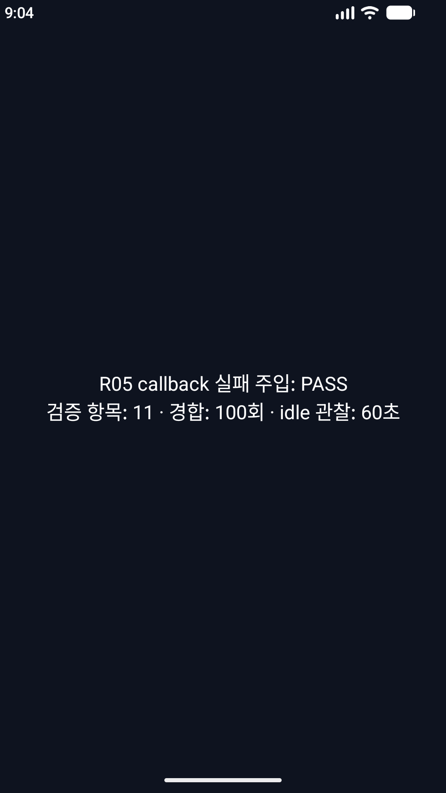
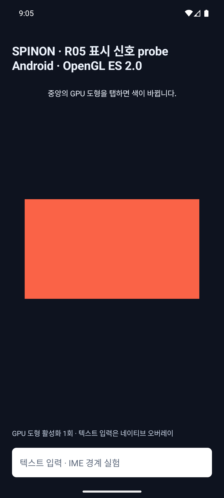

# R05.3 Android 표시 callback 실패 주입 실행

**실행일:** 2026-10-08 · **범위:** Android debug fixture, API 37.2 ARM64 16KB AVD와 API 36 ARM64 GLES 대조 · **결론:** 제한된 에뮬레이터 실패 주입 통과 · **R05.3/R05:** 미완료

## 실행 환경과 원본

| 구분 | 환경·결과 |
|---|---|
| 실패 주입 대상 | `sdk_gphone16k_arm64`, `emulator-5562`, Android API 37.2, ARM64, 16,384-byte page, 1080×1920 |
| GLES fallback 대조 | `emulator-5554`, Android API 36.0, ARM64, 4,096-byte page, 1080×2400 |
| Debug APK SHA-256 | `fbb8ea94ec2fad8cffd27afd79e4548fac32ad1fb18316aea8b8e1c8c8c0ba7d` |
| Release APK SHA-256 | `c766910fc406fff33013e3c7b718e02fceddceb09cf1aae5526f0eb4e0309378` |
| 소스 기준 | `307843bc7e31bdf89b9591e297c3b96839ca19b5` 이후 작업 트리 변경분을 포함한 debug APK |

debug 빌드·설치·실행·Logcat·화면 캡처는 [run-01 원본](r05-android-callback-failure-injection-2026-10-08/run-01/)에, API 36 GLES 대조는 [fallback 원본](r05-android-callback-failure-injection-2026-10-08/api36-gles-fallback/)에 있다. 빌드 로그, APK digest, 기기 속성, PID, 시작 결과와 화면을 보존했다. 두 원본 묶음의 SHA-256은 [manifest](r05-android-callback-failure-injection-2026-10-08/SHA256SUMS)로 고정했다.

## 실행 결과

Android 37.2 debug fixture는 **11개 scenario, 0 failures**로 끝났다. 앱은 결과 화면에서 PASS를 표시했고 프로세스가 살아 있었다.

| 시나리오 | 관찰 | 판정 |
|---|---|---|
| Timeout 뒤 합성 late callback | terminal `timed_out` 유지, `late_after_timeout`, fence unusable | 통과 |
| Owner 불일치 후 취소·late callback | 잘못된 renderer 취소는 pending 유지, 올바른 owner 취소는 timer/map 제거, late callback은 terminal 유지 | 통과 |
| 같은 generation surface 취소 | WGPU request만 취소하고 GLES request는 보존 | 통과 |
| Duplicate·stats 부재 | 두 번째 callback `duplicate_callback`; null stats는 `null_transaction_stats` | 통과 |
| Stale generation | 현재 surface 불일치, usable fence 아님 | 통과 |
| Timeout/callback 원자 경합 | 100회, callback winner 70회·timeout winner 30회, pending 0 | 통과 |
| Production callback executor 포화 | worker 1개를 막고 대기 task 64개 수락; 초과 callback은 caller thread에서 한 번 실행; queue drain, inline 증가 1, fence unusable | 통과 |
| 실제 미적용 `SurfaceControl.Transaction` 등록 | listener 등록 성공, transaction 미적용 | 통과 |
| 실제 취소 | 예약된 main Handler timer가 취소 뒤 제거되고 transaction 닫힘 | 통과 |
| 실제 main Handler timeout | 2초 제한 뒤 `timed_out`, timeout 1회, callback 0회, pending·timer 제거, transaction 닫힘 | 통과 |
| 정리 뒤 유휴 관찰 | 매초 60회, pending·queue·active 0, 새 callback/timeout 없음 | 통과 |



API 36 대조에서는 OpenGL ES 2.0 surface와 draw가 생성됐고 capability가 예상대로 `api_below_37`로 비활성화됐다. 탭 뒤 input sequence 1, revision 1의 draw와 터치 수 1을 확인했다. 이 조합에서는 JankData callback을 제공하지 않으므로 표시 callback 동작 근거로 세지 않는다.



`assembleRelease`도 성공했다. AGP 8.13.2가 compile SDK 37.2 검증 범위 밖이라는 경고는 남았다. Release용 fixture stub가 컴파일되는 것까지 확인했으며 unsigned Release APK에서 fault intent의 런타임 거부는 실행하지 않았다.

## 구현 후 적대 검토 · 독립 실패 관점 20개

구현 전 계획의 20개 항목은 [실패 주입 계획](../../../plan/r05-android-callback-failure-injection.md)에 따로 기록했다. 아래는 최종 코드·빌드·실행 자료에 대해 다시 점검한 20개의 별도 실패 경로다. 일부는 실제 실행으로, 일부는 코드 경로와 생성 산출물 검사로 판정했다.

| # | 공격 관점 | 판정 근거와 남은 경계 |
|---:|---|---|
| 1 | 명시적 fixture intent가 기본 앱 실행에서 켜지는가 | `MainActivity`의 전용 extra가 없으면 새 route를 타지 않는다. API 36의 별도 GLES route와 기본 surface 동작을 실행했다. |
| 2 | Release 빌드에서도 실패 주입 코드를 실행할 수 있는가 | debug fixture는 `src/debug`, release는 `debug_only` stub로 분리했고 `assembleRelease`가 성공했다. unsigned Release APK runtime 실행은 하지 않았다. |
| 3 | 실기기가 에뮬레이터 검증으로 잘못 선택되는가 | `device-12345` 입력을 runner가 실행 전에 거부했고 결과 폴더를 만들지 않았다. 실제 실행 serial은 `emulator-5562`였다. |
| 4 | API 37.0이나 16KB가 아닌 이미지를 API 37.2 대상으로 오인하는가 | API 36 / 4KB AVD 입력을 runner가 실행 전에 거부했고 결과 폴더를 만들지 않았다. API 37.2 대상은 `sdk_int=37`, `sdk_int_full=37.2`, page size `16384`를 요구한다. 다른 API의 실제 failure fixture 실행은 남아 있다. |
| 5 | 합성 상태 전이를 실제 OS callback으로 오인하는가 | 합성 scenario 로그와 `source=real_transaction` 요청을 분리했다. 합성 callback은 null stats를 사용해 표시 성공으로 계산하지 않는다. |
| 6 | timeout을 직접 호출한 결과로 실제 Handler timeout을 주장하는가 | 실제 transaction을 listener에 등록하고 적용하지 않은 별도 요청을 2초 main Handler에 맡겼다. 2.5초 뒤 실제 state·counter를 확인했다. |
| 7 | callback이 예상보다 일찍 도착했는데 timeout만 성공 처리하는가 | 실제 timeout 요청에서 callback count `0`, timeout count `1`을 요구하고 요약 로그로 검사한다. callback이 오면 실패다. |
| 8 | timeout·race 테스트가 UI thread를 막아 timer를 인위적으로 지연시키는가 | synthetic 경합은 fixture worker와 2개 race worker에서 실행하며 main Handler는 대기하지 않는다. 화면 결과는 비동기 완료 뒤 갱신한다. |
| 9 | timeout 뒤 late callback이 상태를 되살리는가 | 합성 callback 후 `late_after_timeout`, terminal `timed_out`, pending 부재와 unusable fence를 모두 검사했다. |
| 10 | 잘못된 renderer/owner가 다른 요청을 취소하는가 | owner mismatch는 pending을 보존하고 올바른 owner만 취소하는 시나리오를 실행했다. |
| 11 | surface 교체 취소가 같은 세대의 다른 renderer 요청까지 지우는가 | 동일 generation에 WGPU/GLES를 함께 등록해 WGPU만 취소되고 GLES는 pending으로 남는 것을 검사했다. |
| 12 | stale surface generation의 callback을 현재 화면 결과로 귀속하는가 | 요청 generation과 current-generation supplier를 다르게 두고 `current_surface=false`, fence unusable을 확인했다. |
| 13 | 중복 callback이 성공을 두 번 만들거나 pending map을 재등록하는가 | 첫 callback `callback_received`, 두 번째 `duplicate_callback`; terminal state와 map 부재가 유지됐다. |
| 14 | null `TransactionStats` 또는 누락 fence를 유효 완료로 처리하는가 | null stats를 `null_transaction_stats`로 분류하고 usable fence가 false인지 합성 경로와 overflow 경로에서 확인했다. 실제 OS의 invalid fence 반환은 이 환경에서 발생시키지 않았다. |
| 15 | callback과 timeout이 동시에 terminal 상태를 차지하는가 | Atomic compare-and-set 기반 경합을 100회 실행했고 매회 terminal winner 하나와 pending 제거를 단언했다. 관측은 callback 70·timeout 30이었다. |
| 16 | 경합 테스트 worker가 실패 뒤 남아 앱을 붙잡는가 | race executor를 `finally`에서 `shutdownNow`하고 3초 종료 대기를 합격 조건에 포함했다. 100회 실행 후 전체 pending은 0이었다. |
| 17 | callback executor의 실제 포화가 재현되지 않았는데 overflow로 기록되는가 | production executor worker 1개를 막고 64개를 큐에 넣은 뒤 초과 callback을 제출했다. caller thread ID, inline counter delta 1, 큐 0을 확인했다. |
| 18 | overflow fixture가 예외 뒤 worker를 풀지 못하거나 queue 잔류를 숨기는가 | release latch는 `finally`에서 풀고 최대 5초 drain/idle을 기다린다. 실패 시 summary는 PASS가 되지 않으며 현재 관측은 queue·active 0이다. |
| 19 | idle 판정이 순간 snapshot 하나거나 새 전이를 놓치는가 | 60초간 초당 pending·queue·active와 callback/timeout 누계 변화, 실제 요청별 callback count를 반복 관찰했다. 결과는 samples 60, 첫 실패 없음이다. CPU·배터리·제품 장기 안정성 판정은 아니다. |
| 20 | 성공 로그만 남고 환경·시각 자료·재현 빌드가 빠지는가 | debug/API36 build·기기 속성·PID·Logcat·화면·APK hash와 release build log를 보존했다. 실기기 serial, API36 target, 기존 출력 경로를 각각 거부하고 원본 negative-control 로그를 SHA-256 manifest에 포함했다. 별도 CI/다른 macOS 재현성은 검증하지 않았다. |

검토 중 실행 결과를 더 넓은 결론으로 읽을 수 있는 경계를 명시했다. 이번 결과는 **API 37.2 AVD에서 특정 debug fixture의 상태 정리와 timeout 경로가 기대대로 움직였다**는 뜻이다. Android API 전체, iOS callback, 실제 렌더러가 적용한 transaction의 모든 실패, 지연 성능 또는 광학적 화면 표시를 입증하지 않는다.

## 남은 범위

- API 35, 37.0, 37.1, API 29–34 failure fixture runtime과 API matrix 전체를 새 구현으로 다시 돌리지 않았다.
- 실제 renderer가 적용한 transaction에서의 late/duplicate callback 주입, framework listener 등록 실패, 실제 OS invalid fence는 재현하지 않았다. late·duplicate·stale 경로는 내부 상태 함수에 대한 합성 입력이다.
- iOS는 이 Android `SurfaceControl.Transaction` fixture의 대상이 아니다. 기존 iOS present-feedback 계획의 Simulator acquire와 device-only callback compile/link 결과를 이 실행에 합산하지 않는다.
- 실기기·물리 touch·하드웨어 GPU·제품 frame queue·event-to-present latency·photon scanout은 검증하지 않았다.
- 전체 R05.3은 iOS device callback runtime, 기기 검증, 기타 호환성·lifecycle gate가 남아 미완료다.

## 재현

```sh
SPINON_ANDROID_EMULATOR_SERIAL=emulator-5562 \
SPINON_R05_CALLBACK_OUTPUT_DIR=spec/internal/evidence/r05-android-callback-failure-injection-2026-10-08/run-01 \
bash tools/verify-r05-android-callback-faults.sh
```

API 36 대조는 `emulator-5554`에서 `--ez spinon_r05_gles_control true`를 실행하고 중앙을 한 번 탭했다. release build는 Android SDK 경로를 명시해 `mise exec -- ./gradlew :app:assembleRelease`로 실행했다.
