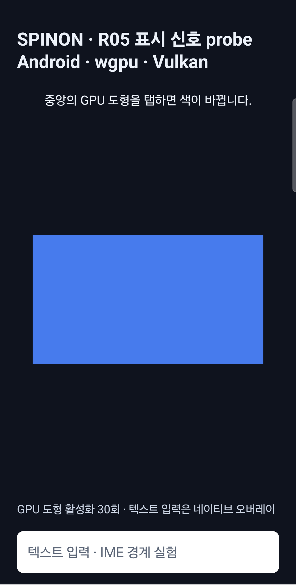

# R05.3 직접 touch block 01 · 2026-10-09

새 Android 앱 process에서 수집기가 완결 raw contact 30개에 도달해 정상 자동 종료했다. raw 파일에는 drain 구간의 추가 contact 2개도 남아 있어 총 32개다. 사전 규칙에 따라 tracking ID down 시각순 첫 30개만 점수 집합으로 고정했다. 동시 시각은 getevent 원본 행 순서를 유지한다.

## 결과

| 단계 | 점수 집합 결과 |
|---|---:|
| raw contact 시도 | 30 |
| 정확한 raw release → 앱 `ACTION_UP` | 28/30 |
| WGPU submit | 28/30 |
| 현재 surface generation callback | 28/30 |
| 같은 request의 usable async fence | 28/30 |
| clock bracket 유효 후보 | 28/30 |
| 점수 집합에서 raw release와 exact join되지 않은 접촉 | 2 |
| 앱이 제외한 입력 | 2 · `cancelled` 1, `outside_target` 1 |
| 30번째 contact 뒤 drain에서 추가 수집된 raw 접촉 | 2 |
| drain raw release와 exact timestamp가 일치하지만 점수에서 제외된 accepted `ACTION_UP` | 2 |

raw 기록에서 동시 포인터 overlap 1건이 있었다. 점수 집합의 미연결 두 raw 접촉과 앱의 제외 로그 두 건은 일대일로 대응하지 않는다. 제외 로그에 event timestamp가 없기 때문이다. 별도로 drain 구간의 raw 두 건과 exact timestamp가 맞는 accepted `ACTION_UP` 두 건은 scoring set 밖임을 확인했다. 입력 실패를 latency 후보 수로 보충하지 않았다. 수집 종료 때 raw protocol error, active contact, pending release, host/device collector 잔존은 0이었다. APK hash는 계획의 고정 hash와 일치했고, 새 process의 R05 화면을 확인했다.

28개 bracket 기반 **transaction-fence 후보 interval**의 block envelope는 **28.230–61.515 ms**다. 이는 단일 block의 후보 범위다. p95, 제품 입력 지연, VSync, frame scanout 또는 광자 시각을 주장하지 않는다. `target_vsync_id=-1`은 모든 연결에서 그대로 유지됐다. 기존 20개 feasibility 입력과 이 block은 아직 300개 후보를 채우지 못했으며 R05.3은 미완료다.

화면에는 30회 활성화가 표시된다. 활성화 횟수가 짝수라 도형은 시작과 같은 파란색이다. 아래 이미지는 상·하단 시스템 영역을 자른 화면 캡처이며 픽셀 색상은 보정하지 않았다.

## 입력·수집 출처

동일 capture에서 `sec_touchscreen`의 `INPUT_PROP_DIRECT` event와 해당 앱 PID의 R05 로그를 함께 수집했다. 별도 process의 synthetic negative control은 기존 [실기기 입력 분리 검증](../../r05-android-physical-input-join-2026-10-09/device-repeat-2026-10-09/README.md)에 있다. 수집 중 ADB touch injection은 사용하지 않았다.

설치 APK SHA-256은 `environment.json`과 manifest의 expected/installed 값이 같다. 후보 시각은 앱이 기록한 uptime/monotonic bracket과 usable fence signal을 사용했다. source timestamp가 microsecond 표현인 한계와 fence endpoint의 의미를 유지한다.

## 개인정보 및 재현 자료

GitHub 저장소는 공개이므로 device serial, 전체 device dump, status-bar 알림, raw X/Y 위치와 접촉 면적은 저장소 사본에서 제외했다. `raw-touch.log`는 tracking ID, slot, down/up timestamp, event frame 순서를 유지하며 positional axes를 삭제했다. 원본 전체 capture는 로컬 `/tmp/spinon-r05-block-01-direct-20261009-1311`에 남아 있다. 외부 Tailscale 미리보기에는 aggregate와 cropped screenshot만 올린다.

분석기는 저장소 사본의 redacted event log에서도 같은 contact 수·join count를 낸다. `capture-manifest.json`은 collector command에서 serial만 지우고 종료 결과와 APK provenance를 유지했다. 각 파일 digest는 [SHA256SUMS](SHA256SUMS)에 있다.
