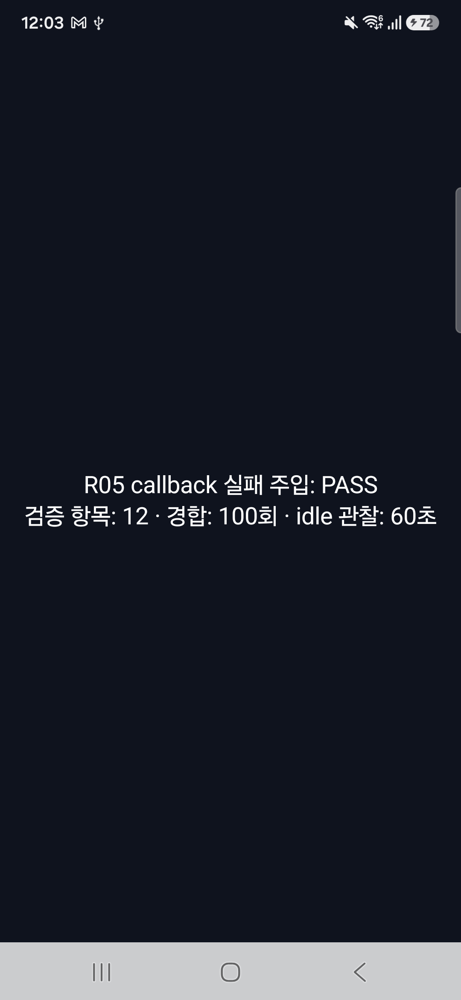

# R05 · Android 실기기 callback 실패 주입 결과

**기기:** Samsung SM-S731N · Android 16 · SDK 36 / `SDK_INT_FULL=36.1` · ARM64 · 4KB page

**결과:** 실기기에서 두 번 실행했다. 두 실행 모두 12 checks, timeout/callback 경합 100회, idle 60초를 통과했고 결과 이미지에 PASS가 보인다. 단, fixture가 받은 TransactionStats의 baseline/recovery fence는 `pending`이라 usable present timestamp는 없었다. 이 실행은 물리 손가락 입력이나 지연 성능을 측정하지 않았다.

## 비교 기준과 빌드

- 기준은 [API 37.0 Android runner](../../../../tools/verify-r05-android-callback-faults.sh)의 동일 debug fixture·intent·필수 marker다. 그 runner는 emulator serial만 허용하므로 physical serial은 주입하지 않았다. physical transport/API guard, source·APK digest, 새 process PID, 동일 fixture assertion을 갖는 [실기기 driver](verify-physical.sh)를 따로 실행했다.
- 작업 소스는 `origin/main`의 앱 코드와 같고 문서 계획만 추가됐다. 고정 V8 revision `7b50b62cb18f28617959e8452e2cd18195b38bcf`의 clean checkout을 사용했다.
- 첫 빌드 시도는 `SPINON_V8_DIR`를 넘기지 않아 저장소 기본 경로에서 V8 checkout을 찾지 못하고 중단됐다. 실패 로그를 보존한 뒤 고정된 clean checkout 경로를 명시했고 debug APK 빌드 및 두 기기 설치가 성공했다. APK SHA-256은 `d9a26b62d326d4f9310394b9eb06ffcecbb7c31e27758548c27eb1b454e40bb1`로 API 37.0 실행본과 같다.
- 로그 수집은 전역 `logcat -c` 없이 새 Spinon process PID로 필터링했다. APK는 `adb install -r`로 교체 설치했고 앱 data 삭제·ADB reset·설정 변경은 없었다. 실제 USB serial은 공개 evidence에서 제거했다.

## 실행 결과

| 실행 | 앱 PID | summary | 경합 100회 | idle 60초 | 캡처 수집 |
|---|---:|---|---|---|---|
| run 01 | 6473 | 12 checks, failures 0 | callback 87 / timeout 13, pending 0 | samples 60, pending·queue·active 0 | 앱 시작 직후 PID 조회가 아직 빈 값을 반환해 임시 driver가 조기 종료했다. 앱은 독립적으로 fixture를 끝냈고 기존 Android logcat buffer의 결과와 PASS bitmap을 사후 보존했다. |
| run 02 | 8010 | 12 checks, failures 0 | callback 93 / timeout 7, pending 0 | samples 60, pending·queue·active 0 | 시작 직후 `pidof`의 정상적인 no-process 종료 코드 1을 허용하도록 고친 driver가 전체 capture·복구까지 통과했다. |

두 run에서 `actual_surface_callback_baseline`, `actual_surface_callback_after_recreation`, `actual_surface_callback_recovery`가 모두 PASS였다. Surface recreation 경로는 generation 1→2 뒤 늦은 callback을 `late_after_cancel`로 분류했다. recovery callback은 generation 2에서 전달됐다.

**present 신호 한계:** baseline과 recovery에서 `stats_available=true`였지만 `fence_state=pending`, `fence_signal_usable=false`였다. surface recreation 뒤 fence는 `signaled`였어도 stale/cancelled 요청이고 `current_surface=false`였다. 따라서 이 실기기에서 callback 전달과 세대 수명 경로는 검증했지만 usable present signal 또는 event→present 시간을 검증하지 못했다.

overflow 시나리오에서는 queue 64개를 비운 뒤 초과 callback이 caller thread에서 한 번 실행됐다(`caller_runs=true`, `inline_delta=1`, fence unusable). 이는 현재 `InlineOnRejectHandler`와 fixture가 요구하는 동작이다. 이 값을 callback 지연의 성능 결과로 해석하지 않는다.

run 02의 UI hierarchy에도 같은 PASS 문구가 있었고 current focus는 Spinon `MainActivity`였다. 테스트 후 원래 전면에 있던 Chrome으로 복귀했으며, 테스트 앱은 force-stop했다. postflight에서도 기기가 연결돼 있고 `stay_on_while_plugged_in=3`, screen timeout 30초 설정이 사전 값 그대로임을 확인했다.

## 환경 복구와 범위

- R05 API 37.0 AVD `emulator-5580`은 종료했고 데이터 디렉터리와 API image를 유지했다. AVD 또는 image 재설치는 하지 않았다.
- `zl_poc`의 `emulator-5554`는 다른 프로젝트 프로세스이므로 종료하지 않았다. [AVD 사후 목록](../r05-android-api370-capture-2026-10-08/avd-postflight.txt)에 AVD 등록과 backing directory 상태를 기록했다.
- run 01의 첫 driver 조기 종료 원인과 복구된 fixture 결과를 숨기지 않고 보존했다. `pidof`가 process 생성 전 exit 1을 반환할 수 있음을 확인해 driver를 고치고 run 02에서 전체 수집을 통과시켰다.
- 두 번 모두 fixture input은 `synthetic_fixture`다. 물리 touch·앱 비교·release 성능·frame-present timestamp·광학 scanout·제품 event-to-present latency를 측정하지 않았다.
- Android 16 SDK 36.1의 이 Samsung 기기 한 대에 한정한다. API 29–35/37.x 전체와 R05.3 완료 근거가 아니다.

## 원본

- 실행 전 조건 및 독립 20개 실패 관점: [실기기 검증 계획](../../../../plan/r05-android-physical-callback-faults.md)
- 실행 후 별도 20개 실패 관점: [구현/실행 검토](implementation-review.md)
- 환경·빌드 실패 및 성공·APK/source checksum·앱 PID·filtered logcat·bitmap·hierarchy·Activity/focus·종료 상태를 `run-01-device/`, `run-02-device/`와 상위 `preflight.txt`, `postflight.txt`에 보존했다.
