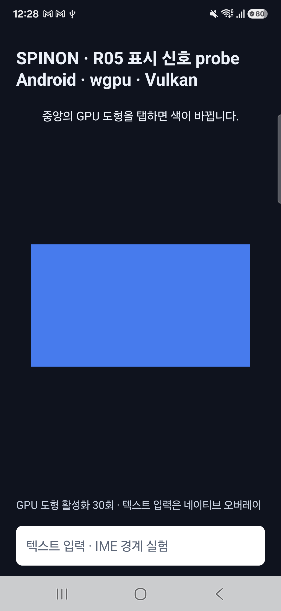
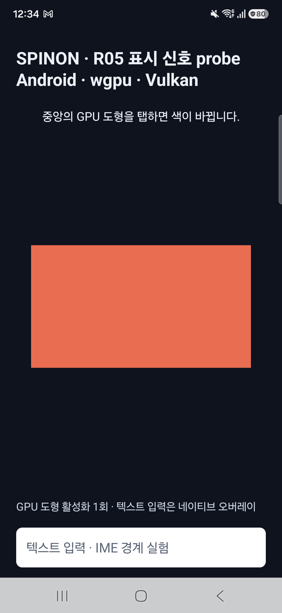

# Android 실기기 present-fence baseline

**실행 시각:** 2026-10-09 00:28 KST (2026-10-08 15:28 UTC)
**기기:** Samsung SM-S731N · Android 16 · SDK 36 / `SDK_INT_FULL=36.1` · ARM64 · 4KB page
**화면:** 1080×2340, density 450, 실행 중 render frame rate 60Hz, 지원 mode 60/120Hz
**renderer:** R08 WGPU/Vulkan · Samsung Xclipse 940 · `SurfaceView`
**결과:** 30개 synthetic 탭에서 입력·submit·TransactionStats callback 30/30 일치. fence 30/30은 유효했으나 callback 안에서 읽은 시점에는 모두 `pending`; usable signal은 0/30.

## 빌드와 입력 조건

- 앱은 `0.1.0-bootstrap` debug APK다. 기기에 설치된 APK SHA-256은 `d9a26b62d326d4f9310394b9eb06ffcecbb7c31e27758548c27eb1b454e40bb1`이며 [10월 8일 실기기 fixture](../r05-android-physical-callback-faults-2026-10-08/README.md)의 APK와 일치한다. 이전 APK 빌드의 source HEAD는 `8cab5154d6ab7be558d04381dda7d04eef08dfa7`이다.
- APK 빌드 HEAD의 Android 소스 manifest 8개 항목이 테스트 기준 `origin/main` `f421b52`와 모두 일치했다. V8 revision은 `7b50b62cb18f28617959e8452e2cd18195b38bcf`다. 이번 재실행에서는 이미 설치된 동일 APK를 사용했으며 새 빌드는 하지 않았다.
- 앱을 새 process로 실행해 R05 present-fence probe를 켰다. 화면 중앙 `(540, 1170)`을 `adb shell input tap`으로 450ms 간격 30회 입력했다. 입력 출처는 **실제 기기에 전달된 synthetic MotionEvent**이며 사람 손가락 입력은 아니다.
- 입력 sequence 1–30, revision 1–30, surface generation 1을 확인했다. Android API 36.1에서는 `SurfaceView_JankData` capability가 `api_below_37`로 비활성이고 `target_vsync_id=-1`이었다.

## 관찰 결과

| 항목 | 결과 |
|---|---:|
| 입력 `ACTION_UP` | 30 |
| R08 frame submit accepted | 30 |
| transaction callback 수신 | 30 |
| 입력 sequence·revision 일치 | 30/30 |
| callback 당시 current surface | 30/30 |
| fence descriptor 유효 | 30/30 |
| callback 시점 signal 상태 `pending` | 30/30 |
| usable present timestamp | 0/30 |
| crash/ANR 또는 callback 처리 오류 | 0 |

예를 들어 첫 표본은 `input_seq=1`, `revision=1`, `generation=1`, `fence_valid=true`, `fence_state=pending`, `latch_time_ns=1461753264209354`로 기록됐다. 모든 표본에서 `processing_error=none`, `fence_close_error=none`, `callback_inline_overflow=false`였다.

이 baseline 결과만으로는 callback 이후 signal 여부를 알 수 없었다. 후속 debug-only worker가 복제 fence를 제한 대기한 결과와 device run 근거는 [비동기 fence 관찰 보고서](async-wait/README.md)에 별도로 기록했다. callback이 pending이었다는 값을 GPU 미완료나 화면 미표시로 해석하지 않으며, 어느 결과로도 `event→present` 제품 지연값을 산출하지 않는다. 실행 전 계획은 [비동기 fence 신호 확인 계획](../../../../plan/r05-android-async-present-fence.md)이다.

## 화면 확인

측정 block 종료 캡처에는 GPU 도형 활성화 횟수 30이 보인다. 별도의 한 번 탭 시각 smoke에서 같은 GPU 도형이 파랑에서 주황 계열로 바뀌는 것을 확인했다. 두 입력 모두 ADB 주입이므로 이 캡처는 시각 변화 확인이며 실제 손가락 입력 검증은 아니다.

## 복구와 제한

- 앱 process를 종료하고 실행 전 전면 앱 Chrome으로 복귀했다. Android 설정은 바꾸지 않았다. `stay_on_while_plugged_in=3`, 화면 꺼짐 시간 30,000ms, 밝기 248, 화면 켜짐 상태가 전후 동일했다.
- ADB serial은 저장하지 않았다. 앱 logcat은 process PID로 필터링했고 global logcat buffer는 비우지 않았다.
- 이 단일 실기기·단일 renderer·debug 실행은 실제 손가락 입력, optical scanout, 제품 event-to-present 지연, 성능 순위 또는 R05.3 완료 근거가 아니다. 60Hz 환경에서 새 async wait 경로를 확인하기 전까지 fence 신호는 미확정이다.

## 원본 자료

- [실행 환경](run-01/environment.txt)
- [입력 protocol](run-01/input-protocol.txt)
- [실행 process와 시각](run-01/process.txt)
- [probe 전 log](run-01/logcat-before-input.txt)
- [입력·submit·callback 전체 log](run-01/logcat.txt)
- [30회 후 screenshot](run-01/after-input.png)
- [one-tap 시각 smoke 원본](visual-smoke/)
- [SHA-256 manifest](run-01/SHA256SUMS)
- [변경 묶음 검토](pr-review.md)
- [실기기 callback lifecycle 이전 결과](../r05-android-physical-callback-faults-2026-10-08/README.md)
