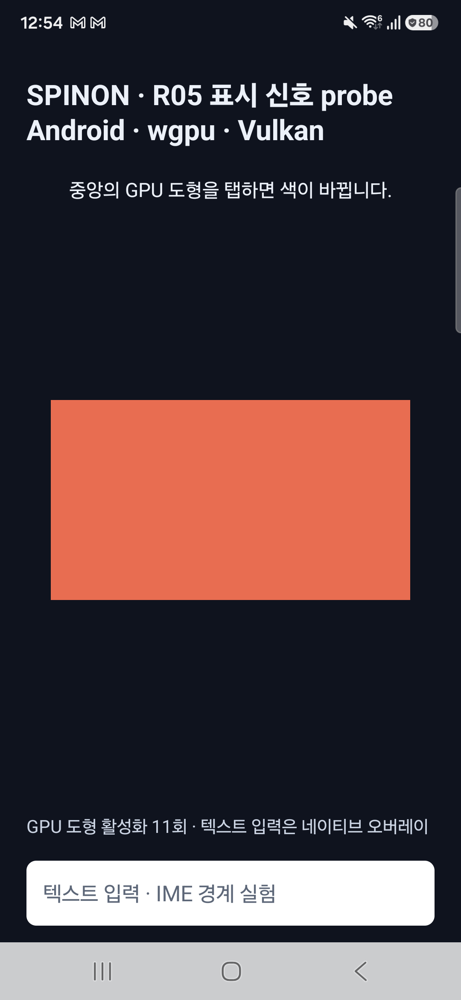

# Android 실기기 비동기 present-fence 관찰

- **실행:** 2026-10-09 00:53–00:55 KST
- **기기:** Samsung SM-S731N · Android 16 · SDK 36 / `SDK_INT_FULL=36.1` · ARM64 · 4KB page
- **화면:** 1080×2340 · density 450
- **renderer:** R08 WGPU/Vulkan `SurfaceView`
- **결론:** callback 직후 `pending`이던 fence도 callback 반환 후 복제본에서 signal을 확인했다. 최종 빌드의 독립 process 3개에서 scored 30개와 drain 3개 모두 입력·submit·callback·usable async signal까지 연결됐다.

## 실행 경로와 빌드

- 새 `spinon_r05_async_fence_wait` debug intent로만 실험을 켠다. callback 안에서는 API 35 `SyncFence` 복제와 bounded queue 제출만 하고, `await(Duration.ofMillis(250))`은 독립 worker 둘이 수행한다. queue는 64개로 제한하고 overflow를 inline 실행하지 않는다. Activity가 종료되면 새 관찰을 끄지만 이미 접수한 worker는 자체 종료·close까지 처리한다.
- `SyncFence`를 사용하는 코드는 API 35 nested helper 안에 두고 API 35 미만에서는 실행 전에 거부한다. release source set에는 no-op이 아닌 실행 거부 stub을 둔다. Android debug APK 빌드와 release Java source-set compile이 모두 통과했다. release APK를 만들거나 release runtime을 실행한 것은 아니다.
- debug APK는 `0.1.0-bootstrap`, versionCode 1이다. 빌드 APK와 기기에서 pull한 설치 APK가 바이트 단위로 일치했고 SHA-256은 `608fbdf9279ddded605c7129fb0123ce32a65d7452f6ff1b36702b9eed7b198e`다. V8 revision은 `7b50b62cb18f28617959e8452e2cd18195b38bcf`다. 변경 Java 소스의 해시는 [build-inputs.sha256](build-inputs.sha256)에 있다.
- Gradle은 compile SDK 37.2와 AGP 8.13.2의 호환성 권고를 출력했지만 debug build와 release Java compile은 성공했다.

## 입력 protocol

- 매 block은 앱을 force-stop한 뒤 새 process로 cold launch했다. 총 세 block이며 각각 첫 10회는 scored, 11번째는 마지막 transaction callback drain용 unscored 입력이다.
- 입력은 `(540, 1170)`에서 `adb shell input tap`으로 만든 synthetic Android `MotionEvent`이고 간격은 약 450ms다. 사람 손가락 touch의 출처·응답성·event-to-photon은 시험하지 않았다.
- 각 block에서 `input_seq`와 `revision` 1–11이 submit·TransactionStats callback·async 결과 각각의 동일한 sequence에 1:1 대응했다. 세 block 모두 서로 다른 앱 process에서 수집했다.
- Android API 36.1에서는 `SurfaceView_JankData`가 `api_below_37`로 제공되지 않았고 `target_vsync_id=-1`이었다. 따라서 FrameTimeline VSync join은 확인하지 않았다.

## 결과

| block | scored 입력 | drain 입력 | 입력 | submit | 실제 callback | usable async signal | callback 당시 fence |
|---|---:|---:|---:|---:|---:|---:|---|
| 01 | 10 | 1 | 11/11 | 11/11 | 11/11 | 11/11 | pending 11 |
| 02 | 10 | 1 | 11/11 | 11/11 | 11/11 | 11/11 | pending 10, signaled 1 |
| 03 | 10 | 1 | 11/11 | 11/11 | 11/11 | 11/11 | pending 11 |
| **합계** | **30** | **3** | **33/33** | **33/33** | **33/33** | **33/33** | **pending 32, signaled 1** |

33개 async 결과는 모두 복제 fence가 대기 전후 유효했고 `await`가 반환한 뒤 양수의 monotonic signal 시각을 읽었으며 latch 순서 검사를 통과했다. observer error, queue rejection, timeout, wait/close error는 없었다. 각 block의 마지막 결과에서 `pending=0`, `active=0`, `queue_depth=0`, `completed=11`이었다. UI thread, transaction callback thread, fence waiter thread의 OS TID는 각 block에서 서로 달랐다.

`await()` 호출 자체의 측정 구간은 33개에서 0.111–13.452ms였다. 이 수치는 worker가 fence를 기다린 시간일 뿐이며, 입력부터 표시까지의 지연값으로 해석하지 않는다. 실제 panel scanout/photon 시각은 측정하지 않았고, API 36.1에서 target VSync ID도 제공되지 않았다.

각 block의 crash buffer는 비어 있었다. Android `ApplicationExitInfo`는 세 process 모두 테스트 후 명시적으로 force-stop한 `USER REQUESTED`로 기록했다. 입력 log에 callback/worker 오류나 ANR 표식도 없었다.

## 시각 확인 및 실행 제외

처음 시도한 block은 앱이 foreground가 아닌 상태로 바뀌어 입력이 probe에 도달하지 않았다. 이를 집계에서 제외하고, foreground 확인 후 최종 APK에서 세 block을 다시 실행했다. 재시도 후 캡처 한 장이 앱 화면 대신 시스템 overlay를 담아 해당 이미지는 즉시 폐기했다. 그 block의 process-filtered log에는 입력·submit·callback·async 결과가 모두 있어 측정은 유효하며, 화면 이미지는 근거로 사용하지 않는다.

## 기기 복구와 한계

- 실행 전후 화면은 켜져 있었고 `stay_on_while_plugged_in=3`, 화면 꺼짐 시간 30,000ms, 밝기 248이 유지됐다. 실험 후 Spinon을 force-stop하고 Chrome을 foreground로 복귀시켰다.
- 세 logcat 파일은 process PID로 분리했다. global logcat buffer는 지우지 않았으며 ADB serial은 저장하지 않았다.
- 이번 결과는 Android 16.1 실기기 한 대, WGPU/Vulkan, debug 빌드와 synthetic 입력에 한정된다. fence가 callback 뒤 signal될 수 있다는 점을 확인했지만, OS signal은 물리 scanout 완료 증거가 아니다. 실제 finger touch, surface 수명 경합, queue 포화·rejection, API 29–35 runtime, release APK, optical measurement, renderer 성능 비교는 검증하지 않았다. R05.3은 미완료다.

## 원본 자료

- [block 01 process log](run-01/logcat.txt) · [launch](run-01/launch.png) · [결과 캡처](run-01/after-11-taps.png)
- [block 02 process log](run-02/logcat.txt) · [결과 캡처](run-02/after-11-taps.png)
- [block 03 process log](run-03/logcat.txt)
- [build source SHA-256](build-inputs.sha256) · [APK SHA-256](apk.sha256) · [전체 증거 checksum](SHA256SUMS)
- [구현 실패 관점 검토](implementation-review.md) · [PR 변경 검토](implementation-pr-review.md)
- [실행 전 계획 및 계획 실패 관점](../../../../../plan/r05-android-async-present-fence.md)
