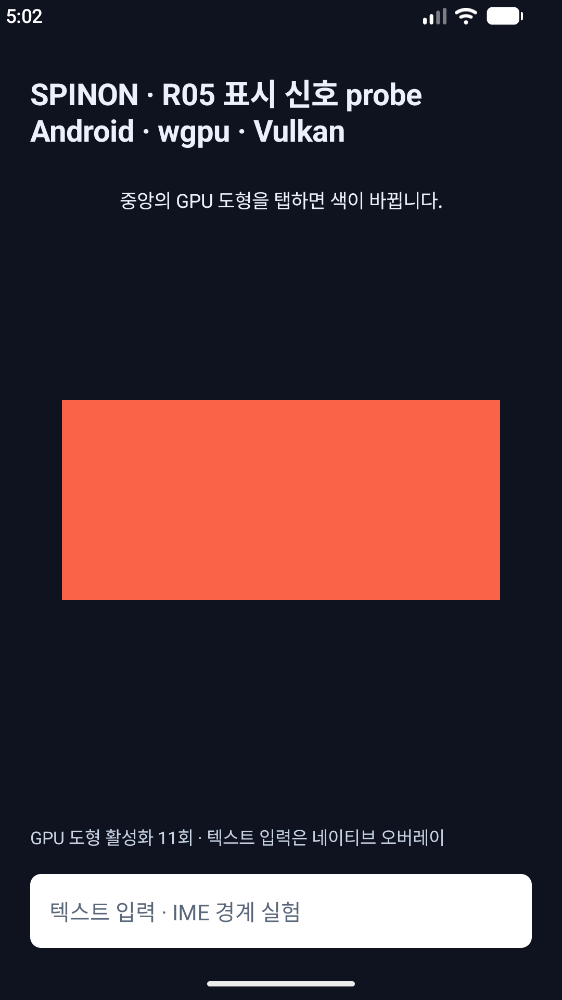

# R05.3 Android transaction present-fence 반복 측정

**실행일:** 2026-10-08 · **환경:** Android AVD만 · **결과:** 119/120 scored fence 신호 사용 가능 · **R05.3/R05:** 미완료

## 실행 범위와 방법

API 36 ARM64 AVD emulator-5554(1080×2400)와 API 37.2 ARM64 AVD emulator-5562(1080×1920)에서 WGPU/Vulkan 및 GLES 2.0을 각각 별도 앱 프로세스 3개로 실행했다. 각 프로세스에서 adb가 주입한 synthetic 중앙 탭 10개를 점수화하고, 비동기 callback 배출을 위한 11번째 입력은 unscored drain으로 뺐다. 입력 간격은 약 450ms였다. 실기기 입력은 하지 않았다.

API 35부터 제공되는 SurfaceControl.Transaction 완료 listener를 같은 SurfaceView frame transaction에 먼저 등록하고, transaction을 SurfaceView.applyTransactionToFrame()에 전달했다. API 37.2에서는 해당 transaction에 FrameTimeline VSync ID도 넣고, JankData의 VSync ID를 정수 exact match로 연결했다. callback에서 TransactionStats.getPresentFence()의 signal time을 읽고 caller-owned SyncFence를 닫았다. invalid/pending/비양수/미래 signal, latch 순서 이상, surface 세대 변화, callback overflow와 clock 구간 불일치는 성공 표본에서 제외했다.

Android 공식 API는 present fence가 transaction이 표시된 때 signal된다고 규정하고, 반환된 fence는 호출자가 닫아야 한다고 명시한다. latch time은 frame이 latch되어 표시 대기열에 들어간 시각이다. 따라서 이 보고서의 timestamp는 OS transaction 표시 신호 후보이며 패널 scanout이나 픽셀 발광 시간은 아니다. [TransactionStats 공식 API](https://developer.android.com/reference/android/view/SurfaceControl.TransactionStats) · [SyncFence 공식 API](https://developer.android.com/reference/android/hardware/SyncFence)

## 빌드와 실행 환경

- Android Java 소스 컴파일과 debug APK 패키징을 통과했다. APK 패키징은 기존 생성 native artifact를 재사용하려고 :app:prepareSpinonBootstrap을 제외했다.
- 전체 bootstrap 빌드는 pinned V8 source checkout이 이 worktree에 없어서 실행하지 못했다. checkout은 저장소의 큰 V8 source tree를 가져오므로 실행하지 않았다. 따라서 clean full build를 통과했다고 주장하지 않는다.
- 테스트 APK SHA-256: 325611b9427ac66a2c82722f89c3193a24b7f04671dadd38b98f9aff90c605cd
- API 36 AVD WGPU backend는 llvmpipe, GLES는 ANGLE/SwiftShader다. API 37.2도 WGPU/Vulkan llvmpipe와 GLES/ANGLE SwiftShader로 서로 다른 virtual graphics path를 사용한다.

## 반복 결과

각 block은 input, submit, fence callback 11/11개였고 sequence 1–11이 중복 없이 일치했다. GLES는 scored/drain revision 1–11의 실제 onDrawFrame 기록을 각각 확인했다. WGPU는 입력별 draw_accepted 제출 기록 11/11을 확인했다. WGPU의 이 기록은 GPU 완료 callback을 뜻하지 않는다. API 37.2의 scored 60개는 모두 같은 target VSync ID의 JankData와 exact match했고, 그 60개의 JankData presentTimeNanos는 모두 -1이었다.

| API / renderer | Block 1 | Block 2 | Block 3 | usable 합계 | event→fence 후보 ms: 최소 / 중앙값 / 최대 |
|---|---:|---:|---:|---:|---:|
| API 36 WGPU/Vulkan | 10/10 | 10/10 | 10/10 | 30/30 | 8.462 / 16.723 / 95.127 |
| API 36 GLES 2.0 | 10/10 | 10/10 | 10/10 | 30/30 | 4.542 / 12.939 / 47.317 |
| API 37.2 WGPU/Vulkan | 10/10 | 10/10 | 9/10 | 29/30 | 28.696 / 40.585 / 75.770 |
| API 37.2 GLES 2.0 | 10/10 | 10/10 | 10/10 | 30/30 | 29.988 / 40.521 / 78.171 |

API 37.2 WGPU block 3의 input 1은 fence descriptor 자체는 valid였지만 getSignalTime()이 SIGNAL_TIME_PENDING을 반환했다. 이 표본은 30개 목표 수를 맞추려고 대체하지 않았으며, 29/30으로 보존했다. 해당 input의 JankData VSync ID는 exact match였지만 presentTimeNanos는 -1이었다.

후보 지연은 input event의 uptime 시각을 입력·callback에서 측정한 uptime−CLOCK_MONOTONIC offset 구간의 교집합으로 변환해 산출했다. 각 표본의 후보는 하나의 확정 시각이 아니라 해당 offset 구간으로 계산했다. 점수에 포함한 표본의 두 anchor 구간은 모두 겹쳤고 후보 구간은 양수였다. 중앙값은 구간 중앙값들의 요약이며 정확한 touch-to-photon 지연이 아니다.

네 API/renderer 환경의 GPU stack과 AVD 화면 구성이 다르므로 위 분포로 WGPU와 GLES의 성능 우열을 정하지 않는다. adb 입력은 물리 touch timing을 나타내지 않는다. API 37.2의 JankData timestamp가 unknown인 이유도 이 실험만으로 특정하지 못했다.

## 화면과 원본 로그

각 block과 단일 capability 실행의 원본 로그·캡처는 [evidence 디렉터리](r05-present-fence-capability-2026-10-08/)에 보존했다. block 로그는 API/renderer별 3개이며 파일명에 block 번호를 포함한다. SHA-256은 같은 디렉터리의 SHA256SUMS에서 확인한다.

## 구현 적대 검토 · 20개 독립 실패 관점

아래 구현 검토는 계획 문서의 별도 20개 계획 실패 관점을 재사용하지 않았다. 코드 경로·공식 계약·각 block 원본 로그를 대조했다. 실행하지 않은 고장 주입은 정적 검토로 표시했다.

| # | 실패 관점 | 결과와 근거 |
|---:|---|---|
| 1 | API 35 미만에서 새 Android API 참조로 앱 시작이 깨짐 | MIN_API 분기와 API 전용 중첩 class를 확인했다. API 36 fallback은 실제 실행했다. API 29–34 실행은 미검증이다. |
| 2 | main thread가 아닌 곳에서 frame transaction을 생성 | 잘못된 thread에서는 표시 probe를 닫고 기본 submit만 진행하는 분기를 확인했다. 비정상 thread 주입은 미실행이다. |
| 3 | detached 또는 stale SurfaceView에 transaction을 붙임 | 등록 전 attach·surface·generation을 확인하고 callback에서도 generation을 재검사한다. stale 상태 직접 주입은 미실행이다. |
| 4 | listener를 등록하지 않은 transaction 또는 다른 transaction의 callback을 연결 | 한 transaction 객체에 listener를 등록한 뒤 같은 객체를 applyTransactionToFrame()에 전달하는 호출 순서를 확인했다. |
| 5 | callback 순서로 input을 잘못 귀속 | closure가 보존한 request/input/revision/generation/VSync ID를 사용한다. 12개 block의 sequence-keyed 로그가 일치했다. |
| 6 | API 37.2에서 다른 VSync record를 target frame으로 오인 | scored JankData 60/60에서 target_vsync_id와 vsync_id 정수 일치 및 exact join을 확인했다. |
| 7 | callback·submit 누락이나 duplicate를 합계로 숨김 | 각 block이 input/submit/fence 11/11/11이고 sequence 1–11이 unique인 것을 독립 파서로 확인했다. |
| 8 | fence는 왔지만 renderer가 해당 revision을 그리지 않음 | GLES 12개 block에서 revision 1–11의 onDrawFrame을 확인했다. WGPU는 draw_accepted 제출만 확인했으며 GPU 완료는 보장하지 않는다. |
| 9 | valid descriptor를 signaled fence로 잘못 해석 | API 37.2 WGPU block 3의 pending signal 하나를 실패로 보존해 scored set에서 제외했다. |
| 10 | invalid·pending·0·미래·latch 순서 이상을 정상 표시로 합침 | 상태 분기와 usable 조건을 검토했고 pending 실제 관측은 거부됐다. 다른 오류 상태의 직접 주입은 미실행이다. |
| 11 | uptime과 CLOCK_MONOTONIC을 동일 clock으로 취급 | 두 시점 offset bracket의 교집합만 사용한다. 전 scored latency 표본에서 교집합이 있었고 구간 산출값이 양수였다. |
| 12 | 불확실한 clock 구간을 단일 정밀값처럼 표시 | 원시 bracket과 교집합을 보존하고 후보 범위로 해석했다. 표의 중앙값은 후보 구간 midpoint 분포이며 정밀도 보장이 아니다. |
| 13 | fence descriptor를 닫지 않아 native 자원이 누수 | getPresentFence() 결과를 finally에서 닫고 close 오류 시 usable=false가 된다. close 실패 자체는 주입하지 않았다. |
| 14 | callback 예외가 TransactionStats 정리를 건너뛰게 함 | listener 경계에서 Throwable을 격리하는 코드를 확인했다. TransactionStats cleanup 동작은 Android framework source 계약에 의존하며 예외 주입은 미실행이다. |
| 15 | callback executor 포화 때 framework 전달 command가 유실 | rejection handler가 callback command를 inline 실행하고 해당 표본을 표시 불가 처리한다. 이 전용 executor를 포화시키는 runtime 검사는 미실행이다. |
| 16 | timeout/cancel과 늦은 callback이 성공 상태를 되살림 | atomic state CAS와 late outcome을 확인했다. timeout/cancel과 callback을 동시에 유도하는 경합 주입은 미실행이다. |
| 17 | rotation/pause 뒤 이전 surface callback을 새 화면에 붙임 | generation 소유권 검사와 surface별 cancel 코드를 확인했다. 이번 matrix는 generation 1 안정 상태이며 pending fence 회전 경합은 미검증이다. |
| 18 | 요청 map·queue가 무제한 성장하거나 거부를 숨김 | request·callback queue 각각 capacity 64와 거부 처리 코드를 확인했다. fence callback queue saturation은 미실행이며 별도의 JankData queue 포화 검증과 혼동하지 않았다. |
| 19 | drain 또는 실패 표본으로 30회 합격을 채움 | 각 block에서 sequence 1–10만 점수화하고 11은 drain으로 분리했다. pending 입력을 제외해 WGPU API 37.2는 29/30으로 보고했다. |
| 20 | AVD 신호 후보를 물리 touch, renderer 우위 또는 photon latency로 확대 | 입력 source unknown과 서로 다른 AVD graphics path를 기록했다. 실기기·광학 계측·성능 비교 주장은 하지 않는다. |

로그 판정기 부정 대조 8개는 pending, stale surface, inline overflow, clock 불일치, close 실패, callback read 실패, invalid fence, timeout 후 callback을 모두 거부했다. 이는 offline eligibility 조건의 변형 점검이며 앱 callback 고장 주입이 아니다.

## 남은 관문

- iPhoneOS SDK device target type-check 및 실제 iOS 정적 라이브러리를 연결한 격리 앱 compile/link가 통과했다. iOS Simulator SDK target에는 device callback API가 없어 type-check가 실패한다. 이후 같은 root `CAMetalLayer` subclass의 실제 WGPU acquire hook과 XCTest 입력→draw ticket exact join을 Simulator에서 확인했고, probe-off R08 대조도 통과했다. [iOS 실행 근거](r05-ios-present-feedback-2026-10-08.md) · [SDK matrix](r05-presentation-signal-probe-2026-10-08/ios-sdk-matrix-typecheck.log). 아직 device callback runtime과 full V8 app bundle은 미검증이며 물리 iPhone 검증은 사용자 요청 뒤에만 실행한다.
- Android API 29–35 및 37.0/37.1 호환, transaction callback timeout/cancel/lifecycle/overflow 고장 주입, 실기기 입력은 미검증이다.
- 실기기 검증은 사용자가 별도로 요청하기 전 수행하지 않는다. optical sensor 없이 물리 scanout 또는 finger-to-photon latency를 주장하지 않는다.
- R05.3은 플랫폼별 표시 신호와 시간 결합을 닫지 못했고, R05 전체도 제품 비교 계측이 끝나지 않아 미완료다.
