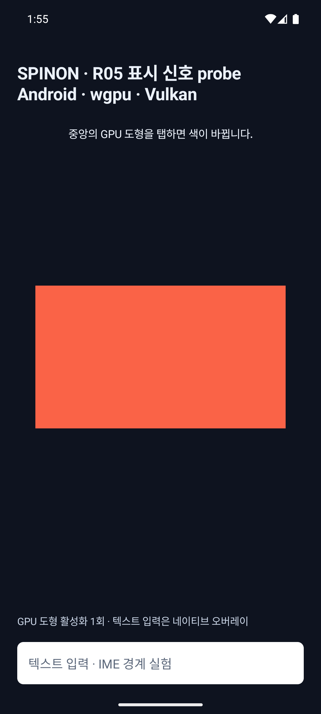
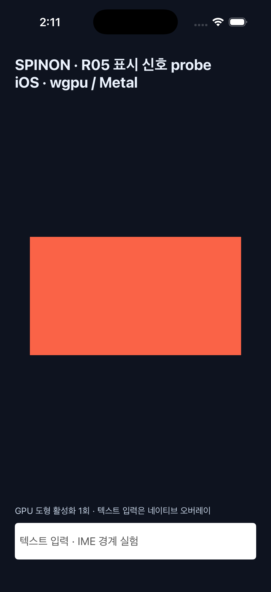
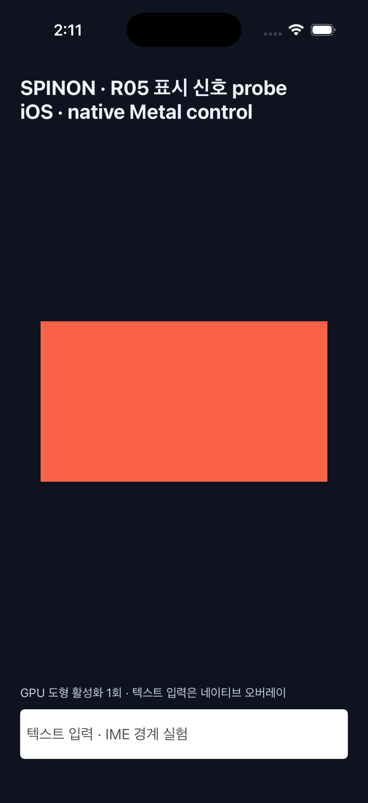
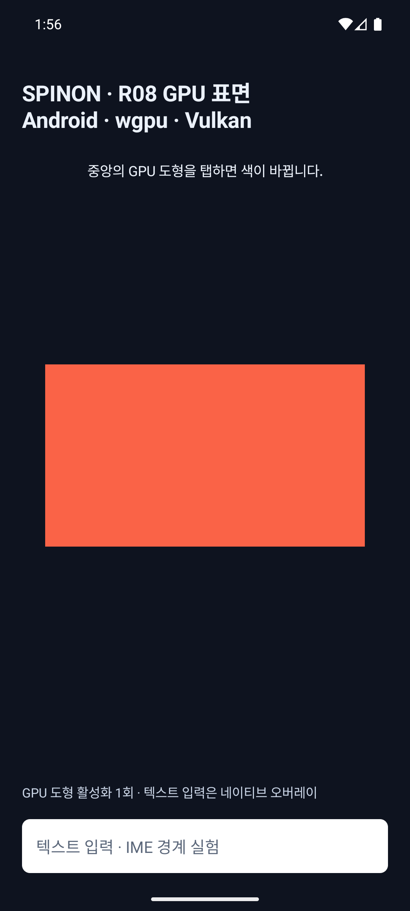
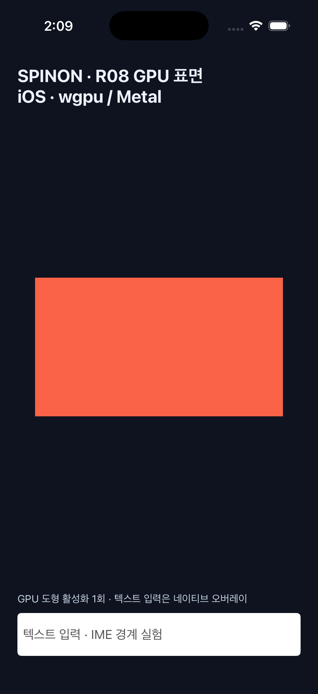
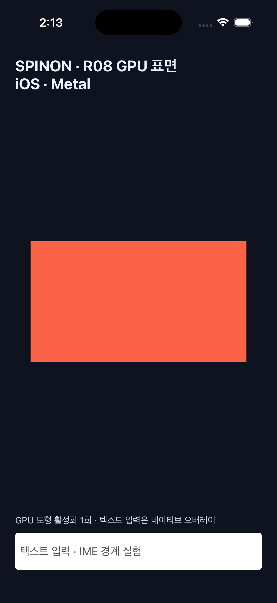

# R05.3 입력·제출 신호 시뮬레이터 probe

## 실행 환경

- iOS: Xcode 26.2 (17C52), iOS 26.2 Simulator, iPhone 17 Pro, arm64.
- Android: API 36 arm64 Emulator `emulator-5554`, 1080×2400, density 420.
- V8 고정 revision: `7b50b62cb18f28617959e8452e2cd18195b38bcf`.
- 빌드: 고정 V8 checkout을 `SPINON_V8_DIR`로 지정해 `mise exec -- bun run build:ios-sim`과 `mise exec -- bun run build:android`를 실행했고 둘 다 성공했다. iOS build는 최종 Swift gesture/surface 변경 뒤 다시 성공했다.
- 입력은 iOS `idb ui tap`/`idb ui swipe`와 Android `adb shell input tap`으로 주입했다. 모두 synthetic이며 앱 내부에서는 출처를 판별할 수 없어 `input_source=unknown`으로 남긴다. 실기기 입력은 하지 않았다.

## 관측 결과

| 경로 | 실행 | 관측 | 해석 |
|---|---|---|---|
| Android wgpu / Vulkan | 바깥 좌표 1회, 도형 중앙 1회 | 바깥 입력은 `outside_target`으로 제외. 중앙 입력 `seq=1 → revision=1`, surface generation 1, `draw_accepted=true` | 입력 종료와 draw 호출 반환까지 연결됐다. `present_signal=unavailable`이므로 실제 표시 시각은 없다. |
| iOS wgpu / Metal | 바깥 좌표 1회, 도형 중앙 1회 | 바깥 입력 제외. 중앙 입력 `seq=1 → revision=1`, generation 1, Rust/wgpu draw 결과 0 | wgpu 호출 반환만 확인했다. drawable ID/presentation callback은 얻지 못했다. |
| iOS native Metal 대조 | 바깥 좌표 1회, 도형 중앙 1회 | 중앙 입력 `seq=1 → revision=1`; command buffer completion callback 수신 | 완료 callback은 GPU command buffer 상태다. 표시 완료 신호로 취급하지 않았다. `presentation_signal=unavailable`. |
| R05 비활성 대조 | Android wgpu, iOS wgpu, iOS native Metal 기존 R08 경로에서 중앙 탭 | 세 경로 모두 기존 탭 동작, R05 비활성 로그에서 R05 marker 0개 | probe flag가 꺼진 기존 입력·그리기 경로를 확인했다. iOS 로그는 [wgpu](r05-presentation-signal-probe-2026-10-08/ios-baseline-followup.log)와 [native Metal](r05-presentation-signal-probe-2026-10-08/ios-metal-baseline.log)에 있다. |

iOS gesture follow-up에서 wgpu와 native Metal 대조 모두 `idb ui swipe 20 420 196 420 --duration 0.5 --delta 5`를 실행했다. 도형 바깥에서 시작해 안에서 끝난 swipe는 `outside_target`으로 제외했다. `idb ui swipe 100 420 196 420 --duration 0.5 --delta 5`는 도형 안에서 시작·종료했지만 8pt probe movement 기준을 넘어 `gesture_moved`로 제외했다. 이후 `idb ui tap 196 420`은 두 경로에서 `seq=1 → revision=1`로 연결됐다. [추가 실행 로그](r05-presentation-signal-probe-2026-10-08/ios-gesture-followup.log). 비활성 대조는 최종 변경 빌드에서도 다시 실행했다. [iOS 비활성 경로 로그](r05-presentation-signal-probe-2026-10-08/ios-baseline-followup.log).

iOS wgpu의 R13 window detach/reattach 대조에서 surface generation `1 → 2`를 기록했고, 재부착 뒤 입력과 제출 모두 generation 2였다. 이는 재부착의 로그 귀속 smoke test다. detach 도중 활성 입력을 강제 주입하지는 않았다.

Android API 36 표본의 `MotionEvent.getEventTimeNanos()` 값은 나노초 API 표현을 사용했지만 관측값은 1ms 경계에 정렬됐다. 나노초 표현은 나노초 정확도를 보장하지 않으므로 시간 지연 결과로 일반화하지 않는다. 입력·handler에는 uptime 계열을 사용했다. API 35 이상은 `SystemClock.uptimeNanos()`, 그 아래는 밀리초 fallback을 별도 표시한다.

iOS 표본의 `UITouch.timestamp`, `ProcessInfo.systemUptime`, `CACurrentMediaTime()` anchor는 이 시뮬레이터 로그의 1µs 소수 자릿수에서 같은 epoch 값으로 관측됐다. 표본이 제한적이므로 clock 변환 오차 상한을 확정하지 않았다.

이 실행은 소수 synthetic 입력으로 한 연결 smoke test다. p50/p95, 입력→표시 지연, 프레임 순위, 실기기 동작 또는 release 성능을 주장하지 않는다. Android 한 입력에서는 submit 호출 구간이 약 59.2ms로 관측됐다. 단일 시뮬레이터 표본이고 Trace 계측과 `drawCurrentFrame` 호출 경계를 포함하므로 원인이나 화면 표시 시각으로 단정하지 않는다. 다음 Android 조사 항목으로 남긴다.

## 표시 신호 capability 판정

### Android

현재 R08 wgpu 출력 표면은 `SurfaceView`다. Perfetto FrameTimeline 문서는 `SurfaceView`를 지원 대상으로 설명하지 않으므로 앱은 capability 실패를 명시하고 값을 대체하지 않는다. [Perfetto FrameTimeline 지원 범위](https://perfetto.dev/docs/data-sources/frametimeline). API 36 Emulator 로그에는 `Perfetto_FrameTimeline_on_SurfaceView available=false`가 기록됐다. 이 probe에서는 `JankData`나 SurfaceFlinger의 다른 timestamp를 actual-present 값으로 대입하지 않았다.

### iOS

Apple 문서는 `MTLDrawable.presentedTime`과 `addPresentedHandler`를 표시 시각/callback API로 설명한다. [MTLDrawable.presentedTime](https://developer.apple.com/documentation/metal/mtldrawable/presentedtime) · [MTLDrawable.addPresentedHandler](https://developer.apple.com/documentation/metal/mtldrawable/addpresentedhandler%28_%3A%29). 아래 SDK matrix에서 Xcode 26.2 iPhoneOS SDK의 device target은 `drawableID`, `addPresentedHandler`, `presentedTime` Swift type-check를 통과했고, 같은 Xcode의 Simulator SDK는 세 멤버가 없어 실패했다. 비공개 API나 selector로 우회하지 않았다.

대조 경로는 `MTLCommandBuffer.addCompletedHandler`에서 completion status와 callback uptime만 기록한다. 제출 로그와 완료 로그는 실제 화면 표시 완료가 아니다. wgpu 쪽도 drawable identity를 앱 계층에 공개하지 않아 같은 제한을 가진다.

## 시뮬레이터 화면과 원본

| 화면 | 캡처 |
|---|---|
| Android R05 wgpu |  |
| iOS R05 wgpu |  |
| iOS native Metal 대조 |  |
| Android R05 비활성 대조 |  |
| iOS R05 비활성 대조 |  |
| iOS native Metal R05 비활성 대조 |  |

원본 OS 로그와 캡처는 [실행 자료 디렉터리](r05-presentation-signal-probe-2026-10-08/)에 두었다. SHA-256은 [체크섬 파일](r05-presentation-signal-probe-2026-10-08/SHA256SUMS)에 기록했다.

## 최초 WGPU probe 구현 적대 검토 · 후속 수정 전 기록

아래 관점은 서로 다른 표본 오염·플랫폼 경계·기능 비활성 경로를 대상으로 코드를 다시 읽고, 가능한 항목은 실제 시뮬레이터 출력과 대조했다. “정적 검토”로 표시한 포인터 취소·다중 터치·접근성 경로는 시뮬레이터에서 직접 주입하지 않았다.

| # | 공격 관점 | 확인과 결과 |
|---:|---|---|
| 1 | probe flag가 꺼져도 새 로그나 동작 변경이 새어 나오는가 | Android·iOS R05 비활성 실행에서 R05 표식이 0개이고 기존 색상 변경은 동작했다. 통과. |
| 2 | iOS native Metal 대조를 wgpu 결과로 오인하는가 | renderer 이름이 로그·화면에 분리되고 대조값을 wgpu 제품 값으로 대체하지 않는다. 통과. |
| 3 | Android ACTION_DOWN을 입력 완료 시각으로 사용하는가 | 표본은 단일 gesture의 ACTION_UP에서만 생성한다. API 36 로그 phase와 일치. |
| 4 | 두 번째 포인터를 올린 뒤 마지막 단일 ACTION_UP을 단일 터치로 오인하는가 | ACTION_POINTER_DOWN/UP에서 gesture 전체 multi-pointer 표식을 유지한다. 코드 검토 통과; multi-touch는 미주입. |
| 5 | ACTION_CANCEL을 성공 탭으로 계산하는가 | pending 표본을 지우고 취소 사유만 남긴다. 코드 검토 통과; 취소 입력은 미주입. |
| 6 | 보이는 도형 밖을 눌러 입력 시퀀스가 생기는가 | Android·iOS 바깥 좌표에서 outside_target 제외 로그를 관측했다. 통과. |
| 7 | 바깥에서 시작해 안에서 끝나거나, 도형 안에서 크게 이동한 swipe를 탭으로 오인하는가 | Android는 touch slop 초과·target 이탈 시 gesture를 영구 제외한다. iOS는 시작점·이동·끝점을 추적하고 target 이탈 또는 8pt 초과 이동 뒤에는 계속 제외한다. 두 iOS renderer에서 synthetic swipe 두 유형을 실행해 `outside_target`/`gesture_moved`를 관측했고, 뒤이은 정상 탭만 seq=1로 연결했다. |
| 8 | API 34 미만에서 없는 나노초 getter를 호출하는가 | API 34 gate 뒤 나노초 event getter를 쓰고 그 아래는 ms fallback을 기록한다. 코드 검토 통과. |
| 9 | Android event와 handler에 서로 다른 monotonic epoch를 섞는가 | event/handler 모두 uptime 계열이며 handler 정밀도 fallback을 별도 출력한다. API 36 실행값 관측. 통과. |
| 10 | 이전 surface 입력을 재부착 뒤 새 generation과 합치는가 | Android는 surface destroy 때 pending을 제외한다. iOS wgpu detach/reattach에서 generation 1→2를 관측했고 재부착 뒤 input/submit은 모두 2였다. detach 중 활성 gesture 강제 주입은 하지 않았다. |
| 11 | revision이 빠졌는데 submit 성공으로 집계하는가 | Android 로그에서 input_seq=1, revision=1, draw_accepted=true가 연결됐다. 이는 API 호출 성공이지 표시 성공은 아니다. |
| 12 | 접근성 activation을 물리 터치로 기록하는가 | 입력 없는 activation은 input_seq=0/attribution=unmatched이며 iOS도 touch 없는 revision을 미연결로 기록한다. 코드 검토; VoiceOver/TalkBack 미주입. |
| 13 | iOS touchesEnded 한 개만 보고 동시 touch를 놓치는가 | probe는 began/moved/ended/cancelled 전체 gesture와 `event.allTouches`를 검사한다. R05 비활성 경로는 기존 끝점 판정을 유지한다. 코드 검토; 다중 touch 미주입. |
| 14 | 자동 주입을 physical 입력으로 오인하는가 | 앱 로그는 input_source=unknown; 실행 증거는 idb/ADB 입력으로 synthetic 분류했다. 통과. |
| 15 | iOS 입력과 handler clock epoch를 확인 없이 빼는가 | uptime/host anchor를 원시 로그로 남겼고 변환 오차 상한은 주장하지 않았다. 제한된 simulator 표본 통과. |
| 16 | iOS 접근성 callback revision을 직전 touch에 잘못 붙이는가 | touch == nil이면 입력 제외와 unmatched revision을 따로 기록한다. 코드 검토; 보조기기 미주입. |
| 17 | 직전 iOS 표본이 그려지지 않았는데 다음 revision과 연결되는가 | 중첩, renderer 부재, drawable/pipeline 부재에서 pending을 제외하고 지운다. 코드 검토; fault injection 미실행. |
| 18 | SDK에 없는 iOS 표시 callback을 있다고 가정하는가 | Xcode 26.2 Simulator SDK 부재를 재현해 시뮬레이터 경로는 unavailable로 fail-closed 처리했다. 이후 iPhoneOS SDK device target type-check도 별도로 통과했다. runtime callback은 미검증이다. |
| 19 | GPU command completion 또는 present() 반환을 화면 표시 시각이라 부르는가 | 로그를 GPU_COMPLETE/SUBMIT으로 분리하고 두 경로 모두 presentation_signal=unavailable임을 확인했다. 통과. |
| 20 | Android API 36 SurfaceView에 FrameTimeline이 나온다고 가정하는가 | 실제 surface와 Perfetto 지원 계약을 대조해 unavailable로 남겼고 actual-present 지연을 계산하지 않았다. 통과. |

초기 실행 시점에 확인한 것은 입력→revision→제출 호출 연결과 capability 실패의 안전한 표기였다. **R05.3 및 R05 전체는 미완료**다. 후속 iOS 작업에서 WGPU drawable acquire hook과 synthetic XCTest 입력 귀속을 확인했고, 이후 callback ledger도 구현해 별도 Swift 시험과 iPhoneOS target compile/link를 통과했다. 현재 남은 iOS 항목은 기기 callback runtime, clock residual, 전체 V8 앱 bundle이다. 이 문서 뒤쪽 [후속 실행 근거](r05-ios-present-feedback-2026-10-08.md)를 현재 상태의 기준으로 본다. Android의 단일 59.2ms submit-call 관측은 통제 조건으로 재현해야 한다. 실기기 실행은 사용자 요청 전까지 보류한다.

## 2026-10-08 표시 신호 API 후속 검증

### Android API 37.2 probe

`R05PresentTimingProbe`를 추가해 API 37.2부터 공개된 `SurfaceView.registerOnJankDataListener()`에서 `vsyncId`, `presentTimeNanos`, jank 분류와 callback 시각을 원시값으로 기록하도록 했다. 실제 `SurfaceView`의 생성·소멸에 등록 수명을 연결한다. API 36에서 사용 가능한 `SDK_INT_FULL`을 읽어 `api_full`로 남기고, 37.2 미만이면 등록하지 않는다. frame/revision 귀속은 아직 없으므로 각 record는 `frame_id=unmatched revision=unmatched attribution=unmatched`다. [공식 SurfaceView API](https://developer.android.com/reference/android/view/SurfaceView#registerOnJankDataListener(java.util.concurrent.Executor,android.view.SurfaceControl.OnJankDataListener)) · [JankData의 표시 시각·sentinel·VSync ID](https://developer.android.com/reference/android/view/SurfaceControl.JankData).

`platforms/android`에서 `:app:assembleDebug`가 성공했다. AGP `8.13.2`는 compile SDK `37.2`까지 검증된 버전이 아니라는 경고가 남았다(해당 plugin은 compile SDK `36.1`까지 시험됨). API 37.2 빌드 자체는 통과했지만 새 API를 쓰는 도구 체인 조합의 지원 검증은 별도다. target SDK는 36으로 유지했다.

최종 APK를 API 36 ARM64 Emulator(`emulator-5554`, 1080×2400)와 API 37.2 ARM64 Emulator(`emulator-5562`, 1080×1920)에 각각 설치하고 실행했다. 안정 대기 후 synthetic 중앙 탭 30회를 주입해 각 기기에서 `R05_INPUT=30`, `R05_SUBMIT=30`, 화면 활성화 30회를 확인했다. API 36은 `api_full=3600000`, `available=false reason=api_below_37`로 fallback했고 API 37.2는 `api_full=3700002`, listener 등록에 성공했다. 처음 빠르게 주입했을 때는 28/30 및 27/30만 집계됐으나, 시작 대기와 탭 간격을 통제한 재실행은 30/30이었다. 빠른 주입의 누락 원인은 특정하지 않았다. [API 36 로그·캡처](r05-presentation-signal-probe-2026-10-08/android-api36-stable-30.log) · [API 36 화면](r05-presentation-signal-probe-2026-10-08/android-api36-stable-30.png) · [API 37.2 로그·캡처](r05-presentation-signal-probe-2026-10-08/android-api37_2-stable-30.log) · [API 37.2 화면](r05-presentation-signal-probe-2026-10-08/android-api37_2-stable-30.png).
API 37.2 안정 실행의 31개 `JankData` record 중 30개는 `vsync_id=-1`, 나머지 1개만 VSync ID가 있었다. 그러나 31개 모두 `present_time_ns=-1`; positive actual-present timestamp는 0개였다. callback TID 10466은 Activity main TID 10415와 달라 전용 executor에서 처리된 것도 확인했다. 120ms 지연 flush 시도에서도 record는 unknown이었고 개선되지 않아 최종 소스를 즉시 비동기 flush로 되돌렸다. [지연 시도 로그](r05-presentation-signal-probe-2026-10-08/android-api37_2-delayed-flush-probe.log).

처음 만든 API 37.2 AVD의 `.ini`와 설정에 `target=android-0`이 들어간 것을 발견했다. 이 값을 `android-37.2`로 고치고 테스트 전용 AVD만 초기화했으며, 800MB였던 데이터 파티션을 10GB로 확장했다. 수정 뒤 AVD는 `-enable-hvf`로 실행되고 `CPU Acceleration: working`, ADB online, `sys.boot_completed=1`을 확인했다. APK 설치와 실행도 성공했다. 원인은 Android API 37.2 자체가 아니라 테스트 AVD 메타데이터·초기 partition 설정이었다. [최종 부팅 로그](r05-presentation-signal-probe-2026-10-08/android-api37_2-avd-boot.log) · [초기 실행 실패 기록](r05-presentation-signal-probe-2026-10-08/android-api37_2-avd-initial-startup-failure.log).
회전 시험은 원래 emulator 설정(`accelerometer_rotation=1`, `user_rotation=0`)을 보존했다. 현재 실행기록에서 generation 1·2의 listener 제거 요청 뒤 generation 2·3 surface가 등록됐다. 늦은 callback 자체를 주입하지는 않았다. [최종 source lifecycle 로그](r05-presentation-signal-probe-2026-10-08/android-api37_2-final-lifecycle.log).

### iOS SDK capability 대조

Apple의 현재 Metal 문서는 `MTLDrawable.drawableID`, `addPresentedHandler`, `presentedTime`을 표시 API로 설명하고, `presentedTime`이 실제 onscreen 표시 시각이며 미표시/드롭에서 0이라고 적는다. [MTLDrawable](https://developer.apple.com/documentation/metal/mtldrawable) · [presentedTime](https://developer.apple.com/documentation/metal/mtldrawable/presentedtime) · [addPresentedHandler](https://developer.apple.com/documentation/metal/mtldrawable/addpresentedhandler%28_%3A%29).

설치된 Xcode `26.2 (17C52)`의 iPhoneOS SDK `26.2`와 iOS Simulator SDK `26.2`를 나눠 검사했다. iPhoneOS SDK `MTLDrawable.h`에는 세 멤버와 iOS 10.3 availability가 선언되어 있고 `arm64-apple-ios26.2` 최소 Swift type-check가 통과했다. Simulator SDK 헤더에는 설명 주석만 있고 멤버 선언이 없어 `arm64-apple-ios26.2-simulator` type-check가 세 멤버 모두에서 실패했다. 양쪽 명령·출력은 [SDK matrix log](r05-presentation-signal-probe-2026-10-08/ios-sdk-matrix-typecheck.log)에 보존했다.

동일한 root `CAMetalLayer`를 사용하는 WGPU 경로에 `nextDrawable()` override를 둔 내부 후보가 컴파일되는지 확인하려고 [layer interception probe](r05-presentation-signal-probe-2026-10-08/metal-layer-interception-probe.swift)를 추가했다. 이 probe는 device target에서 callback code를 포함하고 Simulator에서는 acquire override만 포함한다. 두 target의 Swift type-check가 통과했다. 이는 method override signature가 SDK에서 유효하다는 뜻뿐이며 UIKit root layer 설치, WGPU acquire가 그 override로 dispatch되는지, 표시 callback runtime을 증명하지 않는다. 결과는 [type-check log](r05-presentation-signal-probe-2026-10-08/ios-layer-interception-typecheck.log)다.

기능 구현은 시작하지 않았다. 기기용 public API compile 근거는 생겼지만 Simulator runtime의 WGPU acquire interception과 iPhone device callback runtime은 남아 있다. 세부 합격 기준과 별도 계획 검토는 [R05.3 iOS Metal 표시 feedback 계획](../../../plan/r05-ios-present-feedback.md)에 둔다.

### 후속 변경 적대 검토

아래는 최종 Android probe diff를 대상으로 한 20개 독립 실패 경로 검토다. 각 관점마다 API 경계·호출 경로·기록된 sentinel·표면 수명을 확인했다. API 36/37.2 simulator에서 실행 가능한 경로는 재실행했고, API 29–35·37.0/37.1과 주입이 필요한 예외 경로는 정적 검토로만 표시했다. 이는 20번 전체 빌드를 반복했다는 뜻은 아니다.

| # | 검토 관점 | 확인 결과 |
|---:|---|---|
| 1 | API 36 미만에서 추가 SDK field를 조기 참조하는가 | `SDK_INT < 36`에서 `SDK_INT_FULL`을 읽는 nested class에 들어가지 않는다. 정적 확인; API 29–35 runtime은 미실행. |
| 2 | API 36의 `SDK_INT_FULL`을 누락 또는 0으로 기록하는가 | 처음 검토에서 API36이 `0`으로 나오는 결함을 찾고 API36 nested getter로 수정했다. API36에서 실제 `3600000` 확인. |
| 3 | Android 17.0/17.1에서 37.2 API를 잘못 호출하는가 | `SDK_INT_FULL < 3700002`에서 등록하지 않는다. 공식 constant와 비교; 37.0/37.1 runtime 미실행. |
| 4 | compile SDK와 실행 시 API 존재를 혼동하는가 | `registerOnJankDataListener` 호출은 API 37.2 검사 뒤 별도 nested class에 둔다. API37.2에서 등록 `available=true`와 callback 수신을 실행 확인. |
| 5 | API 추가가 target SDK 계약을 몰래 바꾸는가 | compileSdk는 37.2, targetSdk는 36 그대로다. 빌드는 성공했지만 AGP 8.13.2의 37.2 미검증 경고가 남음. |
| 6 | API36에서 새 framework class 검증으로 시작 시 죽는가 | probe 활성 및 비활성 API36 시작에서 프로세스가 살아 있고 회귀 로그가 정상. 실행 확인. |
| 7 | 다른 surface 또는 Android View 대조 표면을 측정하는가 | 등록 호출은 R08 wgpu `SurfaceView`의 `surfaceCreated`에서만 한다. 정적 확인. |
| 8 | callback을 UI thread에서 처리하거나 계측 비용을 숨기는가 | API37.2 callback TID는 main TID와 다르고 단일 serial executor를 쓴다. 단 executor queue는 무제한이며 backlog 상한·손실 accounting은 미구현이므로 장시간 수집이나 성능 비교에는 쓰지 않는다. |
| 9 | callback 도착 순서를 실제 VSync 순서로 가정하는가 | 배열 각 record의 VSync ID를 보존하고 callback 도착 순서로 정렬·매칭하지 않는다. 정적 확인. |
| 10 | batch 비었음/null을 record로 세거나 앱을 죽이는가 | null/empty batch는 0건 미귀속 로그로 처리한다. 정적 확인; 이번 31-record 실행에는 empty/null batch가 발생하지 않았다. |
| 11 | `PRESENTATION_TIME_UNKNOWN=-1`을 0ms 성공으로 바꾸는가 | 31/31 runtime record가 `present_time_ns=-1`이며 모두 `unknown`으로 남았다. 0ms latency로 변환하지 않았다. |
| 12 | `PRESENTATION_TIME_UNSET=0`을 미표시 외 다른 의미로 쓰는가 | 코드에서 0은 `unset_or_not_presented`로 보존한다. 이 실행에서는 값 0이 관측되지 않아 runtime sentinel 주입은 미실행. |
| 13 | 음수 timestamp sentinel을 정상 timestamp로 받아들이는가 | -1·0 처리 뒤 다른 음수는 `invalid_negative`로 남긴다. 정적 확인. |
| 14 | VSync ID를 Spinon FrameId와 동일하다고 부르는가 | 31건 중 30건은 `vsync_id=-1`, 1건은 VSync ID가 있었지만 전부 `frame_id=unmatched`로 기록한다. IDs를 같은 것으로 취급하지 않는다. |
| 15 | 가장 가까운 revision이나 입력 시각으로 표시 시각을 억지 귀속하는가 | callback은 `revision=unmatched`, `attribution=unmatched`를 기록한다. actual present timestamp도 전부 unknown이므로 frame join·latency 계산은 0건이다. |
| 16 | Android uptime과 presentation clock을 확인 없이 빼는가 | 두 시각을 각각 원시값으로 기록할 뿐 서로 빼지 않는다. 정적 확인. |
| 17 | surface 파괴 뒤 listener가 영구 유지되는가 | 회전 때 generation 1·2 listener의 `removeAfter(0)` 요청 뒤 각각 generation 2·3 등록이 로그에 남았다. API37.2 실행 확인. |
| 18 | 이미 큐에 들어간 구 surface callback을 새 세대에 붙이는가 | queued flush는 surface availability와 현재 generation을 재확인하며 callback은 `current_surface`를 표시한다. 회전으로 세대 증가를 확인했지만 늦은 callback 자체를 인위적으로 주입하지는 않았다. |
| 19 | API absent/registration linkage failure가 앱 전체를 죽이는가 | registration의 `RuntimeException`/`LinkageError`를 capability unavailable로 fail-closed한다. API36 fallback은 실행 확인; API37 registration failure injection은 미실행. |
| 20 | iOS API를 문서 검색만으로 있다고 단정하거나 반대로 iOS 전체 불가라고 단정하는가 | 당시 Apple 문서와 iPhoneOS/Simulator SDK header·type-check를 나눠 대조했다. 후속으로 Simulator acquire runtime은 별도 시험에서 확인했으며 device callback runtime은 아직 미실행이다. |

이 표는 queue 제한·GLES 대조를 추가하기 전 WGPU 전용 구현 시점의 결과다. 그 당시 queue가 무제한이었던 지적은 후속 변경에서 capacity 64와 거부 회계를 추가해 해소했다. 당시에도 API 29–35 및 37.0/37.1 runtime, empty/null batch·0 sentinel·등록 실패 주입, 늦은 callback 경합은 실행하지 않고 코드 경계만 확인했다. actual-present timestamp, 정확한 frame/revision 상관, event-to-present latency, 실기기 결과는 확인되지 않았다.

## 최종 Android GLES 대조 구현 적대 검토 · 2026-10-08

아래는 bounded callback queue, GLES R05 control path, SurfaceHolder 수명 연결을 포함한 최종 diff를 다시 읽고 원본 실행 로그와 대조한 20개 독립 관점이다. “실행 확인”과 “정적 검토”를 구분한다. 20개 관점은 20회 전체 빌드·플랫폼 매트릭스를 반복했다는 의미가 아니다.

| # | 공격 관점 | 확인 및 결과 |
|---:|---|---|
| 1 | API 36 미만에서 `SDK_INT_FULL`를 너무 일찍 읽어 구버전 앱 시작이 실패하는가 | API 36 미만 반환이 full SDK getter 접근보다 앞선다. 정적 확인; API 29–35 runtime은 미실행. |
| 2 | API 36에서 API 37.2 listener를 등록하려 하거나 GLES fallback까지 차단하는가 | API 36 최종 소스 APK에서 `api_full=3600000`, `api_below_37`와 GLES 입력 3/3·draw 요청 3/3을 확인했다. [최종 API 36 smoke](r05-presentation-signal-probe-2026-10-08/android-api36-final-gles-smoke.log). |
| 3 | API 37.0/37.1을 37.2로 잘못 분류하는가 | `SDK_INT_FULL < CINNAMON_BUN_2`에서 등록을 거절한다. 정적 확인; 해당 runtime은 미실행. |
| 4 | API 37.2 framework 참조가 오래된 런타임에서 검증되거나 등록 실패가 앱을 종료시키는가 | 37.2 참조는 전용 nested class에 격리되고 등록의 `RuntimeException`·`LinkageError`를 capability unavailable로 처리한다. 정적 확인; 등록 실패 주입은 미실행. |
| 5 | WGPU와 GLES가 동일 generation을 공유하지 않거나 정수 overflow 뒤 세대를 재사용·앱 종료시키는가 | 첫 검토에서 overflow 예외가 holder callback까지 전파될 수 있음을 발견했다. 무효 generation sentinel을 반환하고 양 renderer가 listener 등록만 생략하도록 수정했다. process-wide CAS와 두 caller를 정적 확인; overflow 자체 주입은 미실행. |
| 6 | GLES가 WGPU 표면에 등록되거나 renderer label을 바꿔 기록하는가 | 두 block 로그와 최종 APK smoke에서 `renderer=opengl_es`·`renderer=wgpu`의 등록·callback을 각각 확인했다. [GLES 최종 smoke](r05-presentation-signal-probe-2026-10-08/android-api37_2-final-gles-smoke.log) · [WGPU 최종 smoke](r05-presentation-signal-probe-2026-10-08/android-api37_2-final-wgpu-smoke.log). |
| 7 | `GLSurfaceView`의 자체 holder callback을 덮어써 실제 renderer 수명 주기를 깨뜨리는가 | 첫 구현에서 결함을 재현했다. 별도 callback 객체를 holder에 추가한 뒤 최종 APK에서 `onSurfaceCreated`, GL draw와 탭 뒤 색상 변경을 확인했다. [수정 전 로그](r05-presentation-signal-probe-2026-10-08/gles_block_1-pre-callback-fix.log) · [최종 화면 캡처](r05-presentation-signal-probe-2026-10-08/android-api37_2-final-gles-smoke.png). |
| 8 | 기본 R08 GLES 실행에 내부 probe listener나 동작 변경이 새어 나오는가 | 최종 APK의 일반 R08 회귀에서 탭 1회를 확인했고 R05 signal capability 등록은 없었다. [회귀 로그](r05-presentation-signal-probe-2026-10-08/api37_2-r08-native-regression.log). |
| 9 | 대조 모드가 S04/R13과 충돌해 모호하게 렌더러를 선택하는가 | GLES control과 S04/R13 동시 요청은 오류 로그 후 종료하도록 했다. 최종 APK에서 `SPINON_R05_MODE_ERROR` 뒤 surface 시작·fatal exception이 없음을 확인했다. [최종 충돌 모드 smoke](r05-presentation-signal-probe-2026-10-08/android-api37_2-final-conflict-smoke.log). |
| 10 | Activity pause/resume이나 회전 뒤 GLES renderer가 정지하거나 이전 surface 결과를 새 세대에 섞는가 | Activity lifecycle 전달을 코드에서 확인했고 API 37.2 회전에서 generation 증가, 이전 listener 제거 요청, 새 등록을 확인했다. late callback 자체 주입은 미실행. [회전 로그](r05-presentation-signal-probe-2026-10-08/api37_2_gles_rotation.log). |
| 11 | 바깥 탭·swipe·다중 포인터·cancel이 성공 탭으로 잘못 계수되는가 | GLES handler는 시작/끝 target, touch slop, pointer 수, `ACTION_CANCEL`을 검사한다. 정적 검토; 최종 3개 block은 중앙 synthetic 단일 탭만 실행했다. |
| 12 | `requestRender()` 또는 GPU 제출 반환을 실제 표시 완료로 부르는가 | GLES 로그는 `draw_requested=true draw_completed=false`; 실제 GL callback은 별도 `SPINON_R05_DRAW`다. WGPU도 제출 호출과 presentation signal을 분리한다. 실행 확인. |
| 13 | 반복 입력의 누락을 세 block 합계로 감추거나 arm 실행 순서가 한쪽으로 고정되는가 | WGPU/GLES, GLES/WGPU, WGPU/GLES 순서로 교대했고 여섯 block 각각 입력·요청 30/30을 확인했다. [WGPU 1](r05-presentation-signal-probe-2026-10-08/api37_2_wgpu_block_1.log) · [GLES 1](r05-presentation-signal-probe-2026-10-08/api37_2_gles_block_1.log) · [GLES 2](r05-presentation-signal-probe-2026-10-08/api37_2_gles_block_2.log) · [WGPU 2](r05-presentation-signal-probe-2026-10-08/api37_2_wgpu_block_2.log) · [WGPU 3](r05-presentation-signal-probe-2026-10-08/api37_2_wgpu_block_3.log) · [GLES 3](r05-presentation-signal-probe-2026-10-08/api37_2_gles_block_3.log). |
| 14 | callback batch 수·record 수를 입력 탭이나 화면 frame 수와 동일시하는가 | 각 block에서 30 input에 WGPU 31 record, GLES 31·31·32 draw/record가 나왔다. 문서에서 count를 분리하며 일대일 frame 주장 없음. 실행 확인. |
| 15 | `present_time_ns=-1`, `0` 또는 다른 음수를 유효 표시 시각으로 계산하는가 | 최종 여섯 block의 모든 record가 `unknown(-1)`이고 latency는 계산하지 않았다. 0·다른 음수 분기는 명시적 sentinel 분류이며 입력 주입은 미실행. |
| 16 | VSync ID, callback 순서 또는 인접 revision으로 Spinon frame을 추정하는가 | 모든 record를 `frame_id=unmatched revision=unmatched attribution=unmatched`로 남긴다. 실행 로그와 소스 모두에서 추정 join 없음. |
| 17 | callback이 UI/main thread에서 실행되거나 OS TID와 Java thread ID를 혼동하는가 | 모든 최종 block에서 callback OS TID가 registering/main OS TID와 달랐고 두 ID를 별도 필드로 남겼다. 실행 확인. |
| 18 | listener executor가 무제한 성장하거나 포화 때 callback 거부를 숨기는가 | `ArrayBlockingQueue(64)`와 callback batch 거부 counter를 확인했다. 최종 APK 포화 fixture에서 64 수락, 초과 callback 거부 1, 거부 callback 미실행을 확인했다. [최종 포화 smoke](r05-presentation-signal-probe-2026-10-08/android-api37_2-final-queue-smoke.log). |
| 19 | flush 거부를 callback 유실과 합치거나 포화 후 worker가 복구되지 않는가 | 최종 APK에서 flush 거부 1, callback 거부 1, 후속 sentinel 실행·queue depth 0을 확인했다. |
| 20 | Android AVD의 renderer 차이 또는 설치 SDK의 한계를 제품·iOS 전체 결론으로 일반화하는가 | AVD backend는 WGPU llvmpipe와 GLES ANGLE/SwiftShader로 서로 달라 성능 비교를 금지했다. iPhoneOS device target compile/link, Simulator의 acquire runtime, device callback runtime을 각각 구분한다. [iOS SDK matrix](r05-presentation-signal-probe-2026-10-08/ios-sdk-matrix-typecheck.log) · [iOS 실행 근거](r05-ios-present-feedback-2026-10-08.md). |

검토 중 발견한 `GLSurfaceView` callback 대체 결함은 별도 holder listener로 수정했고, generation overflow가 holder callback 예외로 번질 수 있는 점도 listener 등록을 건너뛰는 무효 sentinel 경로로 고쳤다. 이 수정 뒤 최종 debug APK를 다시 빌드하고 API 37.2 WGPU/GLES 1회 입력, API 36 GLES fallback 3회, queue 포화, 충돌 모드 거부 smoke를 실행해 통과했다. 앞서 수집한 API 37.2 여섯 block의 30회/arm 결과는 overflow branch 수정 전 코드에서 나온 것이며, 해당 정상 경로는 최종 APK smoke로 재확인했다. 남은 범위는 API 29–35·37.0/37.1 runtime, 예외 sentinel/등록 실패/late callback의 직접 주입, multi-touch·cancel 실행, Android 실기기 및 iOS device callback runtime이다. 모든 API 37.2 표시 timestamp는 unknown(-1)이므로 exact frame/revision 귀속과 event-to-present 지연은 여전히 미확정이며 R05.3/R05 완료 체크는 하지 않는다.

## iOS WGPU drawable 획득 후속 (2026-10-08)

초기 probe 시점에는 iOS WGPU draw가 표시 완료 신호를 노출하지 않았다. 후속으로 Xcode 26.2 iPhoneOS device SDK의 공개 `MTLDrawable` API를 확인하고, probe 전용 `CAMetalLayer.nextDrawable()` hook을 추가했다. 같은 Xcode의 Simulator SDK에는 device-only callback 멤버가 없으므로 simulator에서는 drawable 획득과 ticket만 기록한다. [iOS 구현·실행 근거](r05-ios-present-feedback-2026-10-08.md).

Simulator XCTest 1/1에서 실제 저장소 Swift view와 고정 `wgpu 30.0.1` 정적 라이브러리를 실행했다. 입력 sequence 1·revision 1은 draw sequence 4에 귀속됐고, 다음 draw 5는 입력 미귀속이었다. probe-off R08 대조에서 acquire marker가 없었다. iPhoneOS 격리 앱 target compile/link는 통과했지만 device callback runtime은 실행하지 않았다. 전체 V8 앱 bundle은 고정 V8 checkout이 없어 미빌드다.

## 후속 Android API 호환성 행렬 · 2026-10-08

위 최종 GLES 검토 당시 남았던 API 35·37.0·37.1 runtime 행렬은 후속으로 실행했다. 세 API의 JankData gate·R08 fallback, API35 WGPU/GLES, API37.0 GLES, API37.1 16KB GLES를 각각 3개 독립 block으로 확인했다. API 37.0/37.1 WGPU AVD adapter 미제공, 16KB GNU_RELRO 정렬 실패 및 실제 V8 재링크 미완료는 그대로 남는다. 상세 실행값·분모·별도 구현 적대 검토는 [Android API 호환성 보고서](r05-android-api-compatibility-2026-10-08.md)와 [원본 fixture](r05-android-api-compatibility-2026-10-08/)를 따른다. API 29–34, surface lifecycle·callback 오류 주입, 실기기·iOS device callback runtime은 아직 검증하지 않았다.
