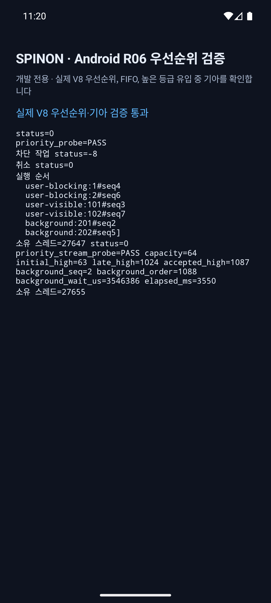
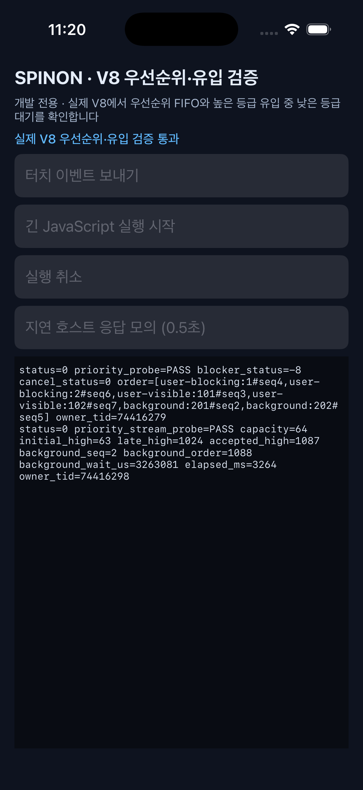

# R06 우선순위 공정성 정책 비교 모델

**목적:** 지속적으로 새 작업이 들어올 때 낮은 우선순위가 굶는지 확인하고 후보 선택 규칙의 비용·보장을 비교한다. **상태:** 결정론적 모델과 Android·iOS Simulator 실제 V8 유한 유입 검증 완료 · 제품 정책 미결정

## 비교 기준

- **현재 Spinon 기준:** 세 FIFO 큐 중 가장 높은 등급을 먼저 선택한다. 실행 중인 JavaScript는 선점하지 않는다.
- **Chromium 기준:** 2026-10-08에 공식 `refs/heads/main`의 `TaskQueue`와 `TaskQueueSelector`를 확인했다. `TaskQueue` 문서는 높은 등급의 지속 유입이 낮은 등급을 굶길 수 있다고 명시하고, selector는 활성 우선순위 중 가장 높은 것을 고른다. selector의 별도 starvation 카운터는 같은 우선순위 안에서 지연 작업이 즉시 작업을 밀어내는 상황을 보정한다. Chromium의 우선순위 개수·작업 종류·지연 작업 동작이 Spinon과 다르므로 전체 Chromium/Blink 호환을 주장하지 않는다.
- 과거 selector snapshot에는 우선순위 간 starvation score가 있었으므로 Chromium 전체 역사에 대해 현행 동작을 일반화하지 않는다. 확인한 [별도 과거 revision](https://chromium.googlesource.com/chromium/src/+/aa595e0ebb8c5ecd64e1598bf1359f0cf076b818/base/task/sequence_manager/task_queue_selector.h)과 현행 `refs/heads/main`은 구분한다.
- 확인한 현행 파일 blob ID는 `task_queue.h=8a5389a3c6259968259cf123ef1ed0f3bdf3b0ef`, `task_queue_selector.h=9a651cb1b02c8d904708f534b96ec2915e205d2f`, `task_queue_selector.cc=b95113b17d1d0e1f7f42b7fbe4ee01a870fe7cf1`이다.
- **독립 oracle:** 같은 입력을 받는 결정론적 기준 모델에서 각 선택 순서와 서비스 횟수를 계산한다. 모델의 예상 결과는 테스트 코드와 이 문서의 명시한 식으로 서로 대조한다.

## 입력·모델

세 우선순위(`user-blocking`, `user-visible`, `background`)에 처음 작업 하나씩 넣는다. 작업 하나가 선택될 때마다 그 작업의 원래 등급으로 후속 작업 하나를 즉시 넣는다. 각 선택 비용은 1이며, 따라서 4,096회 동안 세 등급 모두 계속 runnable 상태다. 선택기는 실행 완료 순서만 정한다. 작업 계산시간, OS 스케줄링, V8 실행시간, 플랫폼 콜백, 렌더 프레임은 모델 입력에 포함하지 않는다.

비교할 선택 규칙은 다음과 같다.

1. **엄격 우선순위:** 현재 동작. `user-blocking` 큐가 비어 있지 않으면 그 FIFO에서 선택하고, 아니면 `user-visible`, 마지막으로 `background`에서 선택한다.
2. **Aging 후보:** 각 작업은 8회 선택을 기다릴 때마다 유효 우선순위를 한 단계 올린다. 최상위에서 더 올리지 않는다. 유효 우선순위가 같으면 먼저 접수한 작업을 선택한다.
3. **가중 순환 후보:** 계속 runnable인 동안 매 13회 선택에 `user-blocking` 8회, `user-visible` 4회, `background` 1회를 배정한다. 해당 등급이 비면 그 자리를 건너뛰며, 등급 내부는 FIFO다.

8회와 8:4:1은 제품 튜닝값이 아니다. 비교를 재현하기 위한 명시적 예시값이다. 실행 horizon은 4,096회이며 기록할 관찰값은 등급별 선택 수, 첫 `background` 선택 번호, 최대 같은 등급 연속 선택 수다. 시뮬레이터에서는 이를 실제 지연이나 성능 수치로 해석하지 않는다.

## 사전 판정 기준

- 같은 초기 상태와 후속 작업 입력에서 각 모델의 결과가 결정론적이어야 한다.
- 엄격 우선순위에서는 높은 등급이 계속 runnable이면 4,096회 안에 `background`가 선택되지 않는 결과를 기대한다.
- Aging과 가중 순환은 4,096회 안에 모든 등급을 서비스해야 하며 첫 `background` 선택과 각 등급 서비스 수를 고정 테스트로 확인한다.
- 실제 V8 진단은 별도 결과로 판정한다. 낮은 작업보다 높은 작업을 먼저 등록하고 유입 중에도 높은 등급 작업이 대기열을 유지한 경우 낮은 작업이 선택되지 않는지, 생산 종료 후 모든 응답이 회수되는지 본다. 생산 종료 뒤 낮은 작업까지 완료되는 것은 누락·교착이 없다는 검사이며 무한 유입 공정성 보장이 아니다.
- Android 에뮬레이터와 iOS Simulator 결과는 플랫폼별 기능 확인으로 분리한다. queue residence는 성능 우열로 비교하지 않는다.

## 결과

## 결정론적 모델 결과

`mise exec -- cargo test --locked -p spinon-runtime --test priority_policy_comparison -- --nocapture`에서 세 정책을 같은 4,096회 입력으로 실행했다.

| 선택 규칙 | `user-blocking` 선택 | `user-visible` 선택 | `background` 선택 | 첫 background 선택 | 최대 연속 등급 |
| --- | ---: | ---: | ---: | ---: | ---: |
| 엄격 우선순위 | 4,096 | 0 | 0 | horizon 안에 없음 | 4,096 |
| Aging · 8회마다 한 단계 | 3,405 | 451 | 240 | 17번째 | 8 |
| 가중 순환 · 8:4:1 | 2,521 | 1,260 | 315 | 13번째 | 8 |

또한 aging 간격을 전체 horizon보다 길게 둔 부정 대조에서 결과가 엄격 우선순위의 기아 결과와 일치하는지, 가중 순환에서 `user-visible` 큐를 비웠을 때 해당 slot을 건너뛰고 `background`로 진행하는지 검사했다. 고정 입력과 서비스 횟수는 성공했다.

이 표는 각 작업의 선택 비용을 모두 1로 둔 규칙 비교다. Aging의 간격과 가중치는 제품 값이 아니며, 실제 작업 실행 시간·CPU 점유·취소·큐 역압력·사용자 지연을 측정하지 않았다. 가중 순환의 작업 개수 비율은 CPU 시간 비율을 보장하지 않는다.

## 실제 V8 유입 결과

고정 V8 revision `7b50b62cb18f28617959e8452e2cd18195b38bcf`, Android ARM64 에뮬레이터와 iOS ARM64 Simulator 모두 `v8_jitless=false`로 실행했다. 각 앱에서 처음 `background` 하나와 `user-blocking` 63개로 64칸을 채운 다음, producer thread가 큐 공간이 날 때마다 `user-blocking` 1,024개를 추가했다. 각 높은 등급 task는 약 3ms의 동기 JS와 V8 callback을 실행한다. 동일 검증을 각 플랫폼에서 5회 반복했다.

모든 10회 실행에서 늦게 접수된 높은 등급 1,087개가 먼저 연속 실행되고 `background`는 실행 순서 1,088번에 실행됐다. 즉 producer의 높은 등급 작업이 처리 중 대기열을 계속 이어간 이 유한 입력에서 실제 V8 선택기가 낮은 등급으로 먼저 넘어가지 않았다. background까지 모든 응답이 회수됐고 같은 등급 FIFO와 callback/owner thread 일치가 유지됐다.

| 실행 | Android background queue residence | iOS Simulator background queue residence | 판정 |
| ---: | ---: | ---: | --- |
| 1 | 3,454,452 µs | 3,260,388 µs | 각 1,087 high 뒤 background · 통과 |
| 2 | 3,605,723 µs | 3,260,646 µs | 각 1,087 high 뒤 background · 통과 |
| 3 | 3,585,897 µs | 3,261,347 µs | 각 1,087 high 뒤 background · 통과 |
| 4 | 3,528,714 µs | 3,261,845 µs | 각 1,087 high 뒤 background · 통과 |
| 5 | 3,546,386 µs | 3,263,081 µs | 각 1,087 high 뒤 background · 통과 |

queue residence는 처음 enqueue부터 scheduler가 dequeue할 때까지의 실험값이다. 에뮬레이터와 Simulator의 V8 실행·호스트 환경이 다르므로 두 열을 성능 순위로 해석하지 않는다. 1,087개의 유한 작업을 처리한 관찰은 무한 유입에서의 수학적 기아 증명이나 사용자 체감 지연 기준이 아니다.

## 재현·산출물

저장소 루트에서 고정 V8 checkout 경로를 `SPINON_V8_DIR`로 지정한다.

```sh
SPINON_V8_DIR=/path/to/pinned-v8-checkout \
  mise exec -- bun run verify:r06-priority:simulators
```

이 명령은 Android 16 / API 36 ARM64 `sdk_gphone64_arm64` 에뮬레이터와 iPhone 17 Pro / iOS 26.2 Simulator를 각각 빌드·설치하고 실제 V8 진단을 한 번 실행한다. 두 플랫폼을 각각 5회 반복하려면 `SPINON_V8_DIR=/path/to/pinned-v8-checkout mise exec -- bun run verify:r06-priority:fairness:simulators`를 사용한다. 모든 원본 실행 요약은 [runtime.log](r06-priority-policy-comparison-2026-10-08/runtime.log), 마지막 실행의 화면은 [Android](r06-priority-policy-comparison-2026-10-08/android.png)와 [iOS](r06-priority-policy-comparison-2026-10-08/ios.png)에 보존했다. 단위 모델은 `crates/spinon-runtime/tests/priority_policy_comparison.rs`에 있다.





- Android 화면 SHA-256: `74deaf9d0539bbcfbb61b53d42b86fc8dcf339e6e1649679d44afa34b2a1e08f`
- iOS 화면 SHA-256: `79463ea6e494334812efc193c93bd0cece02edc68fe7689c07969d1d3e4aa23c`
- 요약 로그 SHA-256: `51950c4e5e3d6b814da703d0561b81c554891622cb35598678dc782ed3567bef`

## 판정과 남은 범위

현재 strict-priority 큐는 구현한 선택 규칙을 지켰고, 높은 우선순위 작업이 계속 대기하는 동안 낮은 등급이 장시간 선택되지 않을 수 있음을 실제 V8에서도 재현했다. Aging과 가중 순환은 선택 보장을 개선하지만 우선순위 의미를 바꾼다. 특히 8:4:1은 입력·애니메이션·일반·유지보수 작업의 사용자 영향도를 정하지 않은 상태에서 제품 정책으로 선택할 수 없다.

이번 결과로 제품 우선순위, 기아 허용 기준, 공식 API의 task source별 정책을 확정하지 않는다. 실제 플랫폼 지연을 기준으로 aging이나 가중치를 조정하지 않았고, 작업 실행시간이 다른 입력, 큐 포화, 취소·종료, 프레임 마감, iOS 실기기와 release 빌드는 다루지 않았다. R06/E05는 미완료 상태로 둔다.
