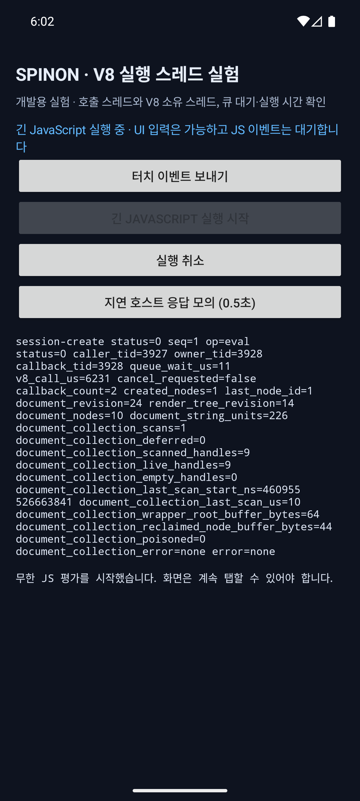
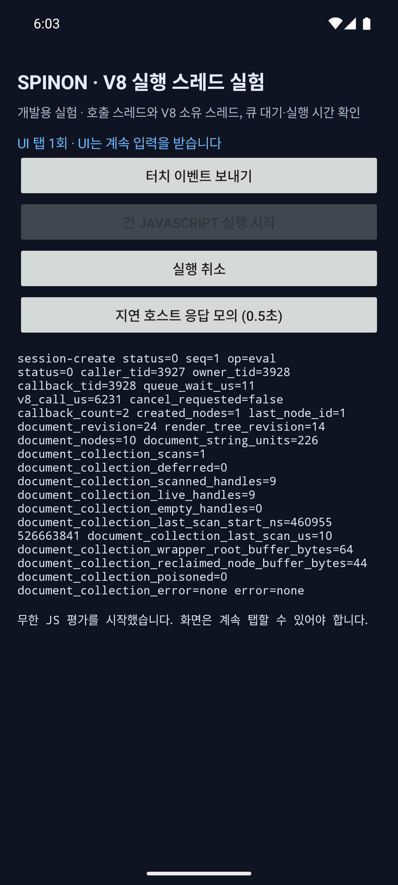
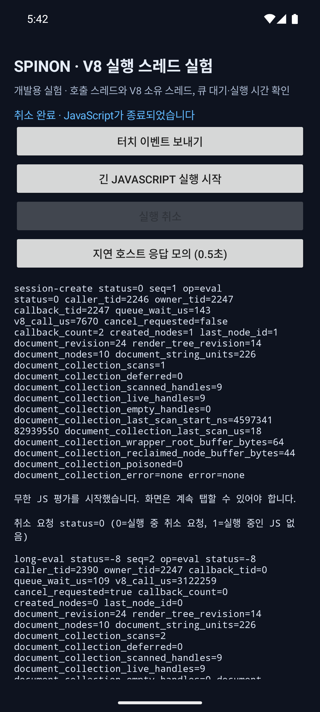
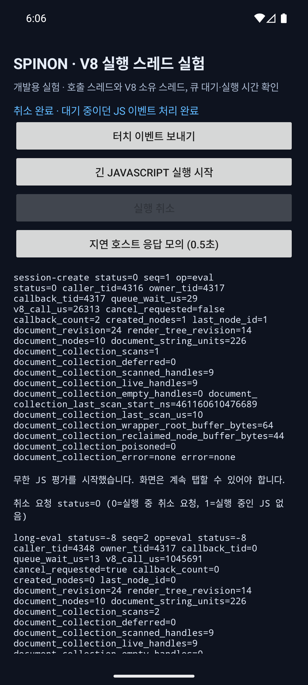

# Android 긴 JavaScript 중 입력 처리 확인

**관찰 날짜:** 2026-10-05 · **결과:** Android UI 입력·버튼 상태·취소 완료 표시·대기 JS 이벤트 처리 확인 · **범위:** Android 에뮬레이터 수동 확인

## 실행 환경

- Android 16 / API 36 ARM64 `sdk_gphone64_arm64` 에뮬레이터
- 최초 큐 지연 관찰 앱 APK SHA-256 `bca927025d3b0cd49d064b09c0f7f836e056f6eb6c8a2270786580d419753537`
- 취소 결과와 대기 dispatch 완료 순서를 고정한 최신 기본 빌드 APK SHA-256 `214aa63ae5c72590da901aa551e49a09861c0a631dc22e04ca87bd2870a32f10`
- 실행 중·이벤트 대기 화면은 직전 빌드 `8ee7f60f7c23c7f2c678e50497b6c6caa783a74fdf7754f74d015229c7725396`에서 캡처했다. 화면 외관은 같으며 최신 빌드에서는 대기 이벤트 완료 여부를 callback 도착 순서와 무관하게 표시한다.
- 개발 화면: `MainActivity --ez spinon_runtime_threads true`
- 긴 평가: 개발 화면의 무한 JavaScript 실행 버튼
- 이벤트: 실행 중 `터치 이벤트 보내기`와 `실행 취소`를 누름
- 직전 버튼 상태 빌드 APK SHA-256 `a9d68679a0d9fba7248b828cbdcefdf9bede5b4fe20f4860c77cf7d2ac00cf3b`에서는 취소가 실제로 끝나도 상태가 일반 실행 완료로 표시됐다.
- 회수 fixture 가시성 확인은 `SPINON_ENABLE_S03_DOM_GC_FIXTURE=1` 빌드 APK SHA-256 `732f89ee7787aad087a8e0df0449f2ffc23a8c6a5be46cd2da7f4b51cd13f712`와 `--ez spinon_dom_gc true`로 별도 실행했다. 기본 빌드에서 회수 버튼은 의도적으로 숨긴다.

## 관찰

긴 JS가 실행 중일 때 Android 화면의 탭 횟수·상태 문구가 바뀌었다. 입력 피드백은 Android UI 스레드에서 갱신되고, 그 버튼이 제출한 JS dispatch는 세션 V8 큐에서 기다렸다.

Android 진단 화면의 버튼 상태를 iOS 흐름에 맞췄다. 세션 대기 상태에서는 긴 JS 시작만 활성화하고 취소는 비활성화한다. 긴 JS가 실행 중일 때 시작은 비활성화하고 취소를 활성화한다. 취소를 누르면 취소 버튼을 잠시 비활성화하고 요청 접수 상태를 표시한다. 이전 빌드는 평가가 `-8`로 취소된 뒤에도 상태를 일반 실행 완료로 표시해 취소가 먹지 않은 것처럼 보일 수 있었다. 최신 빌드는 V8 취소 결과 `-8`을 구분해 `취소 완료`를 표시하고, 평가 중 접수한 JS dispatch가 남아 있으면 시작 버튼을 계속 잠근 뒤 해당 dispatch까지 끝나면 `취소 완료 · 대기 중이던 JS 이벤트 처리 완료`를 표시한다.

`uiautomator` 상태와 화면에서 확인한 전이는 다음과 같다.

| 시점 | 긴 JS 시작 | 실행 취소 | 터치 이벤트 | 관찰 |
| --- | --- | --- | --- | --- |
| 준비됨 | 활성 | 비활성 | 활성 | 기본 앱과 회수 fixture 앱에서 확인 |
| 긴 JS 실행 중 | 비활성 | 활성 | 활성 | UI 탭 횟수는 바로 증가 |
| 이벤트 대기 중 | 비활성 | 활성 | 활성 | JS dispatch는 아직 보고되지 않음 |
| 취소·대기 이벤트 완료 | 활성 | 비활성 | 활성 | eval `-8`, dispatch `0`, 상태 `취소 완료 · 대기 중이던 JS 이벤트 처리 완료` |

버튼이 제출한 JS dispatch는 즉시 실행되지 않고 세션의 단일 V8 작업자 큐에서 대기했다. 취소 버튼은 별도 제어 실행기에서 응답했고, V8 평가는 `-8`로 끝난 뒤 dispatch가 `status=0`으로 완료됐다. 추가로 시작 직후 취소를 보낸 경우에도 취소 요청 `status=0`, 평가 `status=-8`, 최종 `취소 완료` 표시를 확인했다.

| 관측 | 결과 |
| --- | ---: |
| 최초 V8 평가 호출 | `1,078,106 µs` |
| 최초 대기 후 dispatch 실행 | `90 µs` |
| 최초 dispatch 큐 대기 | `711,509 µs` |
| 상태 후속 실행 | 취소 `status=0`, eval `status=-8`, dispatch `status=0`, callback 2회 |
| 취소·UI 결과 확인 | 취소 요청 `status=0`, eval `status=-8`, `cancel_requested=true`, 최종 문구 `취소 완료 · JavaScript가 종료되었습니다` |
| 최신 APK의 취소 중 대기 이벤트 확인 | eval `status=-8`, dispatch `status=0`, 큐 대기 `566,335 µs`, 최종 문구 `취소 완료 · 대기 중이던 JS 이벤트 처리 완료` |

최초 재현 원본은 [s03-android-long-js-ui-2026-10-05.log](s03-android-long-js-ui-2026-10-05.log), 후속 버튼 상태 원본은 [s03-android-long-js-ui-button-states-2026-10-05.log](s03-android-long-js-ui-button-states-2026-10-05.log), 취소 확인은 [단독 취소 로그](s03-android-long-js-ui-cancel-confirmation-2026-10-05.log), [최신 APK의 대기 이벤트 포함 취소 로그](s03-android-long-js-ui-cancel-with-event-2026-10-05.log), [시작 직후 취소 로그](s03-android-long-js-ui-rapid-cancel-2026-10-05.log)에 기록했다. 회수 검증 버튼이 기본 빌드에서 보이지 않는 이유와 검증 전용 빌드 결과는 [별도 실행 기록](s03-android-dom-gc-visible-2026-10-05.md)을 참고한다.

## 해석과 한계

취소 경로는 동작했지만, 이전 Android UI가 취소 뒤 일반 완료 문구만 표시한 것이 오해의 원인이었다. 최신 빌드의 취소 단독·빠른 취소·대기 이벤트 포함 실행에서 요청 접수 `status=0`, 평가 취소 `status=-8`, 최종 취소 문구를 확인했다. 터치와 네이티브 UI 피드백은 긴 JS 중에도 갱신됐다. JS 핸들러가 즉시 실행되지 않는 이유는 현재 동기 JavaScript 호출이 끝나기 전에는 같은 Isolate가 다음 이벤트 작업을 실행하지 않기 때문이다. 우선순위는 다음 작업을 고를 때 적용하며 이미 실행 중인 JavaScript를 선점하지 않는다. 취소하거나 긴 JS가 반환되면 대기 이벤트가 이어서 실행된다.

이 기록은 에뮬레이터의 수동 동작 확인이다. 긴 평가 시간은 사용자가 취소 버튼을 누를 때까지의 대기 시간을 포함하므로 성능 수치가 아니다. 프레임 시간·ANR 한계·지속 입력 역압력·실기기 동작을 측정하지 않았다. 장시간 연산 중 JS 이벤트도 계속 처리되어야 하는 UX가 필요하면 작업 분할 또는 별도 Isolate와 메시지 계약이 필요하다. 이 실행만으로 어느 방식을 선택하지 않는다.
