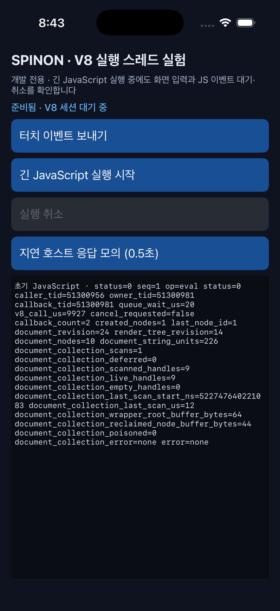
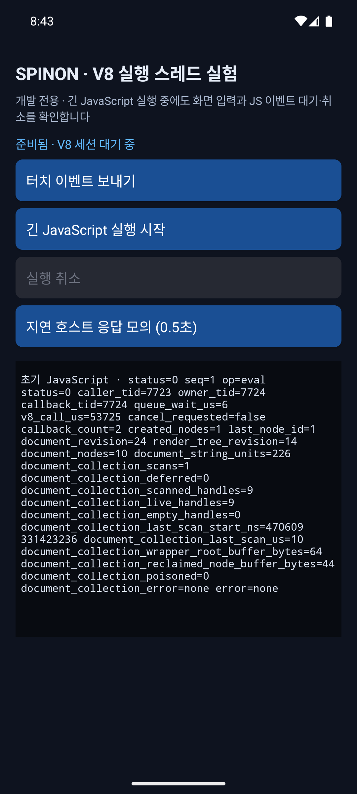
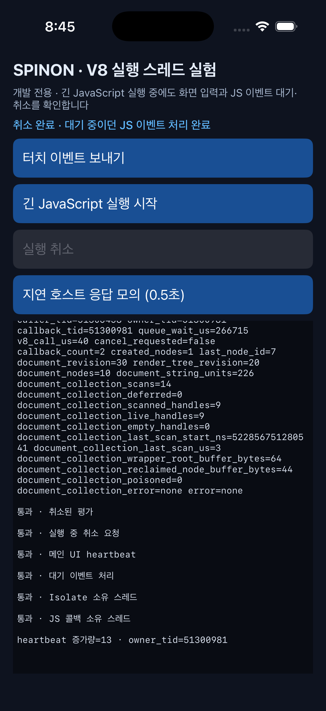
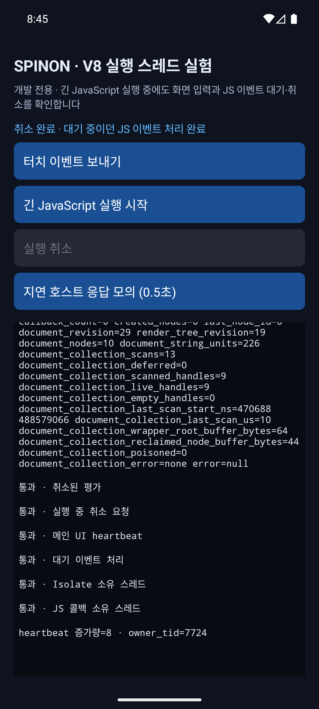
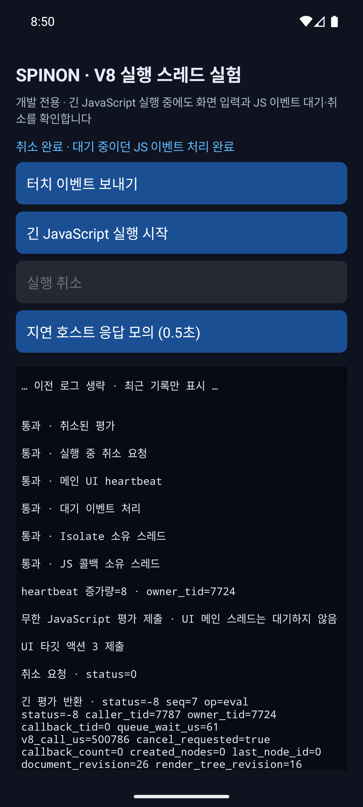

# R06 iOS·Android 진단 화면 일치 확인

**관찰 날짜:** 2026-10-05 · **결과:** 동일 빌드 경로·동작 시나리오에서 핵심 화면 상태와 취소 결과 일치 · **범위:** iOS·Android 시뮬레이터 수동 동작 확인

## 실행 환경과 빌드

- Android 16 / API 36 ARM64 에뮬레이터 `emulator-5554` (`sdk_gphone64_arm64`)
- iPhone 17 Pro / iOS 26.2 시뮬레이터 `ACA7BF91-E2D5-4CF7-909A-08D1AD95FF3D`
- 현재 작업 트리에서 `mise exec -- bun run build:android`와 `mise exec -- bun run build:ios-sim`을 다시 실행해 모두 성공한 뒤 각각 설치·실행했습니다.
- Android APK SHA-256: `ed268da074c3a8da5d8d6e36e4154b6f3e7b8bec757ec51835766e9c1bd0cc7b`
- iOS Simulator 실행 파일 SHA-256: `11d257153686e57d5d7c30611db288268a8ba71ba542def58b68e146fa1429a7`
- Android `--ez spinon_runtime_threads true`, iOS `--spinon-runtime-threads`로 같은 R06 화면을 열었습니다. 두 앱의 기본 빌드에서 S03 DOM GC fixture flag는 꺼져 있습니다.

## 관찰

새로 실행한 두 화면에서 제목, 설명, 준비 상태, 버튼 이름·순서가 일치했습니다. 준비 상태에서는 터치 이벤트·긴 JavaScript 시작·지연 호스트 응답 버튼이 활성화되고 실행 취소 버튼은 비활성화됩니다.

두 플랫폼에서 지연 호스트 응답 버튼을 눌러 0.5초 뒤 제출된 JS 평가가 `status=0`으로 끝나는 것을 확인했습니다. 이어 같은 순서로 긴 JavaScript를 시작하고, UI 이벤트를 제출한 뒤 취소했습니다. 두 플랫폼 모두 취소 요청 `status=0`, eval `status=-8`과 `cancel_requested=true`, 뒤이어 대기 중이던 dispatch `status=0`을 보였습니다. dispatch의 `owner_tid`와 `callback_tid`도 플랫폼별로 일치했고, 최종 상태는 모두 `취소 완료 · 대기 중이던 JS 이벤트 처리 완료`였습니다. 양쪽 화면에서 취소된 평가·취소 접수·UI heartbeat·대기 이벤트·Isolate 소유 스레드·JS 콜백 소유 스레드 여섯 검증 항목이 모두 통과했습니다.

반복 동작 때 로그 표시가 UI 갱신을 과도하게 유발하지 않도록 플랫폼별 pending 로그를 모아 메인 큐에서 한 번에 화면에 반영합니다. 화면은 20,000자를 넘으면 줄 경계까지 오래된 항목을 덜어내 16,000자 안팎으로 줄이고 생략 표시를 붙입니다. Android Logcat과 iOS unified log에는 전체 진단 기록을 남깁니다. Android에서 한도를 실제로 넘겨 생략 표시와 최근 통과 결과가 계속 보이는 것도 확인했습니다.

별도로 이벤트 없이 긴 평가를 시작해 12초 안전 시간 초과 경로도 양쪽에서 실행했습니다. 두 플랫폼 모두 취소 요청 `status=0`, eval `status=-8`, `취소 완료 · JavaScript가 종료되었습니다`를 표시했고, 대기 이벤트 검증은 생략으로 나타냈습니다.

| 확인 항목 | Android 16 에뮬레이터 | iOS 26.2 시뮬레이터 |
| --- | --- | --- |
| 공통 제목·설명·버튼 순서 | 일치 | 일치 |
| 준비 상태의 취소 버튼 | 비활성 | 비활성 |
| 긴 JS 실행 중 UI 이벤트 입력 | 입력·로그 갱신 | 입력·로그 갱신 |
| 취소 요청 | `status=0` | `status=0` |
| 긴 평가 취소 | `status=-8`, `cancel_requested=true` | `status=-8`, `cancel_requested=true` |
| 대기 dispatch | `status=0`, callback과 owner thread 일치 | `status=0`, callback과 owner thread 일치 |
| 최종 상태 | `취소 완료 · 대기 중이던 JS 이벤트 처리 완료` | `취소 완료 · 대기 중이던 JS 이벤트 처리 완료` |
| 12초 안전 취소 | eval `-8`, 취소 완료, 이벤트 검증 생략 | eval `-8`, 취소 완료, 이벤트 검증 생략 |

Android의 새 로그 묶음 반영을 적용한 뒤 `dumpsys gfxinfo`를 초기화하고 긴 평가·UI 이벤트·취소 시나리오를 다섯 번 반복했습니다.

| 반복 | 프레임 수 | deadline 초과 | 비율 | p90 | p99 | slow UI thread | slow issue draw |
| --- | ---: | ---: | ---: | ---: | ---: | ---: | ---: |
| 1 | 52 | 4 | 7.69% | 24ms | 46ms | 0 | 4 |
| 2 | 52 | 2 | 3.85% | 17ms | 18ms | 0 | 2 |
| 3 | 52 | 3 | 5.77% | 17ms | 18ms | 0 | 3 |
| 4 | 53 | 2 | 3.77% | 17ms | 19ms | 0 | 2 |
| 5 | 52 | 2 | 3.85% | 17ms | 18ms | 0 | 2 |

에뮬레이터 그래픽 경로는 Skia/OpenGL이었습니다. 이 값은 로그 갱신 비용을 줄인 뒤의 Android 에뮬레이터 표본이며, 이전의 단일 실행 90프레임 중 7회 지연 표본과 서로 직접 비교할 수 있는 통제 실험은 아닙니다. iOS와 성능을 비교하거나 실기기 성능을 결론내리지 않습니다. 앱 화면은 네이티브 진단용 버튼·텍스트 UI이므로 Spinon GPU renderer 성능 측정도 아닙니다. 따라서 로그 갱신은 Android에서 불필요한 UI 작업을 더하던 요인으로 확인했지만, Android 체감 지연 전체의 원인으로 단정하지 않습니다.

## 화면과 남은 차이

두 시뮬레이터에서 실제로 실행한 초기 화면과 취소 후 화면입니다.

화면 구조·제어 상태·최종 문구는 맞췄습니다. 상태 표시줄과 하단 시스템 영역은 OS가 그리며, 화면 안전 영역과 글꼴 메트릭 때문에 수직 여백·로그 줄바꿈은 픽셀 단위로 같지 않습니다. 스레드 ID·큐 지연·V8 실행 시간·진단 오류 표기도 플랫폼 측정값이라 서로 같은 문자열이 아닙니다. 이 수치는 성능 비교 결과가 아닙니다.

이 결과는 두 시뮬레이터에서의 확인이며 실기기, 접근성 서비스가 켜진 상태, 여러 기기 크기·방향, 장시간 입력 부하는 다루지 않았습니다. 화면은 개발 진단 도구이고 사용자용 UI 계약을 의미하지 않습니다.
