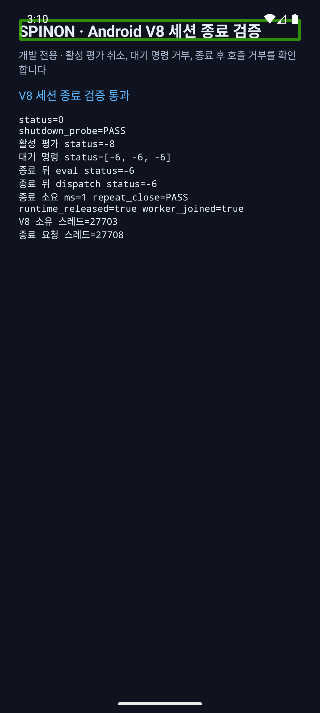
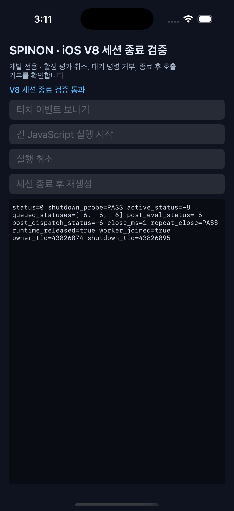

# S03.3 실제 V8 세션 종료 경합 검증

## 검증 기준

구현 전에 고정한 [비교 모델](s03-shutdown-precomparison-2026-10-05.md)에 따라 세션 내부 shutdown과 작업 제출의 순서를 검사했다. Android·iOS 각각 같은 고정 V8 revision, `v8_jitless=false`, 무한 평가 1개, 큐 대기 eval 3개, 종료 뒤 eval/dispatch를 사용했다. raw C ABI handle `free`와 다른 FFI 호출은 경합시키지 않았다.

## 결과

두 시뮬레이터 모두 통과했다.

| 대상 | 결과 | 관찰 |
| --- | --- | --- |
| Android 16 / API 36 / ARM64 emulator | 통과 | 활성 평가 `-8`, 대기 3건 `-6`, 종료 뒤 eval/dispatch `-6`, 반복 close 성공, runtime 해제와 worker join. 측정된 close는 1 ms. |
| iPhone 17 Pro / iOS 26.2 simulator | 통과 | 활성 평가 `-8`, 대기 3건 `-6`, 종료 뒤 eval/dispatch `-6`, 반복 close 성공, runtime 해제와 worker join. 측정된 close는 1 ms. |

실행 원본: [Android 로그](s03-shutdown-android-2026-10-05.log), [iOS 로그](s03-shutdown-ios-2026-10-05.log), [환경·도구 정보](s03-shutdown-environment-2026-10-05.txt).





Android 캡처 제목의 초록 테두리는 검증 시점에 켜져 있던 TalkBack의 접근성 포커스 표시다. 앱이 그린 테두리가 아니다. 사용자 simulator의 접근성 설정은 변경하지 않았다.

## 실행 및 코드 검증

재현 명령:

```sh
SPINON_V8_DIR=/Users/yoonhb/Documents/workspace/spinon/build/v8-source/v8 \
SPINON_S03_SHUTDOWN_OUTPUT_DIR=/tmp/spinon-s03-shutdown-final-run \
mise exec -- bun run verify:s03-shutdown:simulators
```

검증기는 V8 checkout의 revision·tracked source 변경 여부, Android `arm64`와 iOS Simulator `arm64` 대상, 두 `args.gn`의 `v8_jitless=false`를 빌드 전에 검사한다. 실행 시 Android APK와 iOS Simulator 앱을 다시 빌드·설치·실행한 뒤 로그 상태를 판정하고 화면을 캡처한다.

- `mise exec -- bun run test`: Bun 2/2, CSS reference 3/3, Rust workspace 171/171 통과.
- `mise exec -- cargo clippy --locked --workspace --all-targets -- -D warnings`: 통과.
- `mise exec -- cargo fmt --all -- --check`, verifier `bash -n`, `git diff --check`: 통과.
- Android 16 에뮬레이터와 iPhone 17 Pro / iOS 26.2 시뮬레이터 앱 빌드·실제 V8 실행: 통과.

## 수정한 실패 경로

무한 평가가 제한 시간 내 active 상태로 관찰되지 않는 경로는 실행자 호출을 먼저 기다리지 않도록 바꿨다. 종료를 먼저 확정해 대기 중 평가가 뒤늦게 시작하지 못하게 한 다음 호출자 thread를 회수한다. 유휴 종료가 runtime과 worker를 정리하고 후속 eval을 거부하는지, 제출 12개와 동시 종료 4개가 같은 barrier에서 경합하는지 fake V8 단위 테스트로 확인한다. unwind worker panic fixture는 대기 중인 eval과 dispatch를 `-7`로 마무리하고 stale runtime pointer를 비우며, 다른 thread에서 V8 해제를 시도하지 않는 것도 확인한다.

## 검증 경계

- 이 실행은 시뮬레이터의 내부 `RuntimeSession::shutdown()` 경로를 검사한다. 실기기, 여러 프로세스, 장시간 반복, registry 최대 scan 비용, quota 압력은 검증하지 않았다.
- raw C ABI session 포인터에 대한 `free`와 진행 중 `eval`/`dispatch`/`cancel` 동시 호출은 계약상 금지되어 있고 이 probe는 실행하지 않는다.
- Promise, 비동기 host module 요청, timer, 앱 강제 종료도 범위 밖이다.
- probe의 10초 deadline을 넘으면 진단은 실패하고 취소를 다시 요청한다. OS thread를 강제로 죽일 수 없으므로 V8 호출이 반환하지 않는 결함 상황에서는 종료 thread가 남을 수 있다. 제품 shutdown의 `JoinHandle::join()`에도 제한 시간이 없으며 이 실행은 timeout 복구를 입증하지 않는다.
- unwind panic fixture는 Rust thread join·대기 호출 응답 경로만 검증한다. V8 C++ 자원은 owner panic 뒤 다른 thread에서 해제하지 않으며 panic=abort 빌드, C ABI 예외, 전체 앱 복구는 보장하지 않는다.
- 이 slice는 S03.3/J10 제품 완료가 아니다. listener/external root 수명, quota 압력, 최대 registry scan과 실기기 검증은 남는다.
