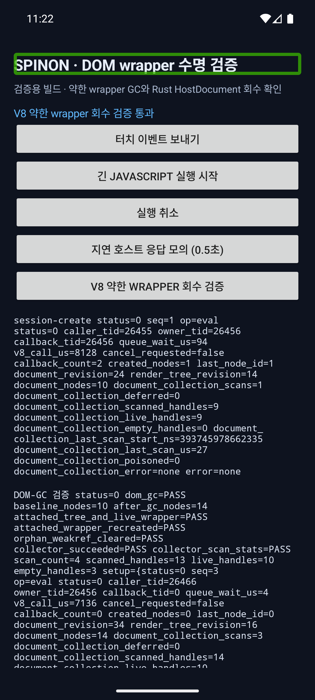
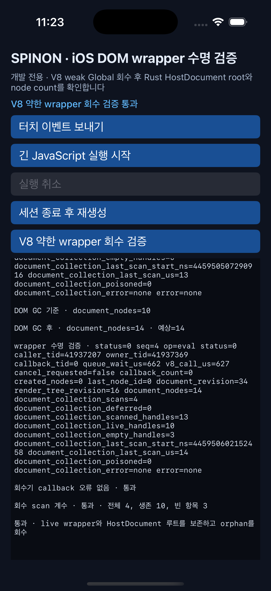

# S03.3 · Android·iOS V8 약한 wrapper 수명 검증

**실행일:** 2026-10-04 · **범위:** 강제 V8 GC 뒤 약한 wrapper scan과 Rust `HostDocument` 회수 · **결과:** 지정 fixture 통과

## 환경과 재현 명령

- 고정 V8 revision: `7b50b62cb18f28617959e8452e2cd18195b38bcf`
- Android: Android 16 / API 36, `sdk_gphone64_arm64` ARM64 에뮬레이터
- iOS: iPhone 17 Pro, iOS 26.2 시뮬레이터
- 검증 앱은 `SPINON_ENABLE_S03_DOM_GC_FIXTURE=1`로 빌드했다. 이 빌드에서만 시험용 `LowMemoryNotification()` 요청 함수를 등록한다.
- 실행 명령:

```sh
SPINON_ANDROID_EMULATOR_SERIAL=emulator-5554 \
SPINON_IOS_SIMULATOR_UDID=ACA7BF91-E2D5-4CF7-909A-08D1AD95FF3D \
mise exec -- bun run verify:s03-dom-lifecycle:simulators
```

## 확인한 동작

동일한 고정 시나리오를 Android와 iOS에서 각각 실행했다.

1. 부팅 직후 기준 노드는 10개였다.
2. attached subtree, wrapper만으로 살아 있는 detached subtree, 그리고 orphan 노드를 만들어 강제 GC를 요청했다. 준비 단계 뒤 노드는 14개였다.
3. outer eval이 끝난 owner safe point에서 V8 weak `Global<Object>`를 검사하고 Rust collector를 호출했다.
4. attached Text wrapper의 이전 `WeakRef`가 비었는지 확인한 뒤 트리 조회로 wrapper를 재생성했다. 새 wrapper의 내용과 반복 조회 identity를 확인했다.
5. HostRoot와 별도 JS wrapper root가 가리키는 노드는 보존됐고, orphan `WeakRef`는 비었다. 준비 단계에서 만든 다섯 노드 중 orphan 하나를 회수해 Rust 문서 노드는 기준 10개에서 14개로 늘었다.
6. collector 오류는 `none`, runtime poison은 `0`, deferred scan은 `0`이었다. 마지막 scan은 handle 13개를 보고 live 10개와 empty 3개로 나눴다. 실행 전체 scan 횟수는 4회였고 마지막 scan 소요 관측값은 Android 12µs, iOS 14µs였다. 이 단일 관측은 성능 기준이나 최대 registry 비용 측정이 아니다.

Android 원본 결과:

```text
DOM-GC 검증 status=0 dom_gc=PASS baseline_nodes=10 after_gc_nodes=14 attached_tree_and_live_wrapper=PASS attached_wrapper_recreated=PASS orphan_weakref_cleared=PASS collector_succeeded=PASS collector_scan_stats=PASS scan_count=4 scanned_handles=13 live_handles=10 empty_handles=3
```

iOS 원본 결과는 마지막 검증 eval에서 `document_nodes=14`, `document_collection_scans=4`, `document_collection_deferred=0`, `document_collection_scanned_handles=13`, `document_collection_live_handles=10`, `document_collection_empty_handles=3`, `document_collection_last_scan_us=14`, `document_collection_poisoned=0`, `document_collection_error=none`을 기록했다. Android 마지막 scan은 `document_collection_last_scan_us=12`였다.

## 화면과 원본 로그

| 플랫폼 | 캡처 | 원본 결과 |
| --- | --- | --- |
| Android 16/API 36 ARM64 에뮬레이터 |  | [android.log](s03-v8-weak-wrapper-android-2026-10-04.log) |
| iPhone 17 Pro / iOS 26.2 시뮬레이터 |  | [ios.log](s03-v8-weak-wrapper-ios-2026-10-04.log) |

빌드 revision과 기기 식별 정보: [environment.txt](s03-v8-weak-wrapper-environment-2026-10-04.txt).

## 결과가 증명하는 범위

- 실제 V8 약한 Global이 GC 뒤 비워질 수 있고, owner safe-point scan이 live wrapper root를 Rust collector에 전달하는 연결을 두 simulator에서 실행했다.
- 살아 있는 attached tree 및 detached wrapper root 보존, orphan 회수, 약한 wrapper reset 뒤 wrapper 재생성·identity를 확인했다.
- Android·iOS probe는 JavaScript assertion 결과, collector 오류·poison 상태와 scan handle 계수에 함께 의존해 통과를 판정한다.

이 실행은 simulator의 단일 고정 시나리오다. 반복 create/detach/drop 후 baseline 복귀, callback closure가 붙든 wrapper, 세션 종료와 scan의 경합, 전체 16,384개 registry의 비용, V8 heap retaining path, 실기기 동작은 증명하지 않는다. 따라서 S03.3과 J10은 계속 미완료다.
