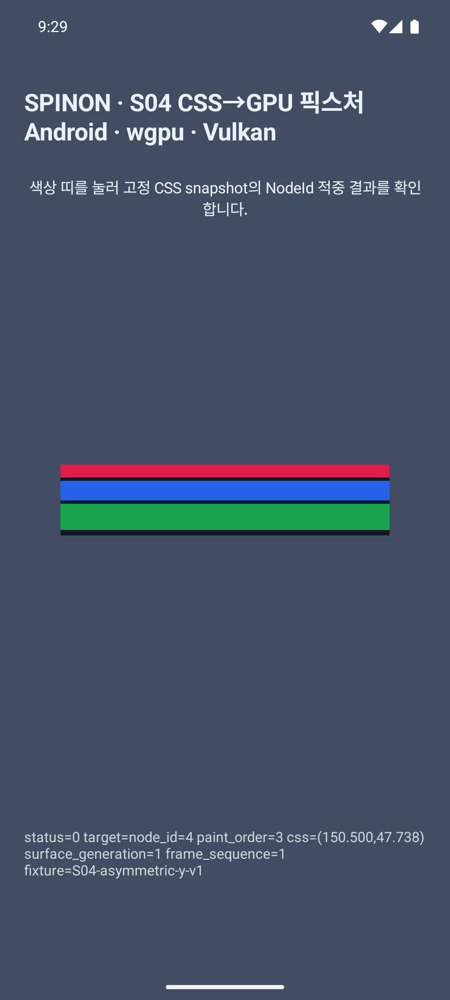
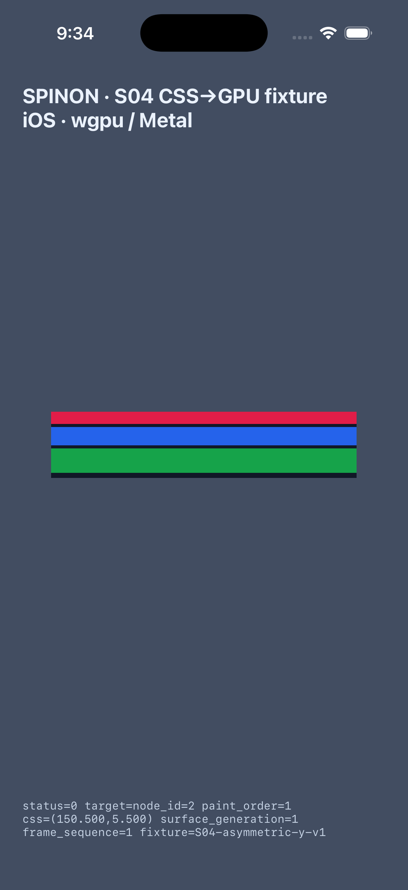

# S04.9 정적 snapshot hit-test 플랫폼 실행 근거

## 판정 범위

고정 `S04-asymmetric-y-v1` `StaticRenderSnapshot`에서 표면 터치 지점을 CSS px로 역변환하고, `paint_order`에 따른 `NodeId`를 반환하는 내부 fixture를 비교했습니다. Chromium `document.elementFromPoint()` oracle, Android Emulator의 실제 주입 터치, iOS Simulator의 Maestro 터치가 모두 예상 target과 일치했습니다.

이 실험은 정적 fixture hit-test와 표면 좌표 연결만 확인합니다. CSS stacking context·clip·transform·일반적인 hit-test 규칙, 표시 완료된 frame 식별, 동적 snapshot·문서 revision, DOM 이벤트 전파·취소·listener·JavaScript callback, 접근성, 실기기·하드웨어 GPU·성능은 검증하지 않았습니다. `Queue::present()` 요청은 화면 표시 완료 증거가 아닙니다.

## 사전 고정 비교 기준

| 항목 | 기준 |
| --- | --- |
| 렌더 fixture | `S04-asymmetric-y-v1`, viewport `301×65 CSS px` |
| hit-test fixture | [`hit-test.v1.json`](../../../tests/fixtures/css/s04/hit-test.v1.json), SHA-256 `1f8987fea841855fa7aece4c1f305eddfed03f5545a7c492217c4878802eb596` |
| Chromium | `154.0.8037.98`, offline headless capture, `document.elementFromPoint()` |
| Chromium reference | [fixed Chromium JSON](../../../tests/fixtures/css/references/s04-asymmetric-y-v1-hit-test-1f8987fea841-chromium-154.0.8037.98-f7ffacb8763c-06ff4aab2ac9-ccffd5c5fe77.json) · SHA-256 `768d8e169f08f3d171a83d9172cb966ae5f38a811f80f57418aa4089e1a3d3d4` |
| rectangle 경계 | left/top 포함, right/bottom 제외 |
| 겹침 | snapshot에 기록된 가장 큰 `paint_order` 우선 |
| 표면 좌표 | 렌더링과 같은 `scale = min(density, surfaceWidth / viewportWidth, surfaceHeight / viewportHeight)` 및 가운데 letterbox offset의 역변환 |
| 성공 frame 조건 | 입력 generation과 현재 generation이 같고 그 generation의 `Queue::submit`이 성공해야 함. 실제 화면 표시 완료는 판정하지 않음 |

11개 Chromium oracle 점에서 자식 내부·경계·gap의 parent hit와 viewport 오른쪽·아래쪽 경계의 빈 결과가 Rust snapshot 계산과 모두 일치했습니다. reference capture는 각 점에서 Chromium의 실제 element target을 수집하며 기존 S04.8 화면 reference를 덮어쓰지 않습니다.

## 플랫폼 실행

| 플랫폼 | 실행 조건 | 입력·관찰 결과 |
| --- | --- | --- |
| Android | Android 16/API 36 ARM64 `sdk_gphone64_arm64` emulator; `1080×2400`, density `2.625`; wgpu Vulkan `Cpu` adapter `llvmpipe (LLVM 21.1.4, 128 bits)` | `adb shell input tap`으로 자식 A/B/C를 각각 눌러 `node_id=2/3/4`, gap에서 parent `node_id=1`, letterbox 바깥에서 `status=1 target=none`을 확인했습니다. generation/frame은 `1/1`입니다. 화면 상태 문구와 캡처도 확인했습니다. |
| iOS | iPhone 17 Pro / iOS 26.2 Simulator; `1206×2622`, density `3.0`; wgpu Metal simulator GPU | Maestro 2.5.1로 빨간 자식 A를 연속 두 번 눌렀고 각 입력에서 `node_id=2`, CSS 점 `(150.500,5.500)`, generation/frame `1/1`이 각각 기록됐습니다. 화면 상태 문구와 캡처도 확인했습니다. |

Android surface pixel 입력은 `MotionEvent` local 좌표를 사용합니다. Android는 `ViewConfiguration.getScaledTouchSlop()`을 사용하며, iOS `UITouch` 좌표는 UIKit point이므로 현재 drawable density를 곱해 surface pixel로 바꾸고 이동 거리가 10 point를 넘으면 탭을 취소합니다. 양쪽 모두 cancel·다중 포인터·터치 중 surface generation 변경을 hit-test에서 제외합니다. 탭 이동 허용치는 플랫폼마다 다르며 이 fixture는 공통 제스처 적합성을 주장하지 않습니다.





플랫폼 원본 로그: [Android](s04-hit-test-android-2026-10-07.log) · [iOS](s04-hit-test-ios-2026-10-07.log).

## 실패·경계 검토

- 비유한 입력 좌표와 잘못된 표면 크기·density를 거부합니다. viewport 밖·letterbox 영역과 어떤 box에도 속하지 않는 내부 공간은 hit가 아닙니다.
- hit rectangle은 half-open이므로 right/bottom edge는 대상 box에 포함되지 않습니다. 부모 배경 box는 자식 gap에서 hit될 수 있습니다.
- 겹치는 영역은 fixture snapshot의 가장 큰 기록 `paint_order`가 반환됩니다. 이것은 CSS stacking context, clipping, transform 또는 `pointer-events` 규칙 구현이 아닙니다.
- resize는 표면 generation을 바꾸고 이전 세대의 제출 상태를 지웁니다. 현재 세대의 첫 draw가 성공하기 전 요청은 거부되며 오래된 입력 generation도 거부합니다.
- 화면 탭 결과는 앱 내부 label과 로그에만 기록됩니다. 실제 DOM event dispatch, listener 수명, bubble/capture, preventDefault, JS callback에 전달되지 않습니다.
- iOS의 `UITouch.tapCount`가 2 이상인 연속 탭도 개별 입력으로 계산합니다. Android와 iOS의 단일·연속 입력은 모두 표면 hit-test를 수행하지만, 일반 웹 `click` 적합성은 주장하지 않습니다.
- 제출된 frame sequence는 기록하지만 실제 표시된 frame ID는 추적하지 않습니다. 즉시 입력한 tap이 OS에 실제 표시된 표면 pixel과 같은 frame을 가리킨다는 보장은 아직 없습니다.
- FFI 반환값은 `0=NodeId hit`, `1=no hit`, `-1=null renderer`, `-2=no S04 scene/current submitted frame`, `-3=stale surface generation`, `-4=invalid coordinate`입니다. 성공 응답 문자열에는 CSS 점, `NodeId`, paint order, surface generation, 제출 frame sequence, fixture ID가 들어갑니다.
- opt-in Android/iOS feature를 사용한 개발용 통합 fixture입니다. 기본 앱 빌드에 제품 hit-test API를 추가하지 않습니다.

## 재현 명령

고정 Chromium reference를 별도 디렉터리에 재생성합니다.

```sh
SPINON_REFERENCE_OUTPUT_DIR=/tmp/s04-hit-test-reference mise exec -- bun run css:reference:s04-hit-test
```

플랫폼 자동 입력은 Android Emulator에서 `adb shell input tap <x-px> <y-px>`, iOS Simulator에서는 Maestro `tapOn.point`를 사용합니다. 빌드·Rust 검증 명령과 feature 설정은 [S04 계약](../0019-s04-css-layout-gpu-slice.md) 및 [플랫폼 안내](../../../platforms/ios/README.md)를 따릅니다.

## 남은 검증

- Android 실기기 하드웨어 GPU 및 iOS 실기기 Metal surface.
- surface 재생성·회전과 tap 동시 경합 자동 입력, Android/iOS별 cancel·multitouch 실패 입력 자동화.
- 실제 표시 완료 frame과 hit-test snapshot을 연결하는 frame token.
- DOM event target 규칙, listener·callback 수명, 전파·취소와 JavaScript 연결.
- CSS stacking context·clip·transform·scroll·pointer-events에 대한 적합성 범위.
